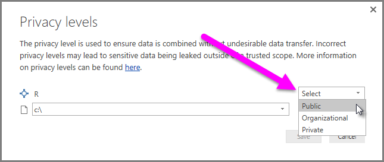

<properties
   pageTitle="Using R in Query Editor"
   description="Use R in Power BI Desktop Query Editor for advanced analytics"
   services="powerbi"
   documentationCenter=""
   authors="davidiseminger"
   manager="mblythe"
   backup=""
   editor=""
   tags=""
   qualityFocus="no"
   qualityDate=""/>

<tags
   ms.service="powerbi"
   ms.devlang="NA"
   ms.topic="article"
   ms.tgt_pltfrm="NA"
   ms.workload="powerbi"
   ms.date="10/12/2016"
   ms.author="davidi"/>

# Using R in Query Editor

You can use <bpt id="p1">**</bpt>R<ept id="p1">**</ept>, a programming language widely used by statisticians, data scientists, and data analysts, in the Power BI Desktop <bpt id="p2">**</bpt>Query Editor<ept id="p2">**</ept>. This integration of R into <bpt id="p1">**</bpt>Query Editor<ept id="p1">**</ept> lets you perform data cleansing using R, and perform advanced data shaping and analytics in datasets, including completion of missing data, predictions, and clustering, just to name a few. <bpt id="p1">**</bpt>R<ept id="p1">**</ept> is a powerful language, and can be used in <bpt id="p2">**</bpt>Query Editor<ept id="p2">**</ept> to prepare your data model and create reports.

## Installing R

To use <bpt id="p1">**</bpt>R<ept id="p1">**</ept> in Power BI Desktop's <bpt id="p2">**</bpt>Query Editor<ept id="p2">**</ept>, you need to install <bpt id="p3">**</bpt>R<ept id="p3">**</ept> on your local machine. You can download and install <bpt id="p1">**</bpt>R<ept id="p1">**</ept> for free from many locations, including the <bpt id="p2">[</bpt>Revolution Open download page<ept id="p2">](https://mran.revolutionanalytics.com/download/)</ept>, and the <bpt id="p3">[</bpt>CRAN Repository<ept id="p3">](https://cran.r-project.org/bin/windows/base/)</ept>.

## Using R in Query Editor

To show how to use <bpt id="p1">**</bpt>R<ept id="p1">**</ept> in <bpt id="p2">**</bpt>Query Editor<ept id="p2">**</ept>, we'll use an example from a stock market dataset, based on a .CSV file that you can <bpt id="p3">[</bpt>download from here<ept id="p3">](http://download.microsoft.com/download/F/8/A/F8AA9DC9-8545-4AAE-9305-27AD1D01DC03/EuStockMarkets_NA.csv)</ept> and follow along. The steps for this example are the following:

1.  First, load your data into <bpt id="p1">**</bpt>Power BI Desktop<ept id="p1">**</ept>. In this example we'll load the <bpt id="p1">*</bpt>EuStockMarkets_NA.csv<ept id="p1">*</ept> file. Select <bpt id="p1">**</bpt>Get Data &gt; CSV<ept id="p1">**</ept> from the <bpt id="p2">**</bpt>Home<ept id="p2">**</ept> ribbon in <bpt id="p3">**</bpt>Power BI Desktop<ept id="p3">**</ept>.

    

2.  Select the file and select <bpt id="p1">**</bpt>Open<ept id="p1">**</ept>, and the CSV is displayed in the <bpt id="p2">**</bpt>CSV file<ept id="p2">**</ept> dialog.

    

3.  Once the data is loaded, you'll see it in the <bpt id="p1">**</bpt>Fields<ept id="p1">**</ept> pane in Power BI Desktop.

    

4.  Open <bpt id="p1">**</bpt>Query Editor<ept id="p1">**</ept> by selecting <bpt id="p2">**</bpt>Edit Queries<ept id="p2">**</ept> from the <bpt id="p3">**</bpt>Home<ept id="p3">**</ept> tab in <bpt id="p4">**</bpt>Power BI Desktop<ept id="p4">**</ept>.

    

5.  In the <bpt id="p1">**</bpt>Transform<ept id="p1">**</ept> tab, select <bpt id="p2">**</bpt>Run R Script<ept id="p2">**</ept> and the <bpt id="p3">**</bpt>Run R Script<ept id="p3">**</ept> editor appears (shown in the next step). Notice that rows 15 and 20 suffer from missing data, as do other rows you can't see in the following image. The steps below show how R can (and will) complete those rows for you.

    

6.  For this example, we'll enter the following script code:

        library(mice)
        tempData <- mice(dataset,m=1,maxit=50,meth='pmm',seed=100)
        completedData <- complete(tempData,1)
        output <- dataset
        output$completedValues <- completedData$"SMI missing values"

    ><bpt id="p1">**</bpt>Note:<ept id="p1">**</ept> You'll need to have the <bpt id="p2">*</bpt>mice<ept id="p2">*</ept> library installed in your R environment for the previous script code to work properly. To install mice, run the following in your R installation: |      &gt; install.packages('mice')

    When put into the <bpt id="p1">**</bpt>Run R Script<ept id="p1">**</ept> dialog, the code looks like the following:

    

7.  When we select <bpt id="p1">**</bpt>OK<ept id="p1">**</ept>, <bpt id="p2">**</bpt>Query Editor<ept id="p2">**</ept> displays a warning about data privacy.

    

8.  For the R scripts to work properly in the Power BI service, all data sources need to be set to <bpt id="p1">*</bpt>public<ept id="p1">*</ept>. For more information about privacy settings and their implications, see <bpt id="p1">[</bpt>Privacy Levels<ept id="p1">](powerbi-desktop-privacy-levels.md)</ept>.

    

    Once we do so, we see a new column in the <bpt id="p1">**</bpt>Fields<ept id="p1">**</ept> well called <bpt id="p2">*</bpt>completedValues<ept id="p2">*</ept>. Notice there are a few missing data elements, such as on row 15 and 18. We'll see how R handles that in the next section.

    Notice

With just five lines of R script, <bpt id="p1">**</bpt>Query Editor<ept id="p1">**</ept> filled in the missing values with a predictive model.

## Creating visuals from R script data

Now we can create a visual to see how the R script code using the <bpt id="p1">*</bpt>mice<ept id="p1">*</ept> library completed the missing values, as shown in the following image.

Once that visual is complete, and any other visuals we might want to create using <bpt id="p1">**</bpt>Power BI Desktop<ept id="p1">**</ept>, we can save the <bpt id="p2">**</bpt>Power BI Desktop<ept id="p2">**</ept> file (which saves as a .pbix file) and then use the data model, including the R scripts that are part of it, in the Power BI service.

><bpt id="p1">**</bpt>Note:<ept id="p1">**</ept> Want to see a completed .pbix file with these steps completed? You're in luck - you can download the completed <bpt id="p1">**</bpt>Power BI Desktop<ept id="p1">**</ept> file used in these examples <bpt id="p2">[</bpt>right here<ept id="p2">](http://download.microsoft.com/download/F/8/A/F8AA9DC9-8545-4AAE-9305-27AD1D01DC03/Complete Values with R in PQ.pbix)</ept>.

Once you've uploaded the .pbix file to the Power BI service, a couple more steps are necessary to enable data refresh (in the service) and to enable visuals to be updated in the service (the data needs access to R for visuals to be updated). The additional steps are the following:

-   <bpt id="p1">**</bpt>Enable scheduled refresh for the dataset<ept id="p1">**</ept> - to enable scheduled refresh for the workbook that contains your dataset with R scripts, see <bpt id="p2">[</bpt>Configuring scheduled refresh<ept id="p2">](powerbi-refresh-scheduled-refresh.md)</ept>, which also includes information about <bpt id="p3">**</bpt>Personal Gateway<ept id="p3">**</ept>.

-   <bpt id="p1">**</bpt>Install the Personal Gateway<ept id="p1">**</ept> - you need a <bpt id="p2">**</bpt>Personal Gateway<ept id="p2">**</ept> installed on the machine where the file is located, and where R is installed; the Power BI service must access that workbook and re-render any updated visuals. You can get more information on how to <bpt id="p1">[</bpt>install and configure Personal Gateway<ept id="p1">](powerbi-personal-gateway.md)</ept>.

## Limitaciones

There are some limitations to queries that include R scripts created in <bpt id="p1">**</bpt>Query Editor<ept id="p1">**</ept>:

-   All R data source settings must be set to <bpt id="p1">*</bpt>Public<ept id="p1">*</ept>, and all other steps in a query created in <bpt id="p2">**</bpt>Query Editor<ept id="p2">**</ept> must also be public. To get to data source settings, in <bpt id="p1">**</bpt>Power BI Desktop<ept id="p1">**</ept> select <bpt id="p2">**</bpt>File &gt; Options and settings &gt; Data source settings<ept id="p2">**</ept>.

    

    From the <bpt id="p1">**</bpt>Data Source Settings<ept id="p1">**</ept> dialog, select the the data source(s) and then select <bpt id="p2">**</bpt>Edit Permissions...<ept id="p2">**</ept> and ensure that the <bpt id="p3">**</bpt>Privacy Level<ept id="p3">**</ept> is set to <bpt id="p4">*</bpt>Public<ept id="p4">*</ept>.

        

-   To enable scheduled refresh of your R visuals or dataset, you need to enable <bpt id="p1">**</bpt>Scheduled refresh<ept id="p1">**</ept> and have a <bpt id="p2">**</bpt>Personal Gateway<ept id="p2">**</ept> installed on the computer that houses the workbook and the R installation. For more information on both, see the previous section in this article, which provides links to learn more about each.

There are all sorts of things you can do with R and custom queries, so explore and shape your data just the way you want it to appear.
