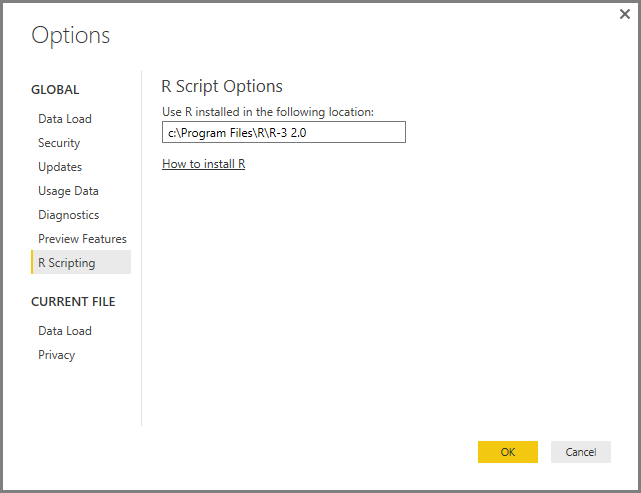

<properties
   pageTitle="Ejecutar Scripts de R en Power BI Desktop"
   description="Ejecutar Scripts de R en Power BI Desktop"
   services="powerbi"
   documentationCenter=""
   authors="davidiseminger"
   manager="mblythe"
   backup=""
   editor=""
   tags=""
   qualityFocus="no"
   qualityDate=""/>

<tags
   ms.service="powerbi"
   ms.devlang="NA"
   ms.topic="article"
   ms.tgt_pltfrm="NA"
   ms.workload="powerbi"
   ms.date="09/29/2016"
   ms.author="davidi"/>

# Ejecutar Scripts de R en Power BI Desktop

Puede ejecutar scripts de R directamente en Power BI Desktop e importar los conjuntos de datos resultante en un modelo de datos de Power BI Desktop.

## Instalar R

Para ejecutar scripts de R en Power BI Desktop, necesitará instalar **R** en el equipo local. Puede descargar e instalar **R** gratuitamente desde varias ubicaciones, incluyendo la [revolución abrir la página de descarga](https://mran.revolutionanalytics.com/download/), y el [repositorio CRAN](https://cran.r-project.org/bin/windows/base/). La versión actual de secuencias de comandos de R en Power BI Desktop admite caracteres Unicode, así como espacios (caracteres vacíos) en la ruta de instalación.

## Secuencias de comandos de ejecución R
Con unos pocos pasos de Power BI Desktop puede ejecutar scripts de R y crear un modelo de datos, desde el que puede crear informes y compartirlos en el servicio Power BI. R secuencias de comandos en Power BI Desktop ahora admite los formatos de número que contienen decimales (.) y comas (,).

### Preparar un Script de R
Para ejecutar un script de R en Power BI Desktop, crear la secuencia de comandos en el entorno de desarrollo local de R y asegúrese de que se ejecuta correctamente.

Para ejecutar la secuencia de comandos de Power BI Desktop, asegúrese de que la secuencia de comandos se ejecuta correctamente en un área de trabajo nueva y sin modificar. Esto significa que todos los paquetes y dependencias deben explícitamente cargarse y ejecutarse. Puede usar *source()* para ejecutar scripts dependientes.

Cuando se prepara y ejecuta un script de R en Power BI Desktop, hay algunas limitaciones:
-   Tramas de datos solo se importan, así que asegúrese de que los datos que desea importar a Power BI se representan en una trama de datos
-   Las columnas que son de tipo complejo y el Vector no se importan y se reemplazan por valores de error en la tabla creada.
-   Valores de n / se convierten en valores NULOS en Power BI Desktop
-   Agota el tiempo de espera de cualquier script de R que se ejecuta más de 30 minutos
-   Llamadas interactivas en el script de R, por ejemplo, esperando la intervención del usuario, detiene la ejecución de la secuencia de comandos
-   Al establecer el directorio de trabajo en el script de R *debe* definir una ruta de acceso completa para el directorio de trabajo, en lugar de una ruta de acceso relativa

### Ejecute el Script de R e importar datos

1.   En Power BI Desktop, el conector de datos de Script de R se encuentra en **obtener datos**. Para ejecutar el Script de R, seleccione **obtener datos &gt; más...**, a continuación, seleccione **otros &gt; R Script** tal como se muestra en la siguiente imagen.

    

2.   Si R está instalado en el equipo local, se selecciona la última versión instalada como su motor de R. Simplemente copie el script en la ventana de script y seleccione **Aceptar**.

    

3.   Si no está instalado R, no se identifica, o si hay varias instalaciones en el equipo local, expanda **configuración de la instalación de R** para mostrar las opciones de instalación, o para seleccionar la instalación que desea ejecutar el script de R.

    

    Si está instalado R no es identificado, se puede proporcionar explícitamente su ubicación en el cuadro de texto proporcionado al expandir **configuración de la instalación de R**. En la imagen anterior, la ruta de acceso *C:\Program Files\R\R-3.2.0* se proporciona explícitamente en el cuadro de texto.

    Configuración de la instalación de R centralmente se encuentra en la sección de secuencias de comandos de R del cuadro de diálogo Opciones. Para especificar la configuración de instalación de R, seleccione **archivo > Opciones y configuración** y, a continuación, **Opciones > Scripting R**. Si hay varias instalaciones de R, aparece un menú desplegable que permite seleccionar cuál utilizar.

    

4.   Seleccione **Aceptar** para ejecutar el Script de R. Cuando la secuencia de comandos se ejecuta correctamente, a continuación, puede elegir las tramas de datos resultante para agregar el modelo de Power BI.

### Actualizar
Puede actualizar un script de R en Power BI Desktop. Al actualizar un script de R, Power BI Desktop ejecuta el script de R de nuevo en el entorno de Power BI Desktop.

### Más información

Eche un vistazo a la siguiente información adicional acerca de R en Power BI.

-   [Crear elementos visuales de R en Power BI Desktop](powerbi-desktop-r-visuals.md)

-   [Usar un IDE R externo con Power BI](powerbi-desktop-r-ide.md)
