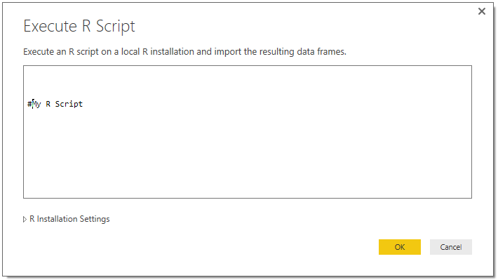

<properties
   pageTitle="Running R Scripts in Power BI Desktop"
   description="Running R Scripts in Power BI Desktop"
   services="powerbi"
   documentationCenter=""
   authors="davidiseminger"
   manager="mblythe"
   backup=""
   editor=""
   tags=""
   qualityFocus="no"
   qualityDate=""/>

<tags
   ms.service="powerbi"
   ms.devlang="NA"
   ms.topic="article"
   ms.tgt_pltfrm="NA"
   ms.workload="powerbi"
   ms.date="09/29/2016"
   ms.author="davidi"/>

# Running R Scripts in Power BI Desktop

You can run R scripts directly in Power BI Desktop, and import the resulting datasets into a Power BI Desktop data model.

## Installing R

To run R scripts in Power BI Desktop, you need to install <bpt id="p1">**</bpt>R<ept id="p1">**</ept> on your local machine. You can download and install <bpt id="p1">**</bpt>R<ept id="p1">**</ept> for free from many locations, including the <bpt id="p2">[</bpt>Revolution Open download page<ept id="p2">](https://mran.revolutionanalytics.com/download/)</ept>, and the <bpt id="p3">[</bpt>CRAN Repository<ept id="p3">](https://cran.r-project.org/bin/windows/base/)</ept>. The current release of R scripting in Power BI Desktop supports Unicode characters as well as spaces (empty characters) in the installation path.

## Running R Scripts
With just a few steps in Power BI Desktop you can run R scripts and create a data model, from which you can create reports, and share them on the Power BI service. R scripting in Power BI Desktop now supports number formats that contain decimals (.) and commas (,).

### Prepare an R Script
To run an R script in Power BI Desktop, create the script in your local R development environment, and make sure it runs successfully.

To run the script in Power BI Desktop, make sure the script runs successfully in a new and unmodified workspace. This means that all packages and dependencies must be explicitly loaded and run. You can use <bpt id="p1">*</bpt>source()<ept id="p1">*</ept> to run dependent scripts.

When preparing and running an R script in Power BI Desktop, there are a few limitations:
-   Only data frames are imported, so make sure the data you want to import to Power BI is represented in a data frame
-   Columns that are typed as Complex and Vector are not imported, and are replaced with error values in the created table.
-   Values that are N/A are translated to NULL values in Power BI Desktop
-   Any R script that runs longer than 30 minutes times out
-   Interactive calls in the R script, such as waiting for user input, halts the script’s execution
-   When setting the working directory within the R script, you <bpt id="p1">*</bpt>must<ept id="p1">*</ept> define a full path to the working directory, rather than a relative path

### Run your R Script and Import Data

1.   In Power BI Desktop, the R Script data connector is found in <bpt id="p1">**</bpt>Get Data<ept id="p1">**</ept>. To run your R Script, select <bpt id="p1">**</bpt>Get Data <ph id="ph1">&amp;gt;</ph> More...<ept id="p1">**</ept>, then select <bpt id="p2">**</bpt>Other <ph id="ph2">&amp;gt;</ph> R Script<ept id="p2">**</ept> as shown in the following image.

    

2.   If R is installed on your local machine, the latest installed version is selected as your R engine. Simply copy your script into the script window and select <bpt id="p1">**</bpt>OK<ept id="p1">**</ept>.

    

3.   If R is not installed, is not identified, or if there are multiple installations on your local machine, expand <bpt id="p1">**</bpt>R Installation Settings<ept id="p1">**</ept> to display installation options, or to select which installation you want to run the R script.

    

    If R is installed is not identified, you can explicitly provide its location in the text box provided when you expand <bpt id="p1">**</bpt>R Installation Settings<ept id="p1">**</ept>. In the above image, the path <bpt id="p1">*</bpt>C:\Program Files\R\R-3.2.0<ept id="p1">*</ept> is explicitly provided in the text box.

    R installation settings are centrally located in the R Scripting section of the Options dialog. To specify your R installation settings, select <bpt id="p1">**</bpt>File &gt; Options and settings<ept id="p1">**</ept> and then <bpt id="p2">**</bpt>Options &gt; R Scripting<ept id="p2">**</ept>. If multiple installations of R are available, a drop-down menu appears that allows you to  select which installation to use.

    

4.   Select <bpt id="p1">**</bpt>OK<ept id="p1">**</ept> to run the R Script. When the script runs successfully, you can then choose the resulting data frames to add to the Power BI model.

### Actualizar
You can refresh an R script in Power BI Desktop. When you refresh an R script, Power BI Desktop runs the R script again in the Power BI Desktop environment.

### Más información

Take a look at the following additional information about R in Power BI.

-   [Create R Visuals in Power BI Desktop](powerbi-desktop-r-visuals.md)

-   [Use an external R IDE with Power BI](powerbi-desktop-r-ide.md)
