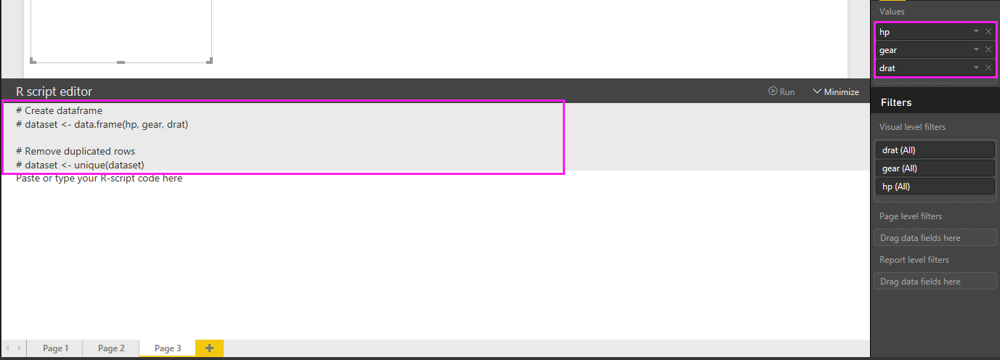

<properties
   pageTitle="Crear efectos visuales de Power BI con R"
   description="Crear efectos visuales de Power BI con R"
   services="powerbi"
   documentationCenter=""
   authors="davidiseminger"
   manager="mblythe"
   backup=""
   editor=""
   tags=""
   qualityFocus="no"
   qualityDate=""/>

<tags
   ms.service="powerbi"
   ms.devlang="NA"
   ms.topic="article"
   ms.tgt_pltfrm="NA"
   ms.workload="powerbi"
   ms.date="09/08/2016"
   ms.author="davidi"/>

# Crear efectos visuales de Power BI con R  

Con Power BI Desktop, puede usar R para visualizar los datos.

### Instalar R

Power BI Desktop incluye, implementar o instalar el motor de R. Para ejecutar scripts de R en Power BI Desktop, debe instalar por separado **R** en el equipo local. Puede descargar e instalar **R** gratuitamente desde varias ubicaciones, incluyendo la [revolución abrir la página de descarga](https://mran.revolutionanalytics.com/download/), y el [repositorio CRAN](https://cran.r-project.org/bin/windows/base/). La versión actual de secuencias de comandos de R en Power BI Desktop admite caracteres Unicode, así como espacios (caracteres vacíos) en la ruta de instalación.

### Habilitar elementos visuales de R
1.   Para habilitar los elementos visuales de R, seleccione **archivo > Opciones y configuración > opciones** y en el **opciones** página que aparece, asegúrese de que la instalación local de R se especifica en la **R Scripting** sección de la **opciones** ventana, tal como se muestra en la siguiente imagen. En la siguiente imagen, es la instalación local de la ruta de acceso de R **C:\Program Files\R\R-3.2.0** y esa ruta de acceso se proporciona explícitamente en el cuadro de texto. Asegúrese de que la ruta de acceso que se mostrará correctamente refleja la instalación local de R que desea Power BI Desktop para usar.

    

Cuando se especifica la instalación de R, ya está listo para empezar a crear elementos visuales de R.

#### Crear elementos visuales de R en Power BI Desktop

1.   Seleccione el **R Visual** icono en el **visualización** panel, como se muestra en la siguiente imagen, para agregar una R visual.

    

2.   Cuando se agrega un objeto visual R a un informe, Power BI Desktop hace lo siguiente:

   (a) una imagen visual de R de marcador de posición aparece en el lienzo de informe.

   (b) el **editor de script de R** aparece en la parte inferior del panel central.

  

3.   A continuación, agregue los campos que desee utilizar en el script de R para el **valores** sección la **campos** Bueno, tal como haría con cualquier otro visual de Power BI Desktop. Solo los campos que se han agregado a la **campos** también están disponibles para el script de R y puede agregar nuevos campos o quitar los campos de la **campos** bien mientras se trabaja en el script de R en Power BI Desktop **editor de script de R**. Power BI Desktop detecta automáticamente los campos que se han agregado o quitado.

> 
            **Nota:** es el tipo de agregación predeterminado para elementos visuales de R *no resumir*.

4.   Ahora puede usar los datos seleccionados para crear un gráfico. Cuando selecciona campos, el **editor de script de R** genera un script de R compatible según las selecciones realizadas en la sección de color gris a lo largo de la parte superior del panel del editor de código de enlace. Al selecciona o quitar campos adicionales, para permitir el código en el editor de secuencias de comandos de R se genera automáticamente o quitado en consecuencia.

    En el ejemplo se muestra en la siguiente imagen, se seleccionaron tres campos: hp, engranaje y drat. Como resultado de estas selecciones, el editor de scripts de R genera el siguiente código de enlace:
      -  Una trama de datos denominada **dataset** creó
        -  Esa trama de datos consta de los distintos campos seleccionados por el usuario
      -  La agregación predeterminada es *no resumir*
      -  Similar a los elementos visuales de la tabla, se agrupan los campos y las filas duplicadas aparecen sólo una vez

    

    >
            **Sugerencia:** en ciertos casos no puede automática agrupar para que se produzca, o realizar todas las filas que aparezca, incluidos los duplicados. En ese caso puede agregar un campo de índice al conjunto de datos que hace que todas las filas que se consideran únicos y evita la agrupación.

    La trama de datos generado se denomina **dataset**, y sus respectivos nombres pueden tener acceso a las columnas seleccionadas. Por ejemplo, puede obtenerse el campo engranaje escribiendo *engranaje de conjunto de datos$* en el script de R. Para los campos con espacios o caracteres especiales, utilice comillas simples.

5. Con la trama de datos generada automáticamente los campos seleccionados, está listo para escribir el script de R que se traduce en trazar en el dispositivo predeterminado de R. Una vez completada la secuencia de comandos, seleccione **ejecutar** desde el **editor de script de R** barra de título (**ejecutar** está en el lado derecho de la barra de título).

    Cuando **ejecutar** está seleccionada, Power BI Desktop identifica el trazado y presentar en el lienzo.
Puesto que el proceso se ejecuta en la instalación local de R, asegúrese de que están instalados los paquetes necesarios.

    Power BI Desktop replots visual cuando se produzca cualquiera de los siguientes eventos:
      - 
            **Ejecutar** está seleccionado en el **editor de script de R** barra de título
      - Siempre que se produce un cambio de datos, debido a la actualización de datos, filtrar o resaltado

La siguiente imagen muestra un ejemplo del código de trazado de correlación y traza las correlaciones entre atributos distintos tipos de automóviles.

Para obtener una vista más grande de las visualizaciones, puede minimizar la **editor de script de R**. Y por supuesto, al igual que otros elementos visuales en Power BI Desktop, puede cruzar filtro trazar la correlación seleccionando sólo de deporte automóviles en el anillo visual por (el redondeo visual a la derecha, en la imagen de ejemplo anterior).

También puede modificar el script de R para personalizar el objeto visual y aprovechar la potencia de R mediante la adición de parámetros para el comando trazado.

El comando trazado original fue el siguiente:

    corrplot(M, method = "color",  tl.cex=0.6, tl.srt = 45, tl.col = "black")

Con unos pocos cambios en el script de R, el comando es el siguiente:

    corrplot(M, method = "circle", tl.cex=0.6, tl.srt = 45, tl.col = "black", type= "upper", order="hclust")

Como resultado, R visual ahora traza círculos, sólo tiene en cuenta en la mitad superior y reordena la matriz para agrupar en clúster correlacionados atributos, como se muestra en la siguiente imagen.

Al ejecutar un script de R que se produce un error, no se traza R visual y se muestra un mensaje de error en el lienzo. Para obtener más información sobre el error, seleccione **Ver detalles** del error visual R en el lienzo.

> 
            **Seguridad de secuencias de comandos de R:** elementos visuales de R se crean a partir de scripts de R, que podrían contener código con los riesgos de seguridad o privacidad. Al intentar ver o interactuar con una R visual por primera vez, aparece un mensaje de advertencia de seguridad. Permitir sólo elementos visuales de R si confía en el autor y el origen o después de revisar y comprender el script de R.

#### Limitaciones conocidas

Elementos visuales de R en Power BI Desktop tiene algunas limitaciones:

-  Limitaciones de tamaño de datos: datos utilizados por el R visual para trazar está limitados a 150.000 filas. Si hay más de 150.000 filas seleccionadas, se usan las primeras filas de 150.000 y se muestra un mensaje en la imagen.

-  Limitación de tiempo de cálculo: si un cálculo de R visual supera los 5 minutos los tiempos de ejecución espera, lo que produce un error.

-  Relaciones: al igual que con otros elementos visuales de Power BI Desktop, si se seleccionan campos de datos de tablas diferentes con ninguna relación definida entre ellos, se produce un error.

-  Elementos visuales de R se actualizan en las actualizaciones de datos, filtrado y resaltado. Sin embargo, la imagen en sí no es interactiva y no puede ser el origen del filtro cruzado.

-  Elementos visuales de R responden al resaltado de otros elementos visuales, pero no puede hacer clic en elementos de R visual para cross filtrar otros elementos.

-  Sólo gráficos que se muestran en el dispositivo de presentación predeterminado de R se muestran correctamente en el lienzo. Evite usar explícitamente un dispositivo de pantalla de R diferentes.

-  En esta versión, las instalaciones RRO no identifica automáticamente la versión de 32 bits de Power BI Desktop, por lo que debe proporcionar manualmente la ruta de acceso al directorio de instalación de R en **Opciones y configuración > Opciones > Scripting R**.

### Más información

Eche un vistazo a la siguiente información adicional acerca de R en Power BI.

-   [Ejecutar Scripts de R en Power BI Desktop](powerbi-desktop-r-scripts.md)

-   [Usar un IDE R externo con Power BI](powerbi-desktop-r-ide.md)
