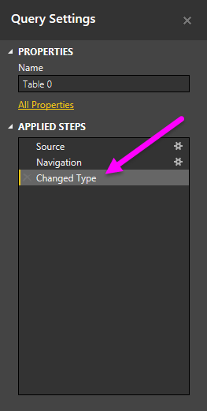
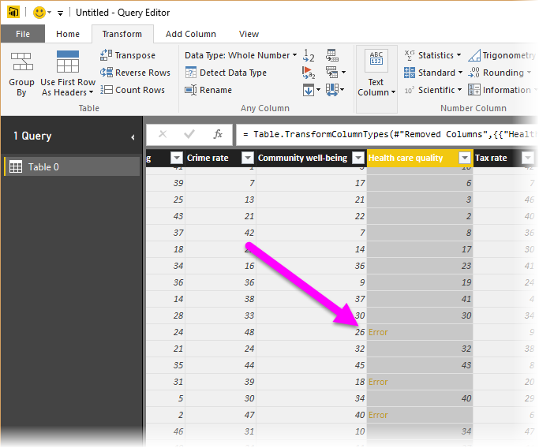
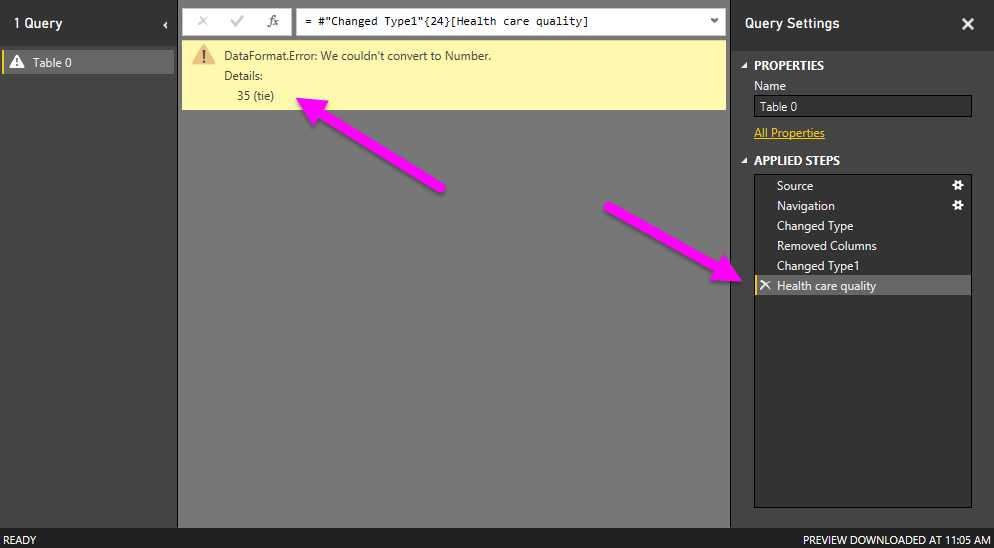
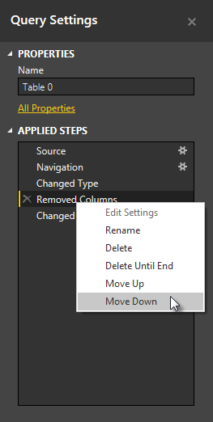
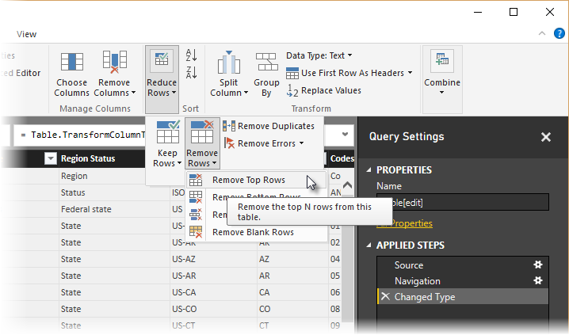
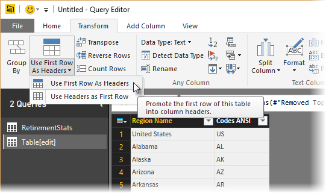
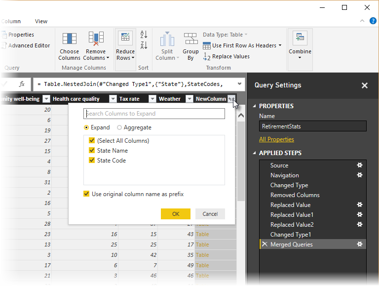

<properties
   pageTitle="La forma y combinar datos en Power BI Desktop"
   description="La forma y combinar datos en Power BI Desktop"
   services="powerbi"
   documentationCenter=""
   authors="davidiseminger"
   manager="mblythe"
   backup=""
   editor=""
   tags=""
   qualityFocus="no"
   qualityDate=""/>

<tags
   ms.service="powerbi"
   ms.devlang="NA"
   ms.topic="article"
   ms.tgt_pltfrm="NA"
   ms.workload="powerbi"
   ms.date="09/29/2016"
   ms.author="davidi"/>
# La forma y combinar datos en Power BI Desktop

Con **Power BI Desktop**, puede conectarse a muchos tipos diferentes de orígenes de datos y luego forma a los datos para satisfacer sus necesidades. 
            *De forma* datos significan transformar los datos, como cambiar el nombre de las columnas o tablas, convertir texto en números, quitar filas, establecer la primera fila como encabezado, etcétera. 
            *Combinar* datos significa conectarse a dos o más orígenes de datos, darles forma según sea necesario, a continuación, consolidar ** en una consulta útil.

Este documento muestra cómo formar una consulta mediante Power BI Desktop, resalta algunas de las tareas más comunes. La consulta que se usa aquí se describe con más detalle, incluido cómo crear la consulta desde cero, en [Getting Started with Power BI Desktop](powerbi-desktop-getting-started.md).

Resulta útil saber que el **Editor de consultas** en Power BI Desktop hace un amplio uso de los menús contextuales, así como la cinta de opciones. La mayoría de lo que puede seleccionar en el **transformar** cinta también está disponible haciendo clic en un elemento (por ejemplo, una columna) y en el menú que aparece.

## Datos de formas

Dar forma a datos en el Editor de consultas, se proporcionan instrucciones paso a paso (Editor de consultas lleva a cabo automáticamente) para ajustar los datos a medida que el Editor de consultas carga y presenta. El origen de datos original no se ve afectado; sólo la vista de los datos se ajusta, o *en forma de*.

Los pasos especificados (como cambiar el nombre de una tabla, transformar un tipo de datos o eliminar columnas) se registran mediante el Editor de consultas, y cada vez que esta consulta se conecta al origen de datos esos pasos se llevan a cabo para que los datos están siempre en forma de la forma que especifique. Este proceso se produce siempre que se use la característica del Editor de consultas de Power BI Desktop o para cualquier persona que use su consulta compartida, como en el **Power BI** servicio. Estos pasos se capturan, de manera secuencial, en el **configuración de consulta** panel bajo **pasos aplicados**.

La siguiente imagen muestra la **configuración de consulta** panel para una consulta que se ha dado forma; se examinará cada uno de estos pasos en los párrafos siguientes.

Utilizando los datos de la retirada de [Getting Started with Power BI Desktop](https://powerbi.uservoice.com/knowledgebase/articles/471664), que se encuentra mediante la conexión a un origen de datos de Web, vamos a dar forma a datos para que se adapten a nuestras necesidades.

Para empezar, resultados de una columna no se transformaron automáticamente de texto a números cuando la tabla de carga de Editor de consultas y necesitamos que sean números. No hay problema: simplemente con el botón secundario en el encabezado de columna y seleccione **Cambiar tipo \> número entero** cambiarlos. Para seleccionar más de una columna, seleccione una columna, mantenga presionada la tecla **MAYÚS**, seleccione columnas adyacentes adicionales y, a continuación, haga clic en un encabezado de columna para cambiar todas las columnas seleccionadas. También puede utilizar el **CTRL** clave para elegir las columnas no adyacentes.

También puede *transformar* las columnas de texto al encabezado de la **transformar** cinta de opciones. Aquí está el **transformar** cinta de opciones, con una flecha que señala hacia la **tipo de datos** botón, que permite transformar el tipo de datos actual a otro.

Tenga en cuenta que en **configuración de consulta**, la **pasos aplicados** reflejan los pasos de conformación aplicados a los datos. Si desea quitar cualquier paso del proceso de forma, simplemente seleccione el **X** a la izquierda del paso. En la siguiente imagen, **pasos aplicados** refleja los pasos hasta ahora: conectarse al sitio Web (**origen**); seleccionar la tabla (**navegación**); y al cargar la tabla, el Editor de consultas cambia automáticamente las columnas numéricas basado en texto de *texto* a *número entero* (**Cambiar tipo**). Una columna de clasificaciones no se cambia automáticamente a un tipo de número y buscaremos el por qué en los siguientes párrafos.

Antes de que podemos trabajar con esta consulta, necesitamos realizar algunos cambios para obtener sus datos donde queremos:

-   
            *Quitar la primera columna* : no se necesita, sólo incluye filas redundantes que dicen "Mira cómo clasifica el estado para la jubilación" que es un artefacto de este origen de datos que se va a una tabla basada en Web

-   
            *Corregir algunos errores* : una de las columnas **calidad sanitaria**, contiene algunos lazos en las clasificaciones de los Estados que anotó en el sitio Web especificando el texto *(lazo)* después sus números. Esto funciona bien en el sitio Web, pero requiere que se transforme la columna de texto a los datos manualmente. Es fácil de solucionar este problema mediante Power BI Desktop y hacerlo muestra una interesante característica de **pasos aplicados** en consulta

-   
            *Cambiar el nombre de la tabla* : **tabla 0** no es un descriptor útil, pero cambiarlo simple

Para quitar la primera columna, simplemente seleccione la columna y elija la **Inicio** la ficha de la cinta de opciones, a continuación, **quitar columnas** tal como se muestra en la ilustración siguiente.

A continuación necesitamos abordar la columna de texto y transformarla en números. En un principio parece sencillo, que solo podemos cambiar el tipo de la **calidad sanitaria** columna de texto a número (como *número entero*, o *número Decimal*). Pero cuando se cambia el tipo de **texto** a **número entero**, a continuación, examine los valores de esa columna, encontramos informa de algunos errores en el Editor de consultas.

Hay varias maneras de obtener más información acerca de cada error. Puede seleccionar la celda (sin hacer clic en la palabra **Error**), o haga clic en la palabra **Error** directamente. Si selecciona la celda *sin* clic directamente en la palabra **Error**, Editor de consultas muestra la información de error en la parte inferior de la ventana.

Si hace clic en la palabra *Error* directamente, la consulta crea una **paso aplicado** en el **configuración de consulta** panel y muestra información sobre el error.

Para volver al Editor de consultas, tiene que quitar ese paso seleccionando la **X** junto a ella.

Cuando se selecciona la última **paso aplicado**, podemos ver el error descrito anteriormente, como se muestra en la siguiente imagen.

Puesto que el Editor de consultas registra los pasos de forma secuencial, podemos seleccionar el paso antes de cambiar el tipo de **pasos aplicados**, y ver lo que el valor de la celda antes de la transformación, tal como se muestra en la siguiente imagen.

Bien, ahora podemos corregir esos valores y *a continuación,* cambiar el tipo. Puesto que el Editor de consultas registra los pasos de forma secuencial, pero independientemente unas de otras, se puede mover cada **paso aplicado** hacia arriba o abajo en la secuencia. Simplemente haga clic en cualquiera de los pasos y el Editor de consultas proporciona un menú que le permite hacer lo siguiente: **cambiar el nombre de**, **Eliminar**, **Eliminar** **final hasta** (quitar el paso actual y todos los pasos subsiguientes demasiado), **Subir**, o **Bajar**.

Además, puede seleccionar una **paso aplicado** en cualquier parte de la lista y seguir dando forma a los datos en ese punto en la secuencia. Editor de consultas insertará automáticamente un nuevo paso directamente después de la seleccionada actualmente **paso aplicado**. Vamos a intentarlo.

En primer lugar, se selecciona el **paso aplicado** antes de cambiar el tipo de la **calidad sanitaria** columna. A continuación, se reemplazan los valores con el texto "(lazo)" en la celda para que solo permanezca el número. Haga clic en la celda que contiene "35 (lazo)" y seleccione *Reemplazar valores* en el menú que aparece. Tenga en cuenta que **paso aplicado** está seleccionado (el paso antes de cambiar el tipo).

Puesto que estamos insertando un paso, el Editor de consultas nos advierte acerca del peligro de hacerlo: pasos posteriores podrían hacer que la consulta se interrumpa. ¡Tenemos que ser cuidado y pensarlo bien! Puesto que se trata de un tutorial y estamos resaltando una característica realmente increíble del Editor de consultas para demostrar cómo crear, eliminar, insertar y reordenar los pasos, crearemos proseguir y seleccione **Insertar**.

Hay tres lazos, por lo que reemplazamos los valores para cada uno. Cuando se crea un nuevo paso aplicado, nombres de Editor de consultas en función de la acción: en este caso, **valor reemplazado**. Cuando tiene más de un paso con el mismo nombre en la consulta, el Editor de consultas agrega un número (en secuencia) a cada **paso aplicado** para diferenciar entre ellos.

La siguiente pantalla muestra los tres **valor reemplazado** los pasos de **configuración de consulta**, sino que también muestra algo más que es aún más interesante: puesto que se eliminaron cada instancia del texto "(lazo)" desde el **calidad sanitaria** columna, el **Cambiar tipo** paso ahora completa *sin errores*.

            **Nota:** también puede **Quitar errores** (mediante la cinta de opciones o el menú contextual), que quita las filas que tienen errores. En este caso se habrían quitado todos los Estados que tenían "*(lazo)*" de nuestros datos y queríamos hacer eso, nos gustan todos los Estados y desea mantenerlos en la tabla.

Está bien participó un poco, pero se que puede ser un buen ejemplo del Editor de consultas de forma eficaz y versátil.

Por último, queremos cambiar el nombre de la tabla por algo descriptivo. Cuando llegue a la creación de informes, resulta especialmente útil para que los nombres de tabla descriptivos, especialmente cuando nos conectamos a varios orígenes de datos y todos aparecen en la **campos** panel de la **informe** vista.

Cambiar el nombre de tabla es fácil: en el **configuración de consulta** panel, bajo **propiedades**, simplemente escriba el nuevo nombre de la tabla, como se muestra en la siguiente imagen y presione **ENTRAR**. Llamaremos a esta tabla *RetirementStats*.

Bueno, hemos dado forma esos datos en la medida en que necesitamos. Siguiente vamos a conectarse a otro origen de datos y combinar datos.

## Combinar datos

Datos acerca de los distintos Estados es interesantes y serán útiles para crear consultas y esfuerzos de análisis adicionales. Pero hay un problema: mayoría de los datos, usa una abreviatura de dos letras para códigos de estado, no el nombre completo del estado. Se necesita una manera para asociar los nombres de los Estados con sus abreviaturas.

Estamos de suerte: hay otro origen de datos públicos que hace justamente eso, pero necesita una cantidad considerable de forma antes de que podemos conectarnos a la tabla de jubilación. Este es el recurso Web de abreviaturas de estado:

<http://en.wikipedia.org/wiki/List_of_U.S._state_abbreviations>

Desde el **Inicio** cinta de opciones en el Editor de consultas, seleccionamos **nuevo origen \> Web** y escriba la dirección, seleccione Aceptar y el explorador muestra la información encontrada en la página Web.

 

Seleccionamos **Table [edit]** ya que incluye los datos deseados, pero va a tardar bastante forma para reducir los datos de la tabla a lo que queremos.

> 
            **Sugerencia:** hay una forma más rápida y fácil de realizar los pasos siguientes? Sí, podríamos crear un *relación* entre las dos tablas y forma los datos según esa relación. Los siguientes pasos son sigue siendo buenos obtener información para trabajar con tablas, sepa que las relaciones pueden ayudarle rápidamente los datos de uso de varias tablas.

Para obtener estos datos en forma, tomamos los pasos siguientes:

-   Quitar las dos primeras filas: son resultado de la manera en que se creó la tabla de la página Web, y no necesitamos. Desde el **Inicio** cinta de opciones, seleccione **reducir filas \> quitar filas \> quitar las primeras filas**.

El **quitar las primeras filas** aparecerá la ventana, que permite especificar el número de filas que desea quitar.

-   Quitar las 26 filas inferiores: son todos los territorios, que no es necesario incluir. Desde el **Inicio** cinta de opciones, seleccione **reducir filas \> quitar filas \> quitar las filas inferiores**.

-   Puesto que la tabla RetirementStats no tiene información de Washington DC, necesitamos filtrar de nuestra lista. Seleccione la flecha desplegable situada junto a la columna de estado de la región, a continuación, desactive la casilla de verificación situada junto a **distrito Federal**.

-   Quitar unas cuantas columnas innecesarias: únicamente se necesita la asignación del estado a su oficial abreviatura de dos letras, por lo que podemos eliminar las siguientes columnas: **Column2**, **Column3**, y, a continuación, **columna5** a través de **columna10**. Primero seleccione Columna2, a continuación, mantenga presionada la **CTRL** clave y seleccione las columnas que va a quitar (Esto le permite seleccionar varias columnas no contiguas). En la ficha Inicio, en la cinta de opciones, seleccione **quitar columnas \> quitar columnas**.

-   Usar la primera fila como encabezados: puesto que se eliminaron las primeras tres filas, la fila superior actual es el encabezado que queremos. Puede seleccionar **Usar primera fila como encabezado** desde el **Inicio** ficha, o desde el **transformar** ficha en la cinta de opciones.

            **Nota:** es un buen momento para señalar que la *secuencia* de los pasos aplicados en el Editor de consultas es importante y puede afectar a cómo los datos tiene la forma. También es importante tener en cuenta cómo un paso puede afectar a otro paso posterior; Si quita un paso de los pasos aplicados, los pasos siguientes no pueden comportarse como se pretendía originalmente, debido al impacto de la secuencia de la consulta de pasos.

            **Otra nota:** cuando cambia el tamaño de la ventana del Editor de consultas para reducir el ancho, algunos elementos de la cinta se comprimen para hacer el mejor uso del espacio visible. Al aumentar el ancho de la ventana del Editor de consultas, expanden los elementos de la cinta de opciones para realizar la mayor parte del uso del área de aumento de la cinta de opciones.

-   Cambiar el nombre de las columnas y la tabla, como de costumbre, hay varias maneras de cambiar el nombre de una columna; Seleccione primero la columna, a continuación, seleccione **cambiar el nombre de** desde el **transformar** ficha en la cinta de opciones, o con el botón secundario y seleccione **cambiar el nombre...** en el menú que aparece. La siguiente imagen tiene flechas que apuntan a ambas opciones; sólo debe elegir uno.

Vamos a cambiar el nombre a *nombre estado* y *el código de estado*. Para cambiar el nombre de la tabla, escriba el nombre en el **nombre** cuadro el **configuración de consulta** panel. Llamaremos a esta tabla *stateCode*.

Ahora que hemos dado forma la tabla stateCode que queremos, vamos a combinar las dos tablas o consultas, en uno; Dado que las tablas que ahora tenemos son el resultado de las consultas se aplica a los datos, se conocen a menudo como *consultas*.

Hay dos formas principales de combinar las consultas, *combinación* y *anexar*.

Cuando haya una o varias columnas que le gustaría agregar a otra consulta, se **mezcla** las consultas. Cuando haya más filas de datos que le gustaría agregar a una consulta existente, se **anexar** la consulta.

En este caso queremos fusionar las consultas. Para empezar, en el panel izquierdo del Editor de consultas, se selecciona la consulta *donde* queremos que la otra consulta para combinar, que en este caso es *RetirementStats*. A continuación, seleccione **combinar \> Combinar consultas** desde el **Inicio** ficha en la cinta de opciones.

Deberá establecer los niveles de privacidad para asegurarse de los datos se combinan sin incluir o transferencia de datos que no desea transferir.

Siguiente el **mezcla** aparecerá la ventana, pide seleccionar la tabla que se quiere combina con la tabla seleccionada y, a continuación, las columnas coincidentes que se utilizará para la combinación. Seleccione el estado de la *RetirementStats* tabla (consulta), a continuación, seleccionar la *stateCode* consulta (fácil en este caso, puesto que hay sólo una consulta: cuando se conecta a varios orígenes de datos, hay muchas consultas para elegir). Cuando se selecciona las columnas coincidentes correctas: **estado** de *RetirementStats*, y **nombre del estado** de *stateCode* : el **mezcla** ventana similar al siguiente y el **Aceptar** botón está habilitado.

Un **nueva columna** se crea al final de la consulta, que es el contenido de la tabla (consulta) que se combinó con la consulta existente. Todas las columnas de la consulta combinada se comprimen en el **Nuevacolumna**, pero puede seleccionar **expandir** la tabla e incluir cualquier columna que desee.

Para expandir la tabla combinada y seleccionar qué columnas desea incluir, seleccione el icono de expandir (). El **expandir** aparecerá la ventana.

En este caso, solamente queremos la **código de estado** columna, así que seleccione sólo esa columna y, a continuación, seleccione **Aceptar**. Se desactive la casilla de usar el nombre de columna original como prefijo porque se no necesitan o desean; Si deja seleccionada, la columna combinada se denominaría **Nuevacolumna.State Code** (el nombre de columna original o **nueva columna**, a continuación, un punto y, a continuación, el nombre de la columna que se incluyen en la consulta).

            **Nota:** desea jugar con la forma de incorporar **nueva columna** tabla? Puede experimentar un poco y, si no le gusta los resultados, elimine ese paso de la **pasos aplicados** lista en el **configuración de consulta** panel; la consulta regresará al estado anterior a la aplicación **expandir** paso. Como una segunda oportunidad, lo que puede hacer tantas veces como sea necesario hasta que el proceso de expansión tenga la apariencia que desee.

Ahora tenemos una sola consulta (tabla) que combina dos orígenes de datos, cada uno de los cuales se ha dado forma a nuestras necesidades. Esta consulta puede servir como base para una gran cantidad de adicionales, datos conexiones interesantes, como estadísticas de costes de alojamiento, datos demográficos u oportunidades de trabajo en cualquier estado.

Para aplicar los cambios y cerrar el Editor de consultas, seleccione Cerrar & Aplicar desde el **Inicio** ficha de cinta de opciones. Conjunto de datos aparece en Power BI Desktop, listas transformado que se usará para la creación de informes.

## Más información

Hay todo tipo de cosas que puede hacer con Power BI Desktop. Para obtener más información sobre sus capacidades, consulte los siguientes recursos:

-   [Introducción a Power BI Desktop](powerbi-desktop-getting-started.md)

-   [Información general sobre consultas con Power BI Desktop](powerbi-desktop-query-overview.md)

-   [Orígenes de datos en Power BI Desktop](powerbi-desktop-data-sources.md)

-   [Conectarse a datos de Power BI Desktop](powerbi-desktop-connect-to-data.md)

-   [Tareas comunes de consultas en Power BI Desktop](powerbi-desktop-common-query-tasks.md)   

¿Desea enviar comentarios? Muy bien, use la **Enviar comentarios** elemento de menú en Power BI Desktop. Esperamos su audiencia.

 
