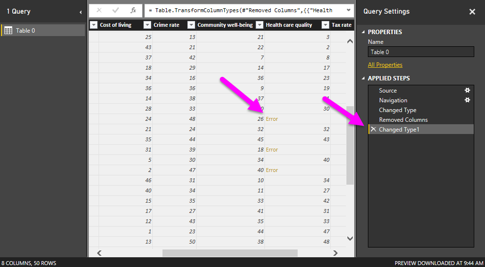
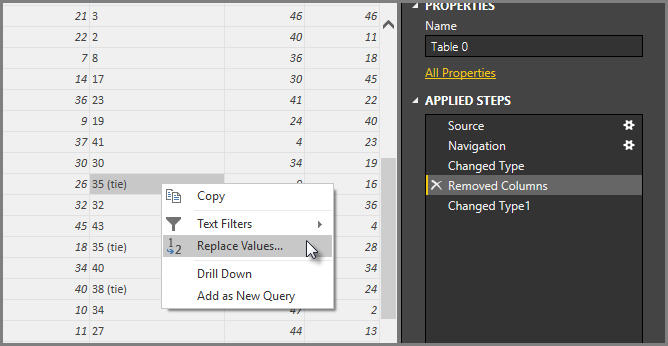
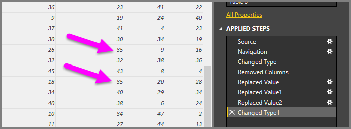
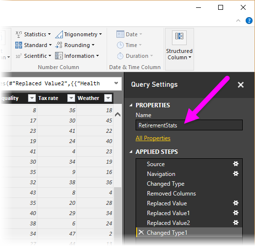
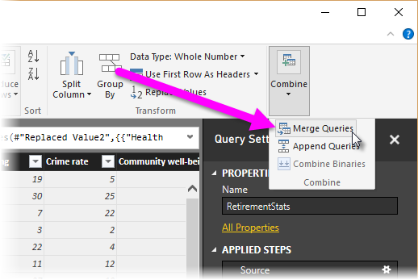

<properties
   pageTitle="Shape and combine data in Power BI Desktop"
   description="Shape and combine data in Power BI Desktop"
   services="powerbi"
   documentationCenter=""
   authors="davidiseminger"
   manager="mblythe"
   backup=""
   editor=""
   tags=""
   qualityFocus="no"
   qualityDate=""/>

<tags
   ms.service="powerbi"
   ms.devlang="NA"
   ms.topic="article"
   ms.tgt_pltfrm="NA"
   ms.workload="powerbi"
   ms.date="09/29/2016"
   ms.author="davidi"/>
# Shape and combine data in Power BI Desktop

With <bpt id="p1">**</bpt>Power BI Desktop<ept id="p1">**</ept>, you can connect to many different types of data sources, then shape the data to meet your needs. <bpt id="p1">*</bpt>Shaping<ept id="p1">*</ept> data means transforming the data – such as renaming columns or tables, changing text to numbers, removing rows, setting the first row as headers, and so on. <bpt id="p1">*</bpt>Combining<ept id="p1">*</ept> data means connecting to two or more data sources, shaping them as needed, then consolidating ** them into one useful query.

This document demonstrates how to shape a query using Power BI Desktop, highlighting some of the most common tasks. The query used here is described in more detail, including how to create the query from scratch, in <bpt id="p1">[</bpt>Getting Started with Power BI Desktop<ept id="p1">](powerbi-desktop-getting-started.md)</ept>.

It’s useful to know that the <bpt id="p1">**</bpt>Query Editor<ept id="p1">**</ept> in Power BI Desktop makes ample use of right-click menus, as well as the ribbon. Most of what you can select in the <bpt id="p1">**</bpt>Transform<ept id="p1">**</ept> ribbon is also available by right-clicking an item (such as a column) and choosing from the menu that appears.

## Shape Data

When you shape data in the Query Editor, you’re providing step-by-step instructions (that Query Editor carries out for you) to adjust the data as Query Editor loads and presents it. The original data source is not affected; only this particular view of the data is adjusted, or <bpt id="p1">*</bpt>shaped<ept id="p1">*</ept>.

The steps you specify (such as rename a table, transform a data type, or delete columns) are recorded by Query Editor, and each time this query connects to the data source those steps are carried out so that the data is always shaped the way you specify. This process occurs whenever you use the Query Editor feature of Power BI Desktop, or for anyone who uses your shared query, such as on the <bpt id="p1">**</bpt>Power BI<ept id="p1">**</ept> service. Those steps are captured, sequentially, in the <bpt id="p1">**</bpt>Query Settings<ept id="p1">**</ept> pane under <bpt id="p2">**</bpt>Applied Steps<ept id="p2">**</ept>.

The following image shows the <bpt id="p1">**</bpt>Query Settings<ept id="p1">**</ept> pane for a query that has been shaped – we’ll go through each of those steps in the next few paragraphs.

Using the retirement data from <bpt id="p1">[</bpt>Getting Started with Power BI Desktop<ept id="p1">](https://powerbi.uservoice.com/knowledgebase/articles/471664)</ept>, which we found by connecting to a Web data source, let’s shape that data to fit our needs.

For starters, one column's scores were not automatically transformed from text to numbers when Query Editor loaded the table, and we need them to be numbers. No problem – just right-click the column header, and select <bpt id="p1">**</bpt>Change Type <ph id="ph1">\&gt;</ph> Whole Number<ept id="p1">**</ept> to change them. To choose more than one column, first select a column then hold down <bpt id="p1">**</bpt>SHIFT<ept id="p1">**</ept>, select additional adjacent columns, and then right-click a column header to change all selected columns. You can also use the <bpt id="p1">**</bpt>CTRL<ept id="p1">**</ept> key to choose non-adjacent columns.

You can also <bpt id="p1">*</bpt>transform<ept id="p1">*</ept> those columns from text to header from the <bpt id="p2">**</bpt>Transform<ept id="p2">**</ept> ribbon. Here’s the <bpt id="p1">**</bpt>Transform<ept id="p1">**</ept> ribbon, with an arrow pointing toward the <bpt id="p2">**</bpt>Data Type<ept id="p2">**</ept> button, which lets you transform the current data type to another.

Note that in <bpt id="p1">**</bpt>Query Settings<ept id="p1">**</ept>, the <bpt id="p2">**</bpt>Applied Steps<ept id="p2">**</ept> reflect any shaping steps applied to the data. If I want to remove any step from the shaping process, I simply select the <bpt id="p1">**</bpt>X<ept id="p1">**</ept> to the left of the step. In the following image, <bpt id="p1">**</bpt>Applied Steps<ept id="p1">**</ept> reflects the steps so far: connecting to the website (<bpt id="p2">**</bpt>Source<ept id="p2">**</ept>); selecting the table (<bpt id="p3">**</bpt>Navigation<ept id="p3">**</ept>); and while loading the table, Query Editor automatically changed text-based number columns from <bpt id="p4">*</bpt>Text<ept id="p4">*</ept> to <bpt id="p5">*</bpt>Whole Number<ept id="p5">*</ept> (<bpt id="p6">**</bpt>Changed Type<ept id="p6">**</ept>). One column of rankings was not automatically changed to a number-based type, and we'll find out why in the next few paragraphs.

Before we can work with this query, we need to make a few changes to get its data where we want it:

-   <bpt id="p1">*</bpt>Remove the first column<ept id="p1">*</ept> – we don’t need it, it just includes redundant rows that say “Check out how your state ranks for retirement” which is an artifact of this data source being a Web-based table

-   <bpt id="p1">*</bpt>Fix a few Errors<ept id="p1">*</ept> – one of the columns, <bpt id="p2">**</bpt>Health care quality<ept id="p2">**</ept>, contains a few ties in states' rankings, which was noted on the website by having the text <bpt id="p3">*</bpt>(tie)<ept id="p3">*</ept> after their numbers. That works well on the website, but it requires that we transform the column from text to data manually. It's easy to fix this using Power BI Desktop, and doing so demonstrates a cool feature of <bpt id="p1">**</bpt>Applied Steps<ept id="p1">**</ept> in Query

-   <bpt id="p1">*</bpt>Change the Table Name<ept id="p1">*</ept> – that <bpt id="p2">**</bpt>Table 0<ept id="p2">**</ept> is not a useful descriptor, but changing it simple

To remove the first column, simply select the column and choose the <bpt id="p1">**</bpt>Home<ept id="p1">**</ept> tab from the ribbon, then <bpt id="p2">**</bpt>Remove Columns<ept id="p2">**</ept> as shown in the following figure.

Next we need to address the text column, and transform it into numbers. At first it seems straightforward, that we can just change the type of the <bpt id="p1">**</bpt>Health care quality<ept id="p1">**</ept> column from text to number (such as <bpt id="p2">*</bpt>Whole Number<ept id="p2">*</ept>, or <bpt id="p3">*</bpt>Decimal Number<ept id="p3">*</ept>). But when we change the type from <bpt id="p1">**</bpt>Text<ept id="p1">**</ept> to <bpt id="p2">**</bpt>Whole Number<ept id="p2">**</ept>, then look through the values in that column, we find that Query Editor reports a few errors.

There are a few ways to get more information about each error. You can select the cell (without clicking on the word <bpt id="p1">**</bpt>Error<ept id="p1">**</ept>), or click the word <bpt id="p2">**</bpt>Error<ept id="p2">**</ept> directly. If you select the cell <bpt id="p1">*</bpt>without<ept id="p1">*</ept> clicking directly on the word <bpt id="p2">**</bpt>Error<ept id="p2">**</ept>, Query Editor displays the error information on the bottom of the window.

If you click the word <bpt id="p1">*</bpt>Error<ept id="p1">*</ept> directly, Query creates an <bpt id="p2">**</bpt>Applied Step<ept id="p2">**</ept> in the <bpt id="p3">**</bpt>Query Settings<ept id="p3">**</ept> pane and displays information about the error.

To get back to the Query Editor, you have to remove that step by selecting the <bpt id="p1">**</bpt>X<ept id="p1">**</ept> next to it.

When we select the most recent <bpt id="p1">**</bpt>Applied Step<ept id="p1">**</ept>, we see the error just described, as shown in the following image.

Since Query Editor records steps sequentially, we can select the step prior to changing the type, in <bpt id="p1">**</bpt>Applied Steps<ept id="p1">**</ept>, and see what the value of that cell is prior to the transformation, as shown in the following image.

Okay, now we can fix those values, and <bpt id="p1">*</bpt>then<ept id="p1">*</ept> change the type. Since Query Editor records the steps sequentially, yet independently of each other, you can move each <bpt id="p1">**</bpt>Applied Step<ept id="p1">**</ept> up or down in the sequence. Just right-click any step, and Query Editor provides a menu that lets you do the following: <bpt id="p1">**</bpt>Rename<ept id="p1">**</ept>, <bpt id="p2">**</bpt>Delete<ept id="p2">**</ept>, <bpt id="p3">**</bpt>Delete<ept id="p3">**</ept> <bpt id="p4">**</bpt>Until End<ept id="p4">**</ept> (remove the current step, and all subsequent steps too), <bpt id="p5">**</bpt>Move Up<ept id="p5">**</ept>, or <bpt id="p6">**</bpt>Move Down<ept id="p6">**</ept>.

In addition, you can select an <bpt id="p1">**</bpt>Applied Step<ept id="p1">**</ept> anywhere in the list, and continue shaping the data at that point in the sequence. Query Editor will automatically insert a new step directly after the currently selected <bpt id="p1">**</bpt>Applied Step<ept id="p1">**</ept>. Let's give that a try.

First, we select the <bpt id="p1">**</bpt>Applied Step<ept id="p1">**</ept> prior to changing the type of the <bpt id="p2">**</bpt>Health care quality<ept id="p2">**</ept> column. Then we replace the values that have the text "(tie)" in the cell so that only the number remains. Right-click the cell that contains "35 (tie)" and select <bpt id="p1">*</bpt>Replace Values...<ept id="p1">*</ept> from the menu that appears. Note which <bpt id="p1">**</bpt>Applied Step<ept id="p1">**</ept> is currently selected (the step prior to changing the type).

Since we're inserting a step, Query Editor warns us about the danger of doing so - subsequent steps could cause the query to break. We need to be careful, and thoughtful! Since this is a tutorial, and we're highlighting a really cool feature of Query Editor to demonstrate how you can create, delete, insert, and reorder steps, we'll push ahead and select <bpt id="p1">**</bpt>Insert<ept id="p1">**</ept>.

There are three ties, so we replace the values for each. When you create a new Applied Step, Query Editor names it based on the action - in this case, <bpt id="p1">**</bpt>Replaced Value<ept id="p1">**</ept>. When you have more than one step with the same name in your query, Query Editor adds a number (in sequence) to each subsequent <bpt id="p1">**</bpt>Applied Step<ept id="p1">**</ept> to differentiate between them.

The following screen shows the three <bpt id="p1">**</bpt>Replaced Value<ept id="p1">**</ept> steps in <bpt id="p2">**</bpt>Query Settings<ept id="p2">**</ept>, but it also shows something else that's even more interesting: since we removed each instance of the text "(tie)" from the <bpt id="p3">**</bpt>Health care quality<ept id="p3">**</ept> column, the <bpt id="p4">**</bpt>Changed Type<ept id="p4">**</ept> step now completes <bpt id="p5">*</bpt>with no errors<ept id="p5">*</ept>.

<bpt id="p1">**</bpt>Note:<ept id="p1">**</ept> You can also <bpt id="p2">**</bpt>Remove Errors<ept id="p2">**</ept> (using the ribbon or the right-click menu), which removes any rows that have errors. In this case it would’ve removed all the states that had "<bpt id="p1">*</bpt>(tie)<ept id="p1">*</ept>" from our data, and we didn’t want to do that – we like all the states, and want to keep them in the table.

Okay that was a little involved, but it was a good example of how powerful and versatile Query Editor can be.

Lastly, we want to change the name of that table to something descriptive. When we get to creating reports, it’s especially useful to have descriptive table names, especially when we connect to multiple data sources, and they’re all listed in the <bpt id="p1">**</bpt>Fields<ept id="p1">**</ept> pane of the <bpt id="p2">**</bpt>Report<ept id="p2">**</ept> view.

Changing the table name is easy: in the <bpt id="p1">**</bpt>Query Settings<ept id="p1">**</ept> pane, under <bpt id="p2">**</bpt>Properties<ept id="p2">**</ept>, simply type in the new name of the table, as shown in the following image, and hit <bpt id="p3">**</bpt>Enter<ept id="p3">**</ept>. Let’s call this table <bpt id="p1">*</bpt>RetirementStats<ept id="p1">*</ept>.

Okay, we’ve shaped that data to the extent we need to. Next let’s connect to another data source, and combine data.

## Combine Data

That data about various states is interesting, and will be useful for building additional analysis efforts and queries. But there’s one problem: most data out there uses a two-letter abbreviation for state codes, not the full name of the state. We need some way to associate state names with their abbreviations.

We’re in luck: there’s another public data source that does just that, but it needs a fair amount of shaping before we can connect it to our retirement table. Here’s the Web resource for state abbreviations:

<http://en.wikipedia.org/wiki/List_of_U.S._state_abbreviations>

From the <bpt id="p1">**</bpt>Home<ept id="p1">**</ept> ribbon in Query Editor, we select <bpt id="p2">**</bpt>New Source <ph id="ph1">\&gt;</ph> Web<ept id="p2">**</ept> and type the address, select OK, and the Navigator shows what it found on that Web page.

 

We select <bpt id="p1">**</bpt>Table[edit]<ept id="p1">**</ept> because that includes the data we want, but it’s going to take quite a bit of shaping to pare that table’s data down to what we want.

> <bpt id="p1">**</bpt>Tip:<ept id="p1">**</ept> Is there a faster or easier way to accomplish the steps below? Yes, we could create a <bpt id="p1">*</bpt>relationship<ept id="p1">*</ept> between the two tables, and shape the data based on that relationship. The following steps are still good to learn for working with tables, just know that relationships can help you quickly use data from multiple tables.

To get this data into shape, we take the following steps:

-   Remove the top two rows – they’re a result of the way that Web page’s table was created, and we don’t need them. From the <bpt id="p1">**</bpt>Home<ept id="p1">**</ept> ribbon, select <bpt id="p2">**</bpt>Reduce Rows <ph id="ph1">\&gt;</ph> Remove Rows <ph id="ph2">\&gt;</ph> Remove Top Rows<ept id="p2">**</ept>.

The <bpt id="p1">**</bpt>Remove Top Rows<ept id="p1">**</ept> window appears, letting you specify how many rows you want to remove.

-   Remove the bottom 26 rows – they’re all the territories, which we don’t need to include. From the <bpt id="p1">**</bpt>Home<ept id="p1">**</ept> ribbon, select <bpt id="p2">**</bpt>Reduce Rows <ph id="ph1">\&gt;</ph> Remove Rows <ph id="ph2">\&gt;</ph> Remove Bottom Rows<ept id="p2">**</ept>.

-   Since the RetirementStats table doesn't have information for Washington DC, we need to filter it from our list. Select the drop-down arrow beside the Region Status column, then clear the checkbox beside <bpt id="p1">**</bpt>Federal district<ept id="p1">**</ept>.

-   Remove a few unneeded columns – we only need the mapping of state to its official two-letter abbreviation, so we can remove the following columns: <bpt id="p1">**</bpt>Column2<ept id="p1">**</ept>, <bpt id="p2">**</bpt>Column3<ept id="p2">**</ept>, and then <bpt id="p3">**</bpt>Column5<ept id="p3">**</ept> through <bpt id="p4">**</bpt>Column10<ept id="p4">**</ept>. First select Column2, then hold down the <bpt id="p1">**</bpt>CTRL<ept id="p1">**</ept> key and select the other columns to be removed (this lets you select multiple, non-contiguous columns). From the Home tab on the ribbon, select <bpt id="p1">**</bpt>Remove Columns <ph id="ph1">\&gt;</ph> Remove Columns<ept id="p1">**</ept>.

-   Use the first row as headers – since we removed the top three rows, the current top row is the header we want. You can select <bpt id="p1">**</bpt>Use First Row As Headers<ept id="p1">**</ept> from the <bpt id="p2">**</bpt>Home<ept id="p2">**</ept> tab, or from the <bpt id="p3">**</bpt>Transform<ept id="p3">**</ept> tab in the ribbon.

<bpt id="p1">**</bpt>Note:<ept id="p1">**</ept> This is a good time to point out that the <bpt id="p2">*</bpt>sequence<ept id="p2">*</ept> of applied steps in Query Editor is important, and can affect how the data is shaped. It’s also important to consider how one step may impact another subsequent step; if you remove a step from the Applied Steps, subsequent steps may not behave as originally intended, because of the impact of the query’s sequence of steps.

<bpt id="p1">**</bpt>Another Note:<ept id="p1">**</ept> When you resize the Query Editor window to make the width smaller, some ribbon items are condensed to make the best use of visible space. When you increase the width of the Query Editor window, the ribbon items expand to make the most use of the increased ribbon area.

-   Rename the columns, and the table itself – as usual, there are a few ways to rename a column; first select the column, then either select <bpt id="p1">**</bpt>Rename<ept id="p1">**</ept> from the <bpt id="p2">**</bpt>Transform<ept id="p2">**</ept> tab on the ribbon, or right-click and select <bpt id="p3">**</bpt>Rename…<ept id="p3">**</ept> from the menu that appears. The following image has arrows pointing to both options; you only need to choose one.

Let’s rename them to <bpt id="p1">*</bpt>State Name<ept id="p1">*</ept> and <bpt id="p2">*</bpt>State Code<ept id="p2">*</ept>. To rename the table, just type the name into the <bpt id="p1">**</bpt>Name<ept id="p1">**</ept> box in the <bpt id="p2">**</bpt>Query Settings<ept id="p2">**</ept> pane. Let’s call this table <bpt id="p1">*</bpt>StateCodes<ept id="p1">*</ept>.

Now that we’ve shaped the StateCodes table the way we want, let’s combine these two tables, or queries, into one; since the tables we now have are a result of the queries we applied to the data, they’re often referred to as <bpt id="p1">*</bpt>queries<ept id="p1">*</ept>.

There are two primary ways of combining queries – <bpt id="p1">*</bpt>merging<ept id="p1">*</ept> and <bpt id="p2">*</bpt>appending<ept id="p2">*</ept>.

When you have one or more columns that you’d like to add to another query, you <bpt id="p1">**</bpt>merge<ept id="p1">**</ept> the queries. When you have additional rows of data that you’d like to add to an existing query, you <bpt id="p1">**</bpt>append<ept id="p1">**</ept> the query.

In this case we want to merge queries. To get started, from the left pane of Query Editor we select the query <bpt id="p1">*</bpt>into which<ept id="p1">*</ept> we want the other query to merge, which in this case is <bpt id="p2">*</bpt>RetirementStats<ept id="p2">*</ept>. Then select <bpt id="p1">**</bpt>Combine <ph id="ph1">\&gt;</ph> Merge Queries<ept id="p1">**</ept> from the <bpt id="p2">**</bpt>Home<ept id="p2">**</ept> tab on the ribbon.

You may be prompted to set the privacy levels, to ensure the data is combined without including or transferring data you didn't want transferred.

Next the <bpt id="p1">**</bpt>Merge<ept id="p1">**</ept> window appears, prompting us to select which table we’d like merged into the selected table, and then, the matching columns to use for the merge. Select State from the <bpt id="p1">*</bpt>RetirementStats<ept id="p1">*</ept> table (query), then select the <bpt id="p2">*</bpt>StateCodes<ept id="p2">*</ept> query (easy in this case, since there’s only one other query – when you connect to many data sources, there are many queries to choose from). When we select the correct matching columns – <bpt id="p1">**</bpt>State<ept id="p1">**</ept> from <bpt id="p2">*</bpt>RetirementStats<ept id="p2">*</ept>, and <bpt id="p3">**</bpt>State Name<ept id="p3">**</ept> from <bpt id="p4">*</bpt>StateCodes<ept id="p4">*</ept> – the <bpt id="p5">**</bpt>Merge<ept id="p5">**</ept> window looks like the following, and the <bpt id="p6">**</bpt>OK<ept id="p6">**</ept> button is enabled.

A <bpt id="p1">**</bpt>NewColumn<ept id="p1">**</ept> is created at the end of the query, which is the contents of the table (query) that was merged with the existing query. All columns from the merged query are condensed into the <bpt id="p1">**</bpt>NewColumn<ept id="p1">**</ept>, but you can select to <bpt id="p2">**</bpt>Expand<ept id="p2">**</ept> the table, and include whichever columns you want.

To Expand the merged table, and select which columns to include, select the expand icon (<ph id="ph1"></ph>). The <bpt id="p1">**</bpt>Expand<ept id="p1">**</ept> window appears.

In this case, we only want the <bpt id="p1">**</bpt>State Code<ept id="p1">**</ept> column, so we select only that column and then select <bpt id="p2">**</bpt>OK<ept id="p2">**</ept>. We clear the checkbox from Use original column name as prefix because we don’t need or want that; if we leave that selected, the merged column would be named <bpt id="p1">**</bpt>NewColumn.State Code<ept id="p1">**</ept> (the original column name, or <bpt id="p2">**</bpt>NewColumn<ept id="p2">**</ept>, then a dot, then the name of the column being brought into the query).

<bpt id="p1">**</bpt>Note:<ept id="p1">**</ept> Want to play around with how to bring in that <bpt id="p2">**</bpt>NewColumn<ept id="p2">**</ept> table? You can experiment a bit, and if you don’t like the results, just delete that step from the <bpt id="p1">**</bpt>Applied Steps<ept id="p1">**</ept> list in the <bpt id="p2">**</bpt>Query Settings<ept id="p2">**</ept> pane; your query returns to the state prior to applying that <bpt id="p3">**</bpt>Expand<ept id="p3">**</ept> step. It’s like a free do-over, which you can do as many times as you like until the expand process looks the way you want it.

We now have a single query (table) that combined two data sources, each of which has been shaped to meet our needs. This query can serve as a basis for lots of additional, interesting data connections – such as housing cost statistics, demographics, or job opportunities in any state.

To apply changes and close Query Editor, select Close &amp; Apply from the <bpt id="p1">**</bpt>Home<ept id="p1">**</ept> ribbon tab. The transformed dataset appears in Power BI Desktop, ready to be used for creating reports.

## Más información

There are all sorts of things you can do with Power BI Desktop. For more information on its capabilities, check out the following resources:

-   [Getting Started with Power BI Desktop](powerbi-desktop-getting-started.md)

-   [Query Overview with Power BI Desktop](powerbi-desktop-query-overview.md)

-   [Data Sources in Power BI Desktop](powerbi-desktop-data-sources.md)

-   [Connect to Data in Power BI Desktop](powerbi-desktop-connect-to-data.md)

-   [Common Query Tasks in Power BI Desktop](powerbi-desktop-common-query-tasks.md)   

Want to give us feedback? Great – use the <bpt id="p1">**</bpt>Send Feedback<ept id="p1">**</ept> menu item in Power BI Desktop. We look forward to hearing from you!

 
