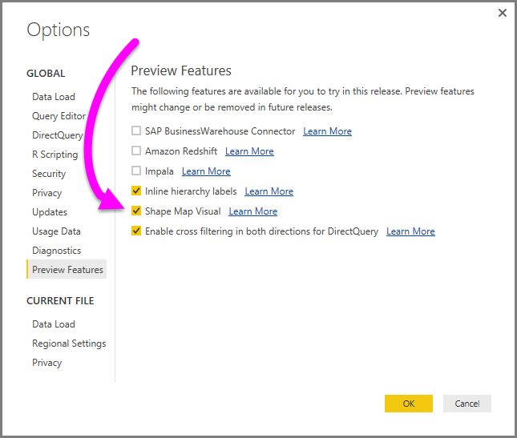
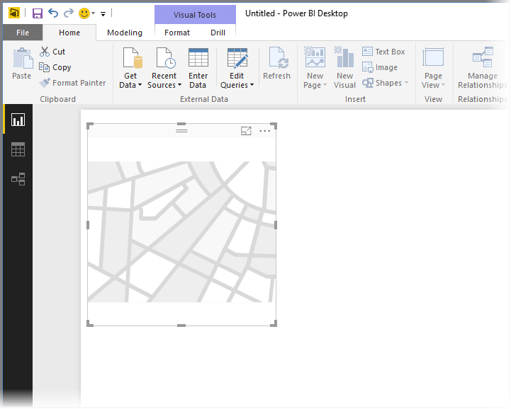
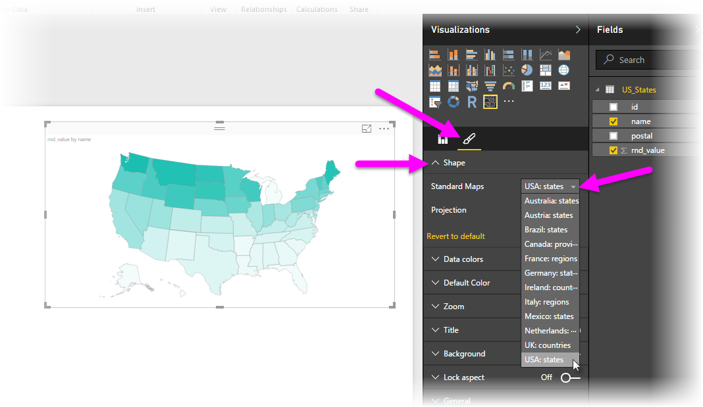
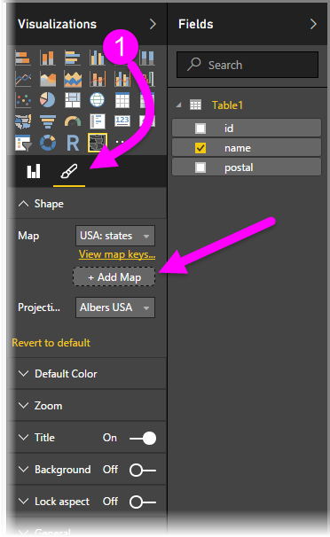

<properties
   pageTitle="Usar asignaciones de formas en Power BI Desktop (vista previa)"
   description="Crear comparaciones relativas a las regiones con asignaciones de formas en Power BI Desktop"
   services="powerbi"
   documentationCenter=""
   authors="davidiseminger"
   manager="mblythe"
   backup=""
   editor=""
   tags=""
   qualityFocus="no"
   qualityDate=""/>

<tags
   ms.service="powerbi"
   ms.devlang="NA"
   ms.topic="article"
   ms.tgt_pltfrm="NA"
   ms.workload="powerbi"
   ms.date="10/12/2016"
   ms.author="davidi"/>

# Asignaciones de formas en Power BI Desktop (vista previa)

En Power BI Desktop, se crea un **mapa de forma** visual para mostrar comparaciones relativas de las regiones en un mapa aplicando colores diferentes para distintas regiones. Diferencia el **mapa** visual, **mapa de forma** no se puede mostrar precisa señala las ubicaciones geográficas de los datos en un mapa; en su lugar, su propósito principal es mostrar comparaciones relativas de las regiones en un mapa mediante colores ellos de forma diferente.

            **Mapa de forma** elementos visuales se basan en los mapas ESRI/TopoJSON que tienen la capacidad atractiva para utilizar asignaciones personalizadas que se pueden crear como geográfica, disposiciones de ubicación, planos y otros. La capacidad de usar mapas personalizados no está disponible en esta versión preliminar de **mapa de forma**, pero asignaciones personalizadas se habilitará cuando esta función se extrae en vista previa, que se espera con la siguiente actualización mensual de Power BI Desktop.

## Crear asignaciones de formas

Puede probar el **mapa de forma** control con los mapas que se entrega con esta versión de vista previa, o puede usar su propio mapa personalizado siempre que cumpla los requisitos descritos en la sección siguiente llamada **utilizar mapas personalizados**.

El **mapa de forma** visual está en vista previa y debe estar habilitado en Power BI Desktop. Habilitado **mapa de forma**, seleccione **archivo > Opciones y configuración > Opciones > características de vista previa**, a continuación, seleccione la **mapa de forma** casilla de verificación. Debe reiniciar Power BI Desktop después de realizar la selección.

Una vez **mapa de forma** está habilitado, haga clic en el **mapa de forma** control desde el **visualizaciones** panel.

Power BI Desktop crea vacío **mapa de forma** lienzo de diseño visual.

Siga estos pasos para crear un **mapa de forma**:

1.  En la **campos** panel, arrastre un campo de datos que tiene los nombres de región (o abreviaturas) la **ubicación** depósito y una medida de datos de campo en el **valores** depósito (no verá un mapa todavía).

    > 
            **Nota:** consulte la sección **obtener datos del mapa**, a continuación, para obtener información sobre cómo obtener rápidamente los datos de mapa para probar **mapa de forma**.

    

2.  En el **formato** panel Configuración, expanda **forma**, y seleccione uno de los **mapas estándar** desplegable para mostrar los datos. En este momento la representación aparece como se muestra en la siguiente imagen.

    

    > 
            **Nota:** en la **claves región** sección al final de este artículo es una colección de tablas que tienen claves de regiones de asignación que puede usar para probar el **mapa de forma** visual.

3.  A continuación, puede modificar la proyección del mapa y hacer zoom de configuración, así como los colores de los puntos de datos, desde el **formato** panel Configuración. También puede modificar la configuración del zoom. Por ejemplo, puede cambiar los colores, conjunto de máximos y mínimos y así sucesivamente.

    

4.  También puede agregar una columna de datos de la categoría a la **leyenda** depósito y clasificar las áreas de mapa basadas en categorías.

## Usar asignaciones personalizadas

Puede utilizar asignaciones personalizadas con **mapa de forma** mientras están en el **TopoJSON** formato. Si la asignación está en otro formato, puede usar herramientas en línea como [**Modelador de mapa**](http://mapshaper.org/) para convertir su *archivos de forma* o la *GeoJSON* asigna a la **TopoJSON** formato.

Para usar su **TopoJSON** archivo de asignación, agregue un elemento visual ShapeMap al informe y agregue algunos datos a la *ubicación* y *valores* depósitos. A continuación, en la **visualizaciones** panel con el **formato** sección seleccionada (el pincel icono, se muestra como (1) en la imagen siguiente), expanda el **forma** sección y seleccione **+ Agregar asignación**.

## Obtener datos de mapa

Para obtener rápidamente los datos en un modelo para que pueda probar **mapa de forma**, puede copiar una de las tablas al final de este artículo y luego seleccione **Escriba datos** desde el **Inicio** cinta de opciones.

A continuación, puede pegar la tabla en Power BI Desktop. La fila superior se identifica automáticamente como un encabezado.

Puede especificar una nueva columna escribiendo un nuevo nombre de columna (en la columna en blanco a la derecha) y luego agregar valores en cada celda, igual que puede hacer en Excel. Cuando termine, seleccione **carga** y la tabla se agrega al modelo de datos para Power BI Desktop.

## Comportamiento de vista previa y requisitos

Hay algunas consideraciones y requisitos para esta vista previa de la versión de **mapa de forma**:

-   El **mapa de forma** visual está en vista previa y debe estar habilitado en Power BI Desktop. Habilitado **mapa de forma**, seleccione **archivo > Opciones y configuración > Opciones > características de vista previa**, a continuación, seleccione la **mapa de forma** casilla de verificación.

-   Actualmente, también debe tener la **valores** depósito establecido para el **leyenda** clasificación funcione correctamente. Prevemos que mejorar este comportamiento en la versión final de **mapa de forma**.

-   La versión de lanzamiento **mapa de forma** tendrán una interfaz de usuario que muestra las claves de asignación de la asignación seleccionada; en esta vista previa, puede hacer referencia a las claves de la región de asignación en las tablas que se encuentra en la siguiente **claves región** sección de este artículo.

## Claves de región

Utilice el siguiente **claves región** en esta versión de vista previa para probar **mapa de forma**.

### Australia: Estados

|id|abbr|ISO|name|postal|
|---|---|---|---|---|
|AU wa| WA| AU WA|  Australia occidental|  WA|
|vic au|Vic|VIC AU| Victoria|   VIC|
|AU-tarea |Tareas|AU-TAREA|    Tasmania    |TAREAS|
|AU-sa  |SA |AU-SA  |Australia meridional|   SA|
|AU-Box |Qld|AU-BOX |Queensland|    QLD|
|AU-nt  |NT |AU-NT  |Territorio septentrional|    NT|
|AU-nsw |NSW|AU-NSW |Nueva Gales del sur|   NSW|
|act au |ACT|ACT AU |Territorio de la Capital Australiana|  ACT|

### Austria: Estados

|id|    ISO|    name|   en nombre de|    postal|
|---|---|---|---|---|
|en wi| AT-9|   Wien|   Viena| WI|
|en vo| AT-8|   Vorarlberg| Vorarlberg| VO|
|en tr| AT-7|   : Tirol|  Tyrol|  TR|
|en st| AT-6|   Steiermark| Styria| ST|
|en sz| AT-5|   Salzburgo|   Salzburgo|   SZ|
|en oo| AT-4|   Oberösterreich| Austria superior|  OO|
|en ningún| AT 3|   Niederösterreich|   Austria inferior|  NO|
|en ka| AT-2|   Kärnten|    Carinthia|  KA|
|en unidad de negocio| AT 1|   : Burgenland| : Burgenland| BU|

### Brasil: Estados

|id|
|---|
|Tocantins
|Pernambuco
|Goias
|Sergipe
|Sao Paulo
|Santa Catarina
|Roraima
|Rondonia
|Río Grande do Sul
|Río Grande do Norte
|Río de Janeiro
|Piaui
|Parana
|Paraiba
|Para
|Minas Gerais
|Mato Grosso
|Maranhao
|Realice Mato Grosso Sul
|Distrito Federal
|Ceara
|Espírito Santo
|Bahia
|Amazonas
|Amapa
|Alagoas
|Acre
|Zona litigated 1
|Zona litigated 2
|Zona litigated 3
|Zona litigated 4

### Canadá: provincias

|id|    ISO |name|  postal|
|---|---|---|---|
|CA nu| CA NU|  Nunavut|    NU|
|nt de la entidad emisora de certificados| NT DE LA ENTIDAD EMISORA DE CERTIFICADOS|  Territorios del noroeste|  NT
|CA yt| CA YT|  Yukon|  YT
|CA-sk| CA-SK|  Saskatchewan|   SK
|CA qc| CA QC|  Quebec| QC
|pe de la entidad emisora de certificados| PE DE LA ENTIDAD EMISORA DE CERTIFICADOS|  Isla del Príncipe Eduardo|   PE
|en CA| EN CA|  Ontario|    ON
|CA-ns| CA-NS|  Nueva Escocia |NS
|CA-nl| CA-NL|  Terranova y Labrador|  NL
|nb de CA| NB DE CA|  Nuevo Brunswick| NB
|mb de la entidad emisora de certificados| MB DE LA ENTIDAD EMISORA DE CERTIFICADOS|  Manitoba|   MB
|bc de CA| BC DE CA|  Columbia Británica    |CONTINUIDAD DEL NEGOCIO
|ab de la entidad emisora de certificados| AB DE LA ENTIDAD EMISORA DE CERTIFICADOS|  Alberta |AB

### Francia: regiones

|id |name|  en nombre de|
|---|---|---|
|Alsace |Alsace|    Alsace
|Alpes Rhone|   Rhône Alpes|    Alpes Rhone
|Costa de Provence-Alpes d'Azur|    Alpes de Provence de Côte d'Azur| Costa de Provence-Alpes d'Azur
|Poitou Charentes|  Poitou Charentes|   Poitou Charentes
|Picardie   |Picardie|  Picardy
|Paga de la Loire|  Paga de la Loire|   Paga de la Loire
|Nord-Pas-de-Calais|    Nord-Pas-de-Calais| Nord-Pas-de-Calais
|Pirineos MIDI| Pirineos MIDI|  Pirineos MIDI
|Lorraine|  Lorraine|   Lorraine
|Limousin|  Limousin|   Limousin
|Languedoc Rosellón|  Languedoc Rosellón|   Languedoc Rosellón
|Ile-del-Francia|    Isla-de-France|  Ile
|Haute Normandie|   Haute Normandie|    Normandía
|Franche-Comte| Franche Comté|  Franche-Comte
|Supuesto| Supuesto|  Córcega
|Champaña Ardenne| Champaña Ardenne|  Champaña Ardenne
|Loira centro|   Loira centro|    Loira centro
|Bretagne|  Bretagne|   Brittany
|Borgoña| Borgoña|  Rojo oscuro
|Basse Normandie|   Basse Normandie|    Normandía inferior
|Auvergne|  Auvergne|   Auvergne
|Aquitaine| Aquitaine|  Aquitaine

### Alemania: Estados

|id|    ISO|    name|   en nombre de|    postal
|---|---|---|---|---|
|de-ser| DE-SER|  Berlín| Berlín| SER
|de-ésimo| DE-ÉSIMO|  Thüringen|  Turingia|  TH
|de st| DE ST|  Anhalt Sachsen| Sajonia-Anhalt|  ST
|de-sn| DE-SN|  Sachsen |Sajonia|    SN
|de mv| DE MV|  Mecklenburg Vorpommern| Mecklenburg Vorpommern| MV
|bb de| BB DE|  Brandemburgo |Brandemburgo|   BB
|de-sh| DE-SH|  Schleswig-Holstein| Schleswig-Holstein| SH
|de-sl| DE-SL|  Sarre|   Sarre|   SL
|de usuario de confianza| DE USUARIO DE CONFIANZA|  Rheinland-Pfalz|    Renania Palatinado|   RP
|de nw| DE NW|  Renania Westfalen|    Renania del Norte-Westfalia| NW
|ni de| NI DE|  Niedersachsen|  Baja Sajonia|   NI
|de-he| DE-HE|  Hesse| Literatura seria e inquietante|  ÉL
|hh de| HH DE|  Hamburgo|    Hamburgo|    HH
|hb de| HB DE|  Bremen| Bremen| HB
|de-por| DE-POR|  Bayern| Baviera|    POR
|de bw| DE BW|  Baden-Wurtemberg|  Baden-Wurttemberg|  BW

### Irlanda: condados

|id|
|---|
|Wicklow
|Wexford
|Westmeath
|Waterford
|Sligo
|Tipperary
|Roscommon
|Offaly
|Monaghan
|Meath
|Mayo
|Louth
|Longford
|Limerick
|Leitrim
|Laoighis
|Kilkenny
|Kildare
|Kerry
|Galway
|Dublin
|Donegal
|Corcho
|Clare
|Cavan
|Carlow

### Italia: regiones

|id|ISO|name|en nombre de|postal|
|---|---|---|---|---|
|vn de TI| 34 DE TI|  Véneto| Véneto| VN
|TI vd| 23 DE TI|  Aosta|  Valle de Aosta|   VD
|TI um| TI 55|  Umbría| Umbría| MENSAJERÍA UNIFICADA
|TI tt| 32 DE TI|  Trentino-Alto Adige|    Tyrol Trentino sur|   TT
|tc de TI| TI 52|  Toscana|    Toscana|    TC
|sc de TI| 82 DE TI|  Sicilia|    Sicilia| SC
|sd de TI| TI 88|  Sardegna|   Cerdeña|   SD
|TI p.m.| 21 DE TI|  Piemonte|   Piedmont|   P. M.
|aprendizaje automático de TI| TI 67|  Molise| Molise| APRENDIZAJE AUTOMÁTICO
|TI AG.| 57 DE TI|  Las marcas| Las marcas| AG
|lm de TI| 25 DE TI|  Lombardia|  Lombardia|   LM
|lg de TI| TI 42|  Liguria|    Liguria|    LG
|TI lz| 62 DE TI|  Lacio|  Lacio|  LZ
|TI vf| TI 36|  Friul-Venecia Julia|  Friul-Venecia Julia|  VF
|lo-er| TI 45|  Emilia-Romagna| Emilia-Romagna| ER
|TI cm| 72 DE TI|  Campania|   Campania|   CM
|equilibrador de carga de TI| TI 78|  Calabria|   Calabria|   LB
|TI bc| 77 DE TI|  Basilicata| Basilicata| CONTINUIDAD DEL NEGOCIO
|pu de TI| TI 75|  Apulia| Puglia| PU
|TI ab| 65 DE TI|  Abruzzi|    Abruzzi|    AB

### México: Estados

|id|    abreviatura|    ISO|    name|   en nombre de|    postal|
|---|---|---|---|---|---|
|zac MX|    ZAC.|   ZAC MX| Zacatecas|  Zacatecas|  ZA
|MX yuc|    Yuc.|   MX YUC| Yucatán|    Yucatán|    YU
|MX-ver|    Ver.|   MX-VER| Veracruz|   Veracruz|   VE
|MX tla|    Tlax.|  MX TLA| Tlaxcala|   Tlaxcala|   TL
|tam MX|    Tamps.| TAM MX| TAMAULIPAS| TAMAULIPAS| TM
|ficha MX|    Ficha.|   FICHA MX| Tabasco|    Tabasco|    TB
|MX-hijo|    Hijo.|   MX-HIJO| Sonora| Sonora| POR LO QUE
|seno de MX|    Seno.|   SENO DE MX| Sinaloa|    Sinaloa|    SI
|slp MX|    S.L.P.| SLP MX| San Luis Potosí|    San Luis Potosí|    SL
|MX roo|    Q.R.|   MX ROO| Quintana Roo|   Quintana Roo|   QR
|MX que|    Qro.|   MX QUE| Querétaro|  Queretaro|  QE
|pue MX|    PUE.|   PUE MX| Puebla| Puebla| PU
|MX oax|    Oax.|   MX OAX| Oaxaca| Oaxaca| OA
|edición no lineal de MX|    N.L.|   EDICIÓN NO LINEAL DE MX| Nuevo León| Nuevo León| NL
|nay MX|    Nay.|   NAY MX| Nayarit|    Nayarit|    N/D
|MX más|    Mor.|   MX MÁS| Morelos|    Morelos|    SR.
|MX-mic|    Michigan.|  MX-MIC| Michoacán|  Michoacan|  MC
|MX mex|    Méx.|   MX MEX| Estado de México|   Estado de México|   MX
|MX jal|    JAL.|   MX JAL| Jalisco|    Jalisco|    JA
|ocultó MX|    HgO.|   OCULTÓ MX| Hidalgo|    Hidalgo|    ALTO
|grupos de MX|    Gro|   GRUPOS DE MX| Guerrero|   Guerrero|   GR
|gua MX|    Gto.|   GUA MX| Guanajuato| Guanajuato| GT
|MX-dur|    Dgo.|   MX-DUR| Durango|    Durango|    DU
|dif MX|    Col.|   DIF MX| Ciudad de México|   Ciudad de México|    DF
|col MX|    Coah.|  COL MX| Colima| Colima| CL
|MX coa|    Chis.|  MX COA| Coahuila|   Coahuila|   CA
|MX chh|    Chih.|  MX CHH| Chihuahua|  Chihuahua|  CH
|MX chp|    CDMX.|  MX CHP| Chiapas|    Chiapas|    CP
|cam MX|    Campamento.|  CAM MX| Campeche|   Campeche|   CM
|bcs MX|    B.C.S.| BCS MX| Baja California Sur|    Baja California Sur|    BS
|MX bcn|    A. C.|   MX BCN| Baja California|    Baja California|    BN
|MX agu|    Grupos de disponibilidad.|   MX AGU| Aguascalientes| Aguascalientes| AG

### Países Bajos: provincias

|id|    ISO|    name|   en nombre de|
|---|---|---|---|
|NL-zh| NL-ZH|  Zuid Holland|   Holanda sur
|NL-ze| NL-ZE|  Zeelands|    Zeelands
|NL-ut| NL-UT|  Utrecht|    Utrecht
|NL ov| NL OV|  Overijssel| Overijssel
|NL: Centro de notificaciones| NL: CENTRO DE NOTIFICACIONES|  Noord Holanda|  Norte de Holanda
|NL-nb| NL-NB|  Noord Brabante|  Brabante Norte
|li NL| LI NL|  Limburg|    Limburg
|NL-gr| NL-GR|  Groningen Tel.|  Groningen Tel.
|NL-ge| NL-GE|  Gelderland| Gelderland
|NL-fr| NL-FR|  Fryslân|    Friesland
|NL-fl| NL-FL|  Flevoland|  Flevoland
|NL-dr| NL-DR|  Drenthe|    Drenthe

### Reino Unido: países

|id|    ISO|    name|
|---|---|---|
|wls GB|    WLS GB| Gales
|sct GB|    SCT GB| Escocia
|nir GB|    NIR GB| Irlanda del Norte
|inglés GB|    INGLÉS GB| Inglaterra

### Estados UNIDOS: Estados

|id|    name|   postal|
|---|---|---|
|nos-mi| Michigan|   MI
|nos-ak| Alaska| AK
|nos-Hola| Hawai| ALTO
|nos-fl| Florida|    FL
|nos-la| Louisiana|  LA
|nos-ar| Arkansas|   AR
|nos-sc| Carolina del sur| SC
|nos-ga| Georgia|    GA
|nos-ms| Mississippi|    SA
|nos-al| Alabama|    AL
|nos-nm| Nuevo México| NM
|nos-tx| Texas|  TX
|nos-tn| Tennessee|  TN
|nos-CN| Carolina del Norte| NC
|nos-Aceptar| Oklahoma|   Aceptar
|nos-az| Arizona|    AZ
|nos-OP| Misuri|   MO
|nos-Virginia| Virginia|   VA
|nos-ks| Kansas| KS
|nos-ki| Kentucky|   KI
|nos-co| Colorado|   CO
|nos-md| Maryland|   MD
|nos-wv| Virginia Occidental|  WV
|nos-de| Delaware|   DE
|nos-dc| Distrito de Columbia|   Controlador de dominio
|nos-il| Illinois|   IL
|nos-oh| Ohio|   AH
|nos-ca| California| CA
|nos-ut| Utah|   UT
|nos-nv| Nevada| NV
|US-en| Indiana|    IN
|nos-nj| Nueva Jersey| NUEVA JERSEY
|nos-ri| Rhode Island|   RI
|nos-ct| Connecticut|    CT
|nos-pa| Pensilvania|   PA
|nos-ny| Nueva York|   NUEVA YORK
|nos-ne| Nebraska|   NE
|nos-ma| Massachusetts|  MA
|nos-ia| Iowa|   IA
|nos: Centro de notificaciones| Nueva Hampshire|  CENTRO DE NOTIFICACIONES
|nos- o| Oregón| O BIEN
|nos-MN.| Minnesota|  MN
|nos-vt| Vermont|    VT
|nos-id| Idaho|  ID
|nos-wi| Wisconsin|  WI
|nos-wy| Wyoming|    WY
|nos-sd| Dakota del sur|   SD
|nos-nd| Dakota del Norte|   ND
|nos-me| Maine|  ME
|nos-mt| Montana|    MT
|nos-wa| Washington| WA
