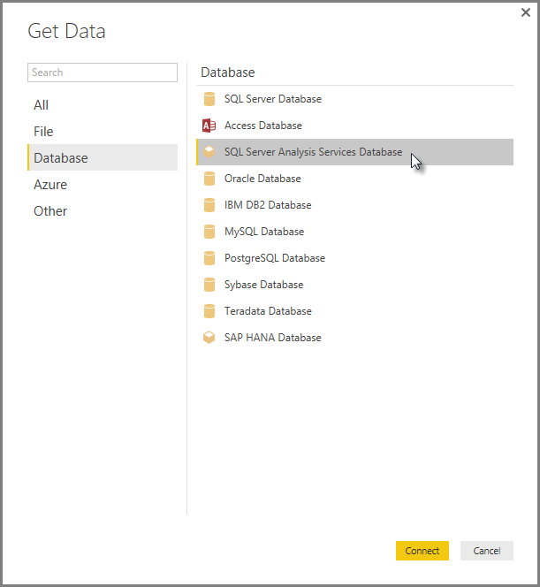

<properties
   pageTitle="Analysis Services Multidimensional data in Power BI Desktop"
   description="Analysis Services Multidimensional data in Power BI Desktop"
   services="powerbi"
   documentationCenter=""
   authors="davidiseminger"
   manager="mblythe"
   backup=""
   editor=""
   tags=""
   qualityFocus="no"
   qualityDate=""/>

<tags
   ms.service="powerbi"
   ms.devlang="NA"
   ms.topic="article"
   ms.tgt_pltfrm="NA"
   ms.workload="powerbi"
   ms.date="10/12/2016"
   ms.author="davidi"/>

# Connect to SSAS Multidimensional Models in Power BI Desktop  

With Power BI Desktop, you can access <bpt id="p1">**</bpt>SSAS Multidimensional models<ept id="p1">**</ept>, commonly referred to as <bpt id="p2">**</bpt>SSAS MD<ept id="p2">**</ept>.

To connect to an <bpt id="p1">**</bpt>SSAS MD<ept id="p1">**</ept> database, select <bpt id="p2">**</bpt>Get Data <ph id="ph1">&amp;gt;</ph> Database <ph id="ph2">&amp;gt;</ph> SQL Server Analysis Services Database<ept id="p2">**</ept> as shown in the following image.

<bpt id="p1">**</bpt>SSAS Multidimensional models<ept id="p1">**</ept> in Live connection mode are supported in both the Power BI service and in Power BI Desktop. You can also publish and upload reports that use <bpt id="p1">**</bpt>SSAS Multidimensional models<ept id="p1">**</ept> in Live mode to the Power BI service.

## Capabilities and features of SSAS MD
The following sections describe features and capabilities of Power BI and SSAS MD connections.

### Tabular metadata of multidimensional models
The following table shows the correspondence between multidimensional objects and the tabular metadata that's returned to Power BI Desktop. Power BI queries the model for tabular metadata, and based on the returned metadata, runs appropriate DAX queries against Analysis Services when you create a visualization such as a table, matrix, chart or slicer.

|BISM-Multidimentional object |Tabular Metadata|
|---|---|
|Cube|Modelo |
|Cube dimension | Tabla |
|Dimension attributes (Keys), Name) | Columnas  |
|Measure group | Tabla|
|Measure | Measure |
|Measures without associated Measure Group | Within table called <bpt id="p1">*</bpt>Measures<ept id="p1">*</ept>|
|Measure group -&gt; Cube dimension relationship | Relationship |
|Perspectiva | Perspectiva|
|KPI | KPI |
|User/Parent-Child hierarchies | Hierarchies |

### Measures, measure groups and KPIs
Measure groups in a multidimensional cube are exposed in Power BI as tables with the ∑ sign beside them in the <bpt id="p1">**</bpt>Fields<ept id="p1">**</ept> pane. Calculated measures that don't have an associated measure group are grouped under a special table called <bpt id="p1">*</bpt>Measures<ept id="p1">*</ept> in the tabular metadata.

In a multidimensional model, you can define a set of measures or KPIs in a cube to be located within a <bpt id="p1">*</bpt>Display folder<ept id="p1">*</ept>, which can help simplify complex models. Power BI recognizes Display folders in tabular metadata, and shows measures and KPIs within the Display folders. KPIs in multidimensional databases support <bpt id="p1">*</bpt>Value<ept id="p1">*</ept>, <bpt id="p2">*</bpt>Goal<ept id="p2">*</ept>, <bpt id="p3">*</bpt>Status Graphic<ept id="p3">*</ept> and <bpt id="p4">*</bpt>Trend Graphic<ept id="p4">*</ept>.

### Dimension attribute type
Multidimensional models also support associating dimension attributes with specific dimension attribute types. For example, a <bpt id="p1">**</bpt>Geography<ept id="p1">**</ept> dimension where the <bpt id="p2">*</bpt>City<ept id="p2">*</ept>, <bpt id="p3">*</bpt>State-Province<ept id="p3">*</ept>, <bpt id="p4">*</bpt>Country<ept id="p4">*</ept> and <bpt id="p5">*</bpt>Postal Code<ept id="p5">*</ept> dimension attributes have appropriate geography types associated with them are exposed in the tabular metadata. Power BI recognizes the metadata, enabling you to create map visualizations. You'll recognize these associations by the <bpt id="p1">*</bpt>map<ept id="p1">*</ept> icon next to element in the <bpt id="p2">**</bpt>Field<ept id="p2">**</ept> pane in Power BI.

Power BI can also render images when you provide a field containing URLs (Uniform Resource Locator) of the images. You can specify these fields as <bpt id="p1">*</bpt>ImageURL<ept id="p1">*</ept> type in SQL Server Data Tools (or subsequently in Power BI), and its type information is provided to Power BI in the tabular metadata. Power BI can then retrieve those images from the URL, and display them in visuals.

### Parent-child hierarchies
Multidimensional models support Parent-child hierarchies, which are presented as a <bpt id="p1">*</bpt>hierarchy<ept id="p1">*</ept> in the tabular metadata. Each level of the Parent-child hierarchy is exposed as a hidden column in the tabular metadata. The key attribute of the Parent-child dimension is not exposed in the tabular metadata.

### Dimension calculated members
Multidimensional models support creation of various types of <bpt id="p1">*</bpt>calculated members<ept id="p1">*</ept>. The two most common types of calculated members are the following:

-   Calculated members on attribute hierarchies and not sibling of <bpt id="p1">*</bpt>All<ept id="p1">*</ept>
-   Calculated members on user hierarchies

Multidimensional model expose <bpt id="p1">*</bpt>calculated members on attribute hierarchies<ept id="p1">*</ept> as values of a column. There are a few additional options and constraints while exposing this type of calculated member:
-   Dimension attribute can have an optional <bpt id="p1">*</bpt>UnknownMember<ept id="p1">*</ept>
-   An attribute containing calculated members cannot be the key attribute of the dimension, unless it is the only attribute of the dimension
-   An attribute containing calculated members cannot be a parent-child attribute

The calculated members of user hierarchies are not exposed in Power BI. Rather, you will be able to connect to a cube containing calculated members on user hierarchies, but you won't be able to see calculated members if they do not meet the constraints mentioned in the previous bulleted list.

### Seguridad
Multidimensional models support dimension and cell level security by way of <bpt id="p1">*</bpt>Roles<ept id="p1">*</ept>. When you connect to a cube with Power BI, you are authenticated and evaluated for appropriate permissions. When a user has <bpt id="p1">*</bpt>dimension security<ept id="p1">*</ept> applied, the respective dimension members are not seen by the user in Power BI. However, when a user has a <bpt id="p1">*</bpt>cell security<ept id="p1">*</ept> permission defined, where certain cells are restricted, then that user cannot connect to the cube using Power BI.

## Limitations of SSAS Multidimensional Models in Power BI Desktop
There are certain limitations to using <bpt id="p1">**</bpt>SSAS MD<ept id="p1">**</ept>:

-   Servers must be running SQL Server 2012 SP1 CU4 or later versions of Analysis Services for the Power BI Desktop SSAS MD connector to work properly
-   Cell level Formatting and translation features are not supported in this release of SSAS MD. These features will be enabled in upcoming releases of Power BI Desktop.
-   <bpt id="p1">*</bpt>Actions<ept id="p1">*</ept> and <bpt id="p2">*</bpt>Named Sets<ept id="p2">*</ept> are not exposed to Power BI, but you can still connect to cubes that also contain <bpt id="p3">*</bpt>Actions<ept id="p3">*</ept> or <bpt id="p4">*</bpt>Named sets<ept id="p4">*</ept> and create visuals and reports.

In addition, as mentioned earlier you cannot publish a report created with this version of <bpt id="p1">**</bpt>SSAS MD<ept id="p1">**</ept> to the Power BI service.

## Supported Features of SSAS MD in Power BI Desktop
The following features of SSAS MD are supported in Power BI Desktop:

-   Consumption of the following elements are supported in this release of <bpt id="p1">**</bpt>SSAS MD<ept id="p1">**</ept> (you can get <bpt id="p2">[</bpt>more information<ept id="p2">](https://msdn.microsoft.com/library/jj969574.aspx)</ept> about these features):
    - Display folders
    - KPI Trends
    - Default Members
    - Dimension Attributes
    - Dimension Calculated Members (must be a single real member when the dimension has more than one attribute, it cannot be the key attribute of the dimension unless it is the only attribute, and it cannot be a parent-child attribute)
    - Dimension Attribute types
    - Hierarchies
    - Measures (with or without Measure groups)
    - Measures as Variant
    - KPI
    - ImageUrls
    - Dimension security
