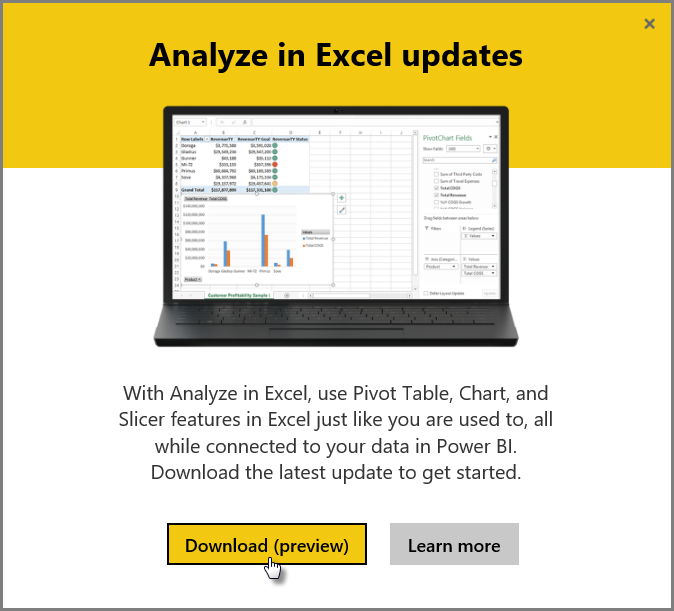
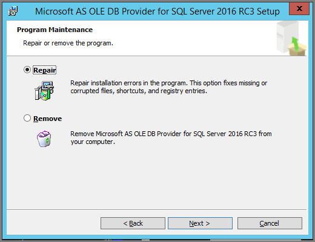

<properties
   pageTitle="Solución de problemas de analizar en Excel"
   description="Soluciones a problemas comunes para analizar en Excel"
   services="powerbi"
   documentationCenter=""
   authors="davidiseminger"
   manager="mblythe"
   backup=""
   editor=""
   tags=""
   qualityFocus=""
   qualityDate=""/>

<tags
   ms.service="powerbi"
   ms.devlang="NA"
   ms.topic="article"
   ms.tgt_pltfrm="NA"
   ms.workload="powerbi"
   ms.date="09/27/2016"
   ms.author="davidi"/>

# Solución de problemas de analizar en Excel

Puede haber ocasiones cuando utilizando analizar en Excel que obtendrá un resultado inesperado o la característica no funciona como esperaba. Esta página proporciona soluciones para problemas comunes al utilizar analizar en Excel.

> 
            **Nota:** hay una página independiente dedicada a describir y habilitar [analizar en Excel](powerbi-service-analyze-in-excel.md).

> Si se encuentra un caso que no se enumera a continuación y está causando problemas, puede pedir ayuda adicional en el [sitio de la Comunidad](http://community.powerbi.com/), o puede crear un [admite vale](https://powerbi.microsoft.com/support/).

Este artículo contiene las siguientes secciones de solución de problemas:

-   Actualizar las bibliotecas de Excel para el proveedor OLE DB
-   Determinar si necesita actualizar las bibliotecas de Excel
-   No se puede realizar la conexión error
-   Error prohibido
-   No hay modelos de datos
-   Error de token ha caducado
-   No se puede tener acceso a Analysis services local
-   Puede arrastrar ningún elemento hasta el área de valores de tabla dinámica (ninguna medida)

## Actualizar las bibliotecas de Excel para el proveedor OLE DB
Usar **analizar en Excel**, el equipo debe tener instalado un proveedor de OLE DB como actual. Esto [entrada de la Comunidad](http://community.powerbi.com/t5/Service/Analyze-in-Excel-Initialization-of-the-data-source-failed/m-p/30837#M8081) es una excelente fuente para comprobar la instalación del proveedor OLE DB o para descargar una versión actualizada.

Las bibliotecas de Excel se necesitan para que coincida con su versión de Windows en términos de nivel de bit. Si tiene instalada de Windows de 64 bits, debe instalar al proveedor OLE DB de 64 bits.

Para descargar las bibliotecas más recientes de Excel, visite Power BI y seleccione el **flecha abajo** en la esquina superior derecha del servicio Power BI, a continuación, seleccione **analizar en actualizaciones de Excel**.

En el cuadro de diálogo que aparece, seleccione **descarga (vista previa)**.

## Determinar si necesita actualizar las bibliotecas de Excel
Puede descargar la versión más reciente de las bibliotecas de proveedor OLE DB de Excel en los vínculos de la sección anterior. Una vez que descargue la biblioteca de proveedor ANTERIOR base de datos adecuada y comenzar la instalación, se realizan comprobaciones en la versión actual instalada.

Si las bibliotecas de cliente de proveedor OLE DB de Excel están actualizadas, verá un cuadro de diálogo es similar a la siguiente:

C:\Users\davidi\Desktop\powerbi-Content-pr\articles\media\powerbi-Desktop-Troubleshooting-ANALYZE-in-Excel

Como alternativa, si la nueva versión que está instalando es más reciente que la versión en el equipo, aparece el cuadro de diálogo siguiente:

Si ve el cuadro de diálogo que le pide que actualice, debe continuar con la instalación para obtener la versión más reciente del proveedor OLE DB instalado en el equipo.

## No se puede realizar la conexión error
La causa principal de un *no se puede realizar la conexión* error es que las bibliotecas de cliente de proveedor de OLE DB de su equipo no están actualizadas. Para obtener información acerca de cómo determinar la actualización correcta y vínculos de descarga, consulte **bibliotecas de Excel de actualización para el proveedor OLE DB** anteriormente en este artículo.

## Error prohibido
Algunos usuarios tienen más de una cuenta de Power BI y cuando Excel intenta conectarse a Power BI mediante las credenciales existentes, puede usar las credenciales que no tienen acceso al conjunto de datos o el informe que desea tener acceso.

Cuando esto ocurre, recibirá un error titulado **prohibido**, lo que significa que puede estar firmado en Power BI con credenciales que no tienen permisos para el conjunto de datos. Después de encontrar el **prohibido** error, cuando se le pida que escriba las credenciales, utilice las credenciales que tengan permiso de acceso del conjunto de datos que está intentando utilizar.

Si aún experimenta errores, inicie sesión en Power BI con la cuenta que tiene permiso y compruebe que puede ver y tener acceso el conjunto de datos en Power BI que está intentando tener acceso en Excel.

## No hay modelos de datos
Si se produce un error que indica que **no se puede encontrar el modelo del cubo OLAP**, entonces el conjunto de datos que está intentando obtener acceso tiene modelo de datos y no se puede analizar en Excel.

## Error de token ha caducado
Si recibe un **token haya expirado** error, significa que no ha utilizado recientemente el **analizar en Excel** característica en el equipo que está utilizando. Simplemente vuelva a escribir sus credenciales, o vuelva a abrir el archivo y el error deberían desaparecer.

## No se puede tener acceso a Analysis Services local
Si está intentando obtener acceso a un conjunto de datos tiene conexiones de datos de Analysis Services local, puede recibir un mensaje de error. 
            **Analizar en Excel** admite la conexión a informes y conjuntos de datos en local **Analysis Services** con una cadena de conexión, siempre y cuando el equipo está en el mismo dominio que el **Analysis Services** servidor y la cuenta tiene acceso a la **Analysis Services** server.

actualmente no admite conexiones a local de Analysis Services.

## Puede arrastrar ningún elemento hasta el área de valores de tabla dinámica (ninguna medida)

Cuando **analizar en Excel** se conecta a un modelo OLAP externo (que es la forma en que Excel se conecta a Power BI), el *tabla dinámica* [requiere **medidas** que deben definirse en el modelo externo](https://support.microsoft.com/kb/234700), ya que todos los cálculos se realizan en el servidor. Esto es diferente a cuando se trabaja con un origen de datos local (como tablas de Excel, o cuando se trabaja con conjuntos de datos en **Power BI Desktop** o **servicio Power BI**), en cuyo caso el modelo tabular está disponible localmente, y [puede utilizar medidas implícitas](https://msdn.microsoft.com/library/gg399077.aspx), que son medidas que se generan dinámicamente y no se almacenan en el modelo de datos. En estos casos, el comportamiento de Excel es diferente del comportamiento en **Power BI Desktop** o **servicio Power BI**: puede haber columnas en los datos que se pueden tratar como medidas en Power BI, pero no puede utilizarse como valores (medidas) en Excel.

Para solucionar este problema, tiene varias opciones:

1.  Crear [medidas en el modelo de datos en **Power BI Desktop**](powerbi-desktop-tutorial-create-measures.md), a continuación, publicar el modelo de datos para el **servicio Power BI** y acceso que publica el conjunto de datos de Excel.
2.  Crear [medidas en el modelo de datos de PowerPivot de Excel](https://support.office.com/article/Create-a-Measure-in-Power-Pivot-d3cc1495-b4e5-48e7-ba98-163022a71198).
3.  Si importa datos de un libro de Excel que tenía sólo tablas (y ningún modelo de datos), entonces puede [Agregar las tablas al modelo de datos](https://support.office.com/article/Add-worksheet-data-to-a-Data-Model-using-a-linked-table-d3665fc3-99b0-479d-ba09-a37640f5be42), a continuación, siga los pasos en la opción 2, directamente encima para crear medidas en el modelo de datos.

Una vez que las medidas se definen en el modelo en el servicio Power BI, podrá utilizarlas en el **valores** área en tablas dinámicas de Excel.

## Véase también  

[Analizar en Excel](powerbi-service-analyze-in-excel.md)

[Tutorial: Crear sus propias medidas en Power BI Desktop](powerbi-desktop-tutorial-create-measures.md)

[Medidas en PowerPivot](https://msdn.microsoft.com/library/gg399077.aspx)

[Crear una medida en PowerPivot](https://support.office.com/article/Create-a-Measure-in-Power-Pivot-d3cc1495-b4e5-48e7-ba98-163022a71198)

[Agregar datos de la hoja de cálculo a un modelo de datos utilizando una tabla vinculada](https://support.office.com/article/Add-worksheet-data-to-a-Data-Model-using-a-linked-table-d3665fc3-99b0-479d-ba09-a37640f5be42)

[Diferencias entre OLAP y dinámicas no OLAP en Excel](https://support.microsoft.com/kb/234700)
