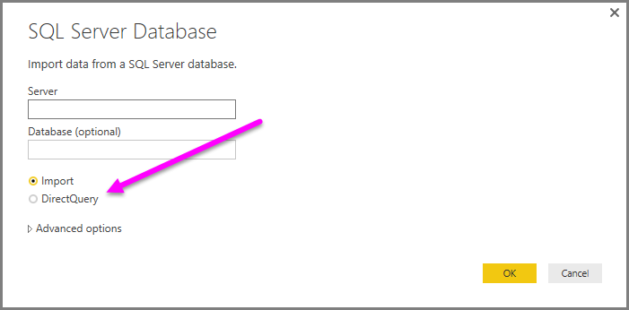

<properties
   pageTitle="Use DirectQuery in Power BI Desktop"
   description="Use DirectQuery in Power BI Desktop"
   services="powerbi"
   documentationCenter=""
   authors="davidiseminger"
   manager="mblythe"
   backup=""
   editor=""
   tags=""
   qualityFocus="no"
   qualityDate=""/>

<tags
   ms.service="powerbi"
   ms.devlang="NA"
   ms.topic="article"
   ms.tgt_pltfrm="NA"
   ms.workload="powerbi"
   ms.date="09/29/2016"
   ms.author="davidi"/>

# Use DirectQuery in Power BI Desktop  

With Power BI Desktop, when you connect to your data source, it is always possible to import a copy of the data into the Power BI Desktop. For some data sources, an alternative approach is available: connect directly to the data source using <bpt id="p1">**</bpt>DirectQuery<ept id="p1">**</ept>.

## Supported Data Sources  
Actualmente se admiten los siguientes orígenes de datos:  

-   SQL Server
-   Azure SQL Database
-   Azure SQL Data Warehouse
-   [SAP HANA](powerbi-desktop-sap-hana.md)
-   [Base de datos de Oracle](powerbi-desktop-directquery-for-oracle-teradata.md)
-   [Teradata Database](powerbi-desktop-directquery-for-oracle-teradata.md)
-   [Amazon Redshift (Preview)](powerbi-desktop-connect-redshift.md)
-   [Impala (Preview)](powerbi-desktop-connect-impala.md)

## How to Connect using DirectQuery  
When you use <bpt id="p1">**</bpt>Get Data<ept id="p1">**</ept> to connect to a data source supported by <bpt id="p2">**</bpt>DirectQuery<ept id="p2">**</ept>, the connection window lets you select how you want to connect.  

The differences between selecting <bpt id="p1">**</bpt>Import<ept id="p1">**</ept> and <bpt id="p2">**</bpt>DirectQuery<ept id="p2">**</ept> are the following:

<bpt id="p1">**</bpt>Import<ept id="p1">**</ept> – the selected tables and columns are imported into Power BI Desktop. As you create or interact with a visualization, Power BI Desktop uses the imported data. You must refresh the data, which imports the full data set again, to see any changes that occurred to the underlying data since the initial import or the most recent refresh.

<bpt id="p1">**</bpt>DirectQuery<ept id="p1">**</ept> – no data is imported or copied into Power BI Desktop. The selected tables and columns appear in your Power BI Desktop <bpt id="p1">**</bpt>Fields<ept id="p1">**</ept> list. As you create or interact with a visualization, Power BI Desktop queries the underlying data source, which means you’re always viewing current data.

Many data modeling and data transformations are available when using <bpt id="p1">**</bpt>DirectQuery<ept id="p1">**</ept>, though with some limitations. When creating or interacting with a visualization, the underlying source must be queried and the time necessary to refresh the visualization is dependent on the performance of the underlying data source. When the data necessary to service the request has recently been requested, Power BI Desktop uses recent data to reduce the time required to display the visualization. Selecting <bpt id="p1">**</bpt>Refresh<ept id="p1">**</ept> from the <bpt id="p2">**</bpt>Home<ept id="p2">**</ept> ribbon will ensure all visualizations are refreshed with current data.

See the following sections for more information about benefits, limitations, and important considerations when using <bpt id="p1">**</bpt>DirectQuery<ept id="p1">**</ept>.

## Benefits of using DirectQuery  
There are two primary benefits to using <bpt id="p1">**</bpt>DirectQuery<ept id="p1">**</ept>:

-   <bpt id="p1">**</bpt>DirectQuery<ept id="p1">**</ept> lets you build visualizations over very large datasets, where it otherwise would be unfeasible to first import all of the data

-   Underlying data changes can require a refresh of data, and for some reports, the need to display current data can require large data transfers, making re-importing data unfeasible. By contrast, <bpt id="p1">**</bpt>DirectQuery<ept id="p1">**</ept> reports always use current data

## Limitations of DirectQuery
There are currently a few limitations to using <bpt id="p1">**</bpt>DirectQuery<ept id="p1">**</ept>:

-   All tables must come from a single database

-   If the <bpt id="p1">**</bpt>Query Editor<ept id="p1">**</ept> query is overly complex, an error will occur. To remedy the error you must either delete the problematic step in <bpt id="p1">**</bpt>Query Editor<ept id="p1">**</ept>, or <bpt id="p2">*</bpt>Import<ept id="p2">*</ept> the data instead of using <bpt id="p3">**</bpt>DirectQuery<ept id="p3">**</ept>

-   Relationship filtering is limited to a single direction, rather than both directions

-   Time intelligence capabilities are not available in <bpt id="p1">**</bpt>DirectQuery<ept id="p1">**</ept>. For example, special treatment of date columns (year, quarter, month, day, so on) are not supported in <bpt id="p1">**</bpt>DirectQuery<ept id="p1">**</ept> mode.

-   By default, limitations are placed on DAX expressions allowed in measures; see the following paragraph for more information

-   There is a 1 million row limit for returning data when using <bpt id="p1">**</bpt>DirectQuery<ept id="p1">**</ept>. This does not affect aggregations or calculations used to create the dataset returned using <bpt id="p1">**</bpt>DirectQuery<ept id="p1">**</ept>, only the rows returned. For example, you can aggregate 10 million rows with your query that runs on the data source, and accurately return the results of that aggregation to Power BI using <bpt id="p1">**</bpt>DirectQuery<ept id="p1">**</ept> as long as the data returned to Power BI is less than 1 million rows. If more than 1 million rows would be returned from <bpt id="p1">**</bpt>DirectQuery<ept id="p1">**</ept>, Power BI returns an error.

To ensure that queries sent to the underlying data source have acceptable performance, limitations are imposed on measures by default. Advanced users can choose to bypass this limitation by selecting <bpt id="p1">**</bpt>File &gt; Options<ept id="p1">**</ept> and then <bpt id="p2">**</bpt>Settings &gt; Options &gt; DirectQuery<ept id="p2">**</ept>, then selecting the option <bpt id="p3">*</bpt>Allow unrestricted measures in DirectQuery mode<ept id="p3">*</ept>*. When that option is selected, any DAX expression that is valid for a measure can be used. Users must be aware, however, that some expressions that perform very well when the data is imported may result in very slow queries to the backend source when in DirectQuery mode.

## Important considerations when using DirectQuery

The following three points should be taken into consideration when using <bpt id="p1">**</bpt>DirectQuery<ept id="p1">**</ept>:

-   <bpt id="p1">**</bpt>Performance and load<ept id="p1">**</ept> - All <bpt id="p2">**</bpt>DirectQuery<ept id="p2">**</ept> requests are sent to the source database, so the time required to refresh a visual is dependent on how long that back-end source takes to respond with the results from the query (or queries). The recommended response time (with requested data being returned) for using <bpt id="p1">**</bpt>DirectQuery<ept id="p1">**</ept> for visuals is five seconds or less, with a maximum recommended results response time of 30 seconds. Any longer, and the experience of a user consuming the report becomes unacceptably poor. In addition, once a report is published to the Power BI service, any query that takes longer than a few minutes will timeout, and the user will receive an error.

    Load on the source database should also be considered, based on the number of Power BI users who will consume the published report. Using <bpt id="p1">*</bpt>Row Level Security<ept id="p1">*</ept> (RLS) can have a significant impact as well; a non-RLS dashboard tile shared by multiple users results in a single query to the database, but using RLS on a dashboard tile usually means the refresh of a tile requires one query <bpt id="p2">*</bpt>per user<ept id="p2">*</ept>, thus significantly increasing load on the source database and potentially impacting performance.

    Power BI creates queries that are as efficient as possible. Under certain situations however, the generated query may not be efficient enough to avoid refresh that would fail. One example of this situation is when a generated query would retrieve an excessively large number of rows (more than 1 million) from the back-end data source, in which case the following error occurs:

        The resultset of a query to external data source has exceeded
        the maximum allowed size of '1000000' rows.

    This situation can occur with a simple chart that includes a very high cardinality column, with the aggregation option set to <bpt id="p1">*</bpt>Don’t Summarize<ept id="p1">*</ept>. The visual needs to only have columns with a cardinality below 1 million, or must have appropriate filters applied.

-   <bpt id="p1">**</bpt>Security<ept id="p1">**</ept> - All users who consume a published report connect to the back-end data source using the credentials entered after publication to the Power BI service. This is the same situation as data that is imported: all users see the same data, irrespective of any security rules defined in the backend source.

-   <bpt id="p1">**</bpt>Supported features<ept id="p1">**</ept> - Not all features in <bpt id="p2">**</bpt>Power BI Desktop<ept id="p2">**</ept> are supported in <bpt id="p3">**</bpt>DirectQuery<ept id="p3">**</ept> mode, or have some limitations. In addition, there are some capabilities in the Power BI service (such as <bpt id="p1">*</bpt>Quick Insights<ept id="p1">*</ept>) that are not available for datasets using <bpt id="p2">**</bpt>DirectQuery<ept id="p2">**</ept>. As such, the limitation of such features when using <bpt id="p1">**</bpt>DirectQuery<ept id="p1">**</ept> should be taken into consideration when determining whether to use <bpt id="p2">**</bpt>DirectQuery<ept id="p2">**</ept>.   

## Publish to the Power BI service
Reports created using <bpt id="p1">**</bpt>DirectQuery<ept id="p1">**</ept> can be published to the Power BI Service.

If the data source used is <bpt id="p1">**</bpt>Azure SQL Database<ept id="p1">**</ept> or <bpt id="p2">**</bpt>Azure SQL Data Warehouse<ept id="p2">**</ept>, credentials must be provided before the published report will be displayed in the Power BI Service.

You can provide credentials by selecting the <bpt id="p1">**</bpt>Settings<ept id="p1">**</ept> gear icon in Power BI, then select <bpt id="p2">**</bpt>Settings<ept id="p2">**</ept>.

Power BI displays the <bpt id="p1">**</bpt>Settings<ept id="p1">**</ept> window. From there, select the <bpt id="p1">**</bpt>Datasets<ept id="p1">**</ept> tab and choose the dataset that uses <bpt id="p2">**</bpt>DirectQuery<ept id="p2">**</ept>, and select <bpt id="p3">**</bpt>Edit credentials<ept id="p3">**</ept>.

Until credentials are supplied, opening a published report or exploring a dataset created with a <bpt id="p1">**</bpt>DirectQuery<ept id="p1">**</ept> connection to <bpt id="p2">**</bpt>Azure SQL Database<ept id="p2">**</ept> or <bpt id="p3">**</bpt>Azure SQL Data Warehouse<ept id="p3">**</ept> results in an error.

For data sources other than <bpt id="p1">**</bpt>Azure SQL Database<ept id="p1">**</ept> or <bpt id="p2">**</bpt>Azure SQL Data Warehouse<ept id="p2">**</ept> that use DirectQuery, and Enterprise Gateway must be installed and the data source must be registered to establish a data connection. You can <bpt id="p1">[</bpt>learn more about Enterprise Gateway<ept id="p1">](http://go.microsoft.com/fwlink/p/?LinkID=627094)</ept>.
