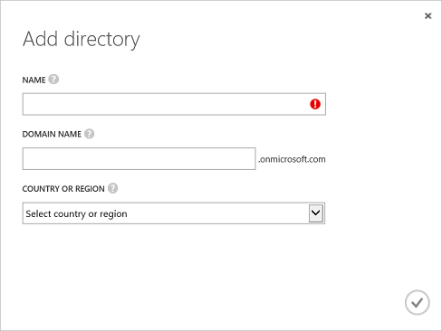

<properties
   pageTitle="Create an Azure Active Directory tenant"
   description="Create an Azure Active Directory tenant"
   services="powerbi"
   documentationCenter=""
   authors="guyinacube"
   manager="mblythe"
   backup=""
   editor=""
   tags=""
   qualityFocus="no"
   qualityDate=""/>

<tags
   ms.service="powerbi"
   ms.devlang="NA"
   ms.topic="article"
   ms.tgt_pltfrm="NA"
   ms.workload="powerbi"
   ms.date="08/23/2016"
   ms.author="asaxton"/>

# Create an Azure Active Directory tenant

Using the Power BI REST API, you can create a Power BI app in any platform that supports calling REST operations. However, before you get started creating a Power BI app, you need an <bpt id="p1">**</bpt>Azure Active Directory<ept id="p1">**</ept>, an organizational user, and a <bpt id="p2">[</bpt>Power BI service account<ept id="p2">](powerbi-admin-free-with-custom-azure-directory.md)</ept>.

## Create an Azure Active Directory tenant for a Power BI app

Power BI apps are integrated with <bpt id="p1">**</bpt>Azure Active Directory<ept id="p1">**</ept> (Azure AD) to provide secure sign in and authorization for your app. To integrate a Power BI app with Azure AD, you register the details about your application with Azure AD by using the Azure Management Portal.

<bpt id="p1">**</bpt>Important<ept id="p1">**</ept> To sign up for the <bpt id="p2">**</bpt>Power BI service<ept id="p2">**</ept>, your <bpt id="p3">**</bpt>Azure Active Directory<ept id="p3">**</ept> must have at least one organizational user. Use your organizational user to <bpt id="p1">[</bpt>sign up for the Power BI service<ept id="p1">](powerbi-admin-free-with-custom-azure-directory.md)</ept>.

### Create an Azure Active Directory tenant
Before you get started creating a Power BI app, you need <bpt id="p1">**</bpt>Azure Active Directory<ept id="p1">**</ept> and an organizational user. Here's how to setup <bpt id="p1">**</bpt>Azure Active Directory<ept id="p1">**</ept>:

 1. Navigate to https://manage.windowsazure.com and log in with the account that has an Azure subscription.
 2. Click <bpt id="p1">**</bpt>ACTIVE DIRECTORY<ept id="p1">**</ept> management icon in the left pane.

    

 3. Click <bpt id="p1">**</bpt>NEW<ept id="p1">**</ept> button at the bottom of the page.
 4. Choose <bpt id="p1">**</bpt>APP SERVICES<ept id="p1">**</ept><ph id="ph1"> &gt; </ph><bpt id="p2">**</bpt>ACTIVE DIRECTORY<ept id="p2">**</ept><ph id="ph2"> &gt; </ph><bpt id="p3">**</bpt>DIRECTORY<ept id="p3">**</ept><ph id="ph3"> &gt; </ph><bpt id="p4">**</bpt>CUSTOM CREATE<ept id="p4">**</ept>

    

 5. In the <bpt id="p1">**</bpt>Add directory<ept id="p1">**</ept> page, enter a name and domain name. For country or region choose United States or the country were Power BI is available.

    

 6. Choose OK icon. An Azure Active Directory is created.

### Add a user to your Azure Active Directory tenant
You need an organizational user from your Azure AD to sign up for the <bpt id="p1">**</bpt>Power BI service<ept id="p1">**</ept>. Once you login to the <bpt id="p1">**</bpt>Power BI service<ept id="p1">**</ept> for the first time, you’ll see the <bpt id="p2">**</bpt>Power BI service<ept id="p2">**</ept> added to your Azure AD which will allow you to create Power BI apps with the right permissions. Here's how to add a user to your Azure Active Directory:

1. Navigate to https://manage.windowsazure.com and log in with the account that has an Azure subscription.
2. Click <bpt id="p1">**</bpt>ACTIVE DIRECTORY<ept id="p1">**</ept> management icon in the left pane.
3. In your <bpt id="p1">**</bpt>Azure Active Directory<ept id="p1">**</ept>, click <bpt id="p2">**</bpt>USERS<ept id="p2">**</ept>.

    
4. At the bottom of the page, click <bpt id="p1">**</bpt>ADD USER<ept id="p1">**</ept>. A user account is used to register a Power BI app.
5. In the <bpt id="p1">**</bpt>Tell us about this user page<ept id="p1">**</ept>:

    1. For <bpt id="p1">**</bpt>TYPE OF USER<ept id="p1">**</ept>, choose <bpt id="p2">**</bpt>New user in your organization<ept id="p2">**</ept>.
    2. Enter your <bpt id="p1">**</bpt>USER NAME<ept id="p1">**</ept>.
    3. Haga clic en **Siguiente**.

        

6. In the <bpt id="p1">**</bpt>user profile<ept id="p1">**</ept> page, enter your <bpt id="p2">**</bpt>DISPLAY NAME<ept id="p2">**</ept>. Display name is a required field.

    

7. Haga clic en **Siguiente**. For <bpt id="p1">**</bpt>ROLE<ept id="p1">**</ept>, you can use <bpt id="p2">**</bpt>User<ept id="p2">**</ept>.
8. Click <bpt id="p1">**</bpt>Create<ept id="p1">**</ept> to create a temporary password. The new user is assigned a temporary password that must be changed on first sign in.
9. In the <bpt id="p1">**</bpt>Get temporary password<ept id="p1">**</ept> page, copy the temporary password, and click <bpt id="p2">**</bpt>Complete<ept id="p2">**</ept> icon. You use the temporary password when you first login to your AAD.
10. After you click the <bpt id="p1">**</bpt>Complete<ept id="p1">**</ept> icon, a new Azure AD user is created.

Once you have an <bpt id="p1">**</bpt>Azure Active Directory<ept id="p1">**</ept> tenant, and an organizational user, you <bpt id="p2">[</bpt>sign up for Power BI<ept id="p2">](powerbi-admin-free-with-custom-azure-directory.md)</ept>.

<bpt id="p1">**</bpt>Note<ept id="p1">**</ept> When you sign up for the Power BI service, use your organizational user. Once you login to the <bpt id="p1">**</bpt>Power BI service<ept id="p1">**</ept> for the first time, you will see the <bpt id="p2">**</bpt>Power BI service<ept id="p2">**</ept> added to your Azure AD.

## Véase también

[¿Qué es un directorio de Azure AD?](https://msdn.microsoft.com/library/azure/jj573650.aspx)  
[How to get an Azure Active Directory tenant](https://azure.microsoft.com/documentation/articles/active-directory-howto-tenant/)  
More questions? [Try the Power BI Community](http://community.powerbi.com/)