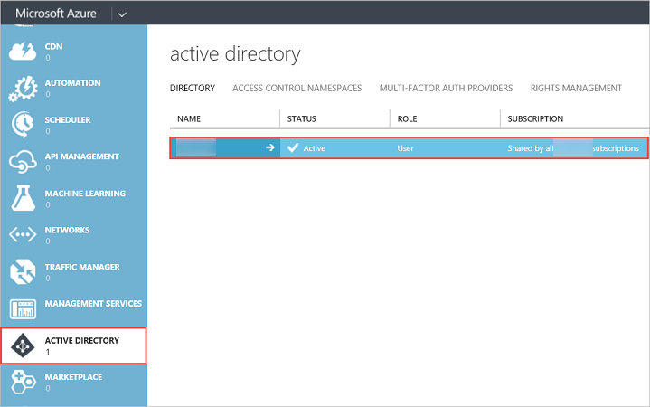
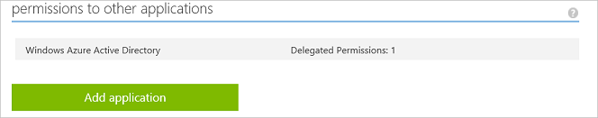

<properties
   pageTitle="Registrar una aplicación cliente"
   description="Registrar una aplicación cliente"
   services="powerbi"
   documentationCenter=""
   authors="guyinacube"
   manager="mblythe"
   backup=""
   editor=""
   tags=""
   qualityFocus="no"
   qualityDate=""/>

<tags
   ms.service="powerbi"
   ms.devlang="NA"
   ms.topic="article"
   ms.tgt_pltfrm="NA"
   ms.workload="powerbi"
   ms.date="08/23/2016"
   ms.author="asaxton"/>

# Registrar una aplicación cliente

Este artículo muestra cómo registrar una aplicación de cliente de Power BI en **Azure Active Directory (Azure AD)**. Registrar la aplicación cliente con Azure AD para permitir que la aplicación tenga acceso a la API de REST de Power BI. Esto le permitirá establecer una identidad para la aplicación y especificar permisos para recursos de REST de Power BI. Para obtener una lista de permisos de Power BI, consulte [permisos de Power BI](powerbi-developer-power-bi-permissions.md).

            **Importante** antes de registrar una aplicación de Power BI necesita un [inquilino de Azure Active Directory y un usuario de la organización](powerbi-developer-create-an-azure-active-directory-tenant.md), y un [cuenta de servicio de Power BI](powerbi-developer-sign-up-for-power-bi-service.md).

Hay dos maneras de registrar la aplicación cliente: con la herramienta de registro de aplicación de Power BI o en el Portal de administración de Azure. La herramienta de registro de aplicación de Power BI es la opción más fácil dado que hay solo unos cuantos campos a rellenar. Si desea realizar cambios en la aplicación, esto puede hacerse a través del Portal de administración de Azure.

### En este artículo

- [Registrar una aplicación cliente con la herramienta de registro de aplicación de Power BI](#clientTool)
- [Registrar una aplicación cliente con el Portal de administración de Azure](#client)
- [Cómo obtener un identificador de cliente en el Portal de administración de Azure](#clientID)

## Registrar una aplicación cliente con la herramienta de registro de aplicación de Power BI
Debe registrar la aplicación cliente en **Azure Active Directory** para establecer una identidad para la aplicación y especificar permisos para recursos de REST de Power BI. Al registrar una aplicación de cliente, como una aplicación de consola, recibirá un **Id. de cliente**.  El **Id. de cliente** se utiliza la aplicación para identificarse ante los usuarios que están solicitando permisos.
Aquí se muestra cómo registrar la aplicación cliente con la herramienta de registro de aplicación de Power BI:

1.  Vaya a dev.powerbi.com/apps.
2.  En la herramienta de registro de aplicaciones de BI energía, siga estos cuatro pasos:

            **Paso 1** -elija **Inicio de sesión en** para iniciar sesión en su cuenta de Azure AD. Verá su nombre en la línea principal.

            **Paso 2** : especificar información acerca de la aplicación.

  * 
            **Nombre de la aplicación**: el nombre de la aplicación.
  * 
            **Tipo de aplicación**: elija la aplicación nativa.
  * 
            **URI de redireccionamiento**: para una aplicación de cliente nativo, un uri de redireccionamiento da a AAD más detalles en la aplicación específica que autenticará. Cualquier Uri válida funcionará como https://login.live.com/oauth20_desktop.srf.

            **Paso 3** : elija API para tener acceso. Para obtener más información acerca de los permisos de acceso de Power BI, consulte [permisos de Power BI](powerbi-developer-power-bi-permissions.md).

            **Paso 4** : para registrar la aplicación, haga clic en **aplicación registrar**. Una vez que se registra la aplicación en Azure AD, obtendrá un **Id. de cliente**. Asegúrese de que copiar el identificador de cliente. Puede obtener el identificador de cliente más adelante en el **Portal de administración de Azure**. Vea [cómo obtener un identificador de cliente en el Portal de administración de Azure](#clientID).

Ahora puede usar el identificador de cliente para la aplicación. La sección siguiente muestra cómo registrar una aplicación cliente con el Portal de administración de Azure.

## Registrar una aplicación cliente con el Portal de administración de Azure
Debe registrar la aplicación cliente en **Azure Active Directory** para establecer una identidad para la aplicación y especificar permisos para recursos de REST de Power BI. Al registrar una aplicación de cliente, como una aplicación de consola, recibirá un **Id. de cliente**.  El **Id. de cliente** se utiliza la aplicación para identificarse ante los usuarios que están solicitando permisos.

Para obtener información sobre cómo autenticar una aplicación cliente con Azure AD **Id. de cliente**, consulte [autenticar una aplicación cliente](powerbi-developer-authenticate-a-client-app.md).

### Registrar una aplicación cliente

Aquí se muestra cómo registrar una aplicación de cliente:
1. Acepte el [términos de la API de Microsoft Power BI](https://powerbi.microsoft.com/api-terms).
2. Inicie sesión en su suscripción de Microsoft Azure en https://manage.windowsazure.com.
3. En el panel izquierdo del servicio, elija **ACTIVE DIRECTORY**.
4. Haga clic en active directory al que pertenece.

  

5. Haga clic en **APLICACIONES**.

    

6. Haga clic en **AGREGAR**.

    

7. En **más información sobre la aplicación**, escriba un **NOMBRE**, y elija **APLICACIÓN de CLIENTE NATIVO** para el tipo y haga clic en **siguiente** icono...

    

8. En **información de la aplicación**, escriba un **URI de REDIRECCIONAMIENTO**. Para una aplicación de cliente, un uri de redireccionamiento da a AAD más detalles en la aplicación específica que autenticará. Para una aplicación cliente, puede usar cualquier Uri válida como https://login.live.com/oauth20_desktop.srf.

9.  Haga clic en el **completado** icono.
10. En la página aplicación, elija **CONFIGURAR**. Verá su **Id. de CLIENTE**.
11. En el **CONFIGURACIÓN** en permisos para otras aplicaciones, haga clic en **Agregar aplicación**.

    

12. En **permisos para otras aplicaciones**, elija **servicio Power BI**.

    

      
            **Importante** Si no ve **servicio Power BI** en el **permisos para otras aplicaciones** lista, debe registrarse para el [servicio Power BI](https://www.powerbi.com/). Para suscribirse al servicio Power BI, necesita al menos un usuario de la organización en el inquilino de Azure Active Directory (AAD). Si no tiene un inquilino de Azure Active Directory (AAD), consulte [crear un inquilino de Azure Active Directory](powerbi-developer-create-an-azure-active-directory-tenant.md) para crear un inquilino de Azure AD y un usuario de la organización en su inquilino de Azure AD.

13. Haga clic en **Complete** icono.
14. En el **permisos para otras aplicaciones** grupo, elija todos los **permisos delegados**, y elige uno o varios permisos. Para obtener más información acerca de los permisos de Power BI, consulte [permisos de Power BI](powerbi-developer-power-bi-permissions.md).

    

15. Haga clic en **Guardar**.

## Cómo obtener un identificador de aplicación cliente
Al registrar una aplicación de cliente, como una aplicación de consola, recibirá un **Id. de cliente**.  El **Id. de cliente** se utiliza la aplicación para identificarse ante los usuarios que están solicitando permisos.

Aquí se muestra cómo obtener un identificador de cliente:

1. Inicie sesión en su suscripción de Microsoft Azure en https://manage.windowsazure.com.
2. En el panel izquierdo del servicio, elija **ACTIVE DIRECTORY**.
3. Haga clic en active directory al que pertenece.
4. Haga clic en **APLICACIONES**.
5. Elija una aplicación.
6. En la página aplicación, elija **CONFIGURAR**.
7. En el **CONFIGURAR** página, copie el **Id. de CLIENTE**.

    

## Consulte también

[Permisos de Power BI](powerbi-developer-power-bi-permissions.md)  
[Inquilino de Azure Active Directory y un usuario de la organización](powerbi-developer-create-an-azure-active-directory-tenant.md)  
[Cuenta de servicio de Power BI](powerbi-developer-sign-up-for-power-bi-service.md)  
[Autenticar una aplicación cliente](powerbi-developer-authenticate-a-client-app.md)  
[Información general sobre la API de REST de Power BI](powerbi-developer-overview-of-power-bi-rest-api.md)  
¿Preguntas más frecuentes? [Pruebe la Comunidad de Power BI](http://community.powerbi.com/)