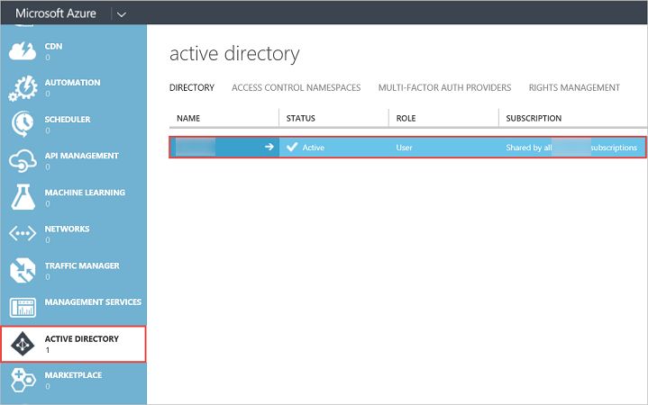
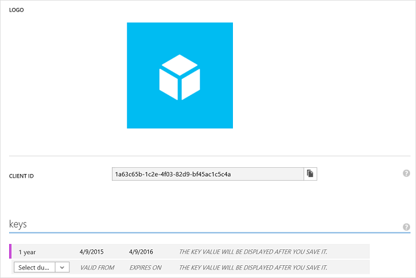
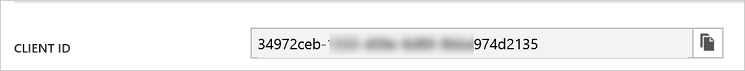

<properties
   pageTitle="Registrar una aplicación web"
   description="Registrar una aplicación web"
   services="powerbi"
   documentationCenter=""
   authors="guyinacube"
   manager="mblythe"
   backup=""
   editor=""
   tags=""
   qualityFocus="no"
   qualityDate=""/>

<tags
   ms.service="powerbi"
   ms.devlang="NA"
   ms.topic="article"
   ms.tgt_pltfrm="NA"
   ms.workload="powerbi"
   ms.date="08/23/2016"
   ms.author="asaxton"/>

# Registrar una aplicación web

En este artículo se muestra cómo registrar una aplicación web de Power BI en Azure Active Directory (Azure AD). Para permitir que la aplicación tenga acceso a la API de REST de Power BI, deberá registrar la aplicación con **Azure Active Directory**. Esto le permitirá establecer una identidad para la aplicación y especificar permisos para recursos de REST de Power BI. Para obtener una lista de permisos de Power BI, consulte [permisos de Power BI](powerbi-developer-power-bi-permissions.md).

            **Importante** antes de registrar una aplicación de Power BI necesita un [Azure Active Directory y un usuario de la organización](powerbi-developer-create-an-azure-active-directory-tenant.md), y un [cuenta de servicio de Power BI](powerbi-developer-sign-up-for-power-bi-service.md).

Hay dos maneras de registrar la aplicación web: con la herramienta de registro de aplicación de Power BI o en el Portal de administración de Azure. La herramienta de registro de aplicación de Power BI es la opción más fácil dado que hay solo unos cuantos campos a rellenar. Si desea realizar cambios en la aplicación, esto puede hacerse a través del Portal de administración de Azure.

## Registrar una aplicación web con la herramienta de registro de aplicación de Power BI
Debe registrar la aplicación web en **Azure Active Directory** para establecer una identidad para la aplicación y especificar permisos para recursos de REST de Power BI. Al registrar una aplicación web, recibirá un **Id. de cliente** y **secreto de cliente**.  El **Id. de cliente** se utiliza la aplicación para identificarse ante los usuarios que están solicitando permisos. El secreto del cliente **clave** se utiliza la aplicación web para identificarse de forma segura a los **servicio Power BI**.

Aquí se muestra cómo registrar su aplicación web con el **herramienta de registro de aplicación de Power BI**:

1.  Vaya a dev.powerbi.com/apps.
2.  En el **herramienta de registro de aplicación de Power BI**, siga estos cuatro pasos:

            **Paso 1** -elija **Inicio de sesión en** para iniciar sesión en su cuenta de Azure AD. Verá su nombre en la línea principal.

            **Paso 2** : especificar información acerca de la aplicación.

  * 
            **Nombre de la aplicación**: el nombre de la aplicación.
  * 
            **Tipo de aplicación**: elija la aplicación nativa.
  * 
            **URI de redireccionamiento**: para una aplicación web, un uri de redireccionamiento da a AAD más detalles en la aplicación específica que autenticará. Un ejemplo **URI de redireccionamiento** este aspecto: http://localhost/redirect.
  * 
            **Página principal**: la página principal o la página de la aplicación web de inicio de sesión.

            **Paso 3** : elija API para tener acceso. Para obtener más información acerca de los permisos de acceso de Power BI, consulte [permisos de Power BI](powerbi-developer-power-bi-permissions.md).

            **Paso 4** : para registrar la aplicación, haga clic en **aplicación registrar**. Una vez que se registra la aplicación en Azure AD, obtendrá un **Id. de cliente** y **secreto de cliente** clave. Asegúrese de que copiar la clave de Id. de cliente y el secreto del cliente. Puede obtener la clave de Id. de cliente o el secreto de cliente más adelante en el **Portal de administración de Azure**. Vea [cómo obtener un identificador de cliente en el Portal de administración de Azure](#clientID) y [cómo obtener un cliente clave secreta](#clientSecret).

Ahora puede usar el identificador de cliente y el secreto del cliente para la aplicación. La siguiente sección muestra cómo registrar una aplicación web con **Portal de administración de Azure**.

## Registrar una aplicación web con el Portal de administración de Azure
Al registrar una aplicación web, recibirá un **Id. de cliente** y un secreto de cliente **clave**. El **Id. de cliente** se utiliza la aplicación para identificarse ante los usuarios que están solicitando permisos. El secreto del cliente **clave** se utiliza la aplicación web para identificarse de forma segura a los **servicio Power BI**.

Para obtener información sobre cómo autenticar una aplicación web con Azure AD **Id. de cliente** y el secreto del cliente **clave**, consulte [autenticar una aplicación web](powerbi-developer-authenticate-a-web-app.md).

Aquí se muestra cómo registrar una aplicación de cliente:

1. Acepte el [términos de la API de Microsoft Power BI](https://powerbi.microsoft.com/api-terms).
2. Inicie sesión en su suscripción de Microsoft Azure en https://manage.windowsazure.com.
3. En el panel izquierdo del servicio, elija **ACTIVE DIRECTORY**.
4. Haga clic en active directory.

    

5. Haga clic en **APLICACIONES**.

    

6. Haga clic en **AGREGAR**.

    

7.  En **más información sobre la aplicación**, escriba un **NOMBRE**, y elija **APLICACIÓN WEB o API de WEB** para el tipo y haga clic en **siguiente** icono.

    

8. En **Propiedades de la aplicación**, escriba una **dirección URL de inicio de sesión** y **APP ID URI**. El **dirección URL de inicio de sesión** es la dirección url de aplicación web como https://localhost: 44307. El **APP ID URI** es el URI del inquilino de Azure seguido por el nombre de la aplicación. Por ejemplo, https://yourtenant.onmicrosoft.com/YourWebApp.

    

9.  Haga clic en el **completado** icono.
10. En la página aplicación, elija **CONFIGURAR**. El **CONFIGURAR** página tiene un **Id. de cliente** y **clave** para la aplicación.

    

11. Para una aplicación web, necesita un secreto de cliente **clave**. En el **claves** seleccione una duración. La clave se muestra después **Guardar** lo. Asegúrese de que copiar la clave; de lo contrario, la clave no estará disponible en futuras navegaciones a la página de configuración.

12. En el **CONFIGURACIÓN** haga clic en **Agregar aplicación**.
13. En **permisos para otras aplicaciones**, elija **servicio Power BI**.

    

    
            **Importante** Si no ve **servicio Power BI** en el **permisos para otras aplicaciones** lista, debe registrarse para el [servicio Power BI](https://www.powerbi.com/). Para suscribirse al servicio Power BI, necesita al menos un usuario de la organización en el inquilino de Azure Active Directory (AAD). Si no tiene un inquilino de Azure Active Directory (AAD), consulte [crear un inquilino de Azure Active Directory](powerbi-developer-create-an-azure-active-directory-tenant.md) para crear un inquilino de Azure AD y un usuario de la organización en su inquilino de Azure AD.

14. Haga clic en **Complete** icono que se encuentra en la esquina inferior derecha de la página.
15. En el **permisos para otras aplicaciones** grupo, la lista desplegable  

            **Permisos delegados**, y elegir qué operaciones se permite llamar a la aplicación. Para obtener más información acerca de los permisos de Power BI, consulte [permisos de Power BI](powerbi-developer-power-bi-permissions.md).

    

16. Haga clic en **Guardar**.

    
                ** Importante ** para una aplicación web, necesita un secreto de cliente **clave**. El secreto del cliente **clave** se muestra después **Guardar** lo. Asegúrese de que copiar la clave; de lo contrario, la clave no estará disponible en futuras navegaciones a la página de configuración.

## Cómo obtener un identificador de aplicación cliente
Al registrar una aplicación web, recibirá un **Id. de cliente**.  El **Id. de cliente** se utiliza la aplicación para identificarse ante los usuarios que están solicitando permisos.

Aquí se muestra cómo obtener un identificador de la aplicación cliente:

1. Inicie sesión en su suscripción de Microsoft Azure en https://manage.windowsazure.com.
2. En el panel izquierdo del servicio, elija **ACTIVE DIRECTORY**.
3. Seleccione cualquier active directory.
4. Haga clic en **APLICACIONES**.
5. Elija una aplicación.
6. En la página aplicación, elija **CONFIGURAR**.
7. En el **CONFIGURAR** página, copie el **Id. de CLIENTE**.

    

## Cómo obtener un secreto de cliente

Para una aplicación web, necesita un secreto de cliente **clave**. Al registrar una aplicación web, genera una clave de Azure AD (consulte el paso 11 anterior). En el **claves** seleccione una duración. La clave se muestra después de guardarlo. Asegúrese de que copiar la clave; de lo contrario, la clave no estará disponible en futuras navegaciones a la página de configuración.

## Consulte también

[Permisos de Power BI](powerbi-developer-power-bi-permissions.md)  
[Inquilino de Azure Active Directory y un usuario de la organización](powerbi-developer-create-an-azure-active-directory-tenant.md)  
[Cuenta de servicio de Power BI](powerbi-developer-sign-up-for-power-bi-service.md)  
[Autenticar una aplicación web](powerbi-developer-authenticate-a-web-app.md)  
[Información general sobre la API de REST de Power BI](powerbi-developer-overview-of-power-bi-rest-api.md)  
¿Preguntas más frecuentes? [Pruebe la Comunidad de Power BI](http://community.powerbi.com/)