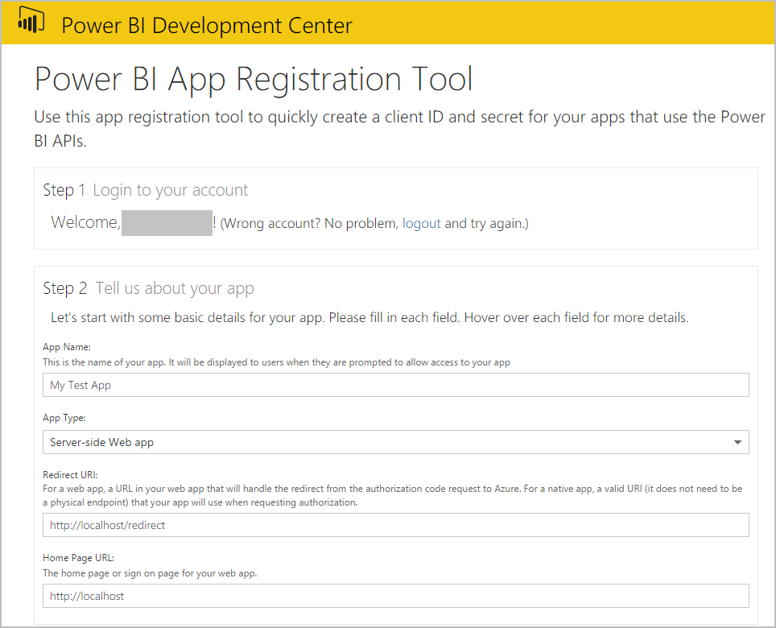
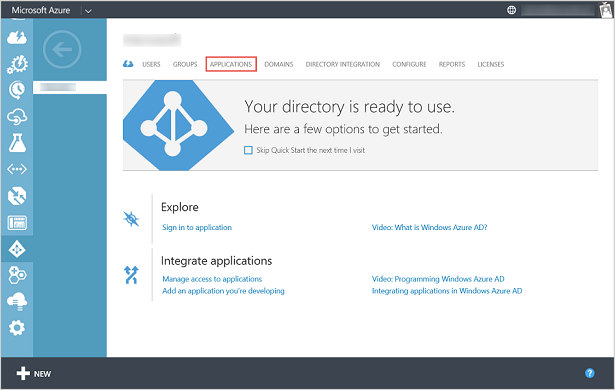
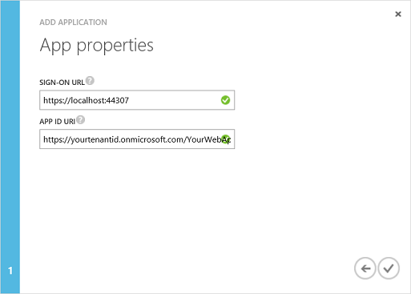

<properties
   pageTitle="Register a web app"
   description="Register a web app"
   services="powerbi"
   documentationCenter=""
   authors="guyinacube"
   manager="mblythe"
   backup=""
   editor=""
   tags=""
   qualityFocus="no"
   qualityDate=""/>

<tags
   ms.service="powerbi"
   ms.devlang="NA"
   ms.topic="article"
   ms.tgt_pltfrm="NA"
   ms.workload="powerbi"
   ms.date="08/23/2016"
   ms.author="asaxton"/>

# Register a web app

This article shows you how to register a Power BI web app in Azure Active Directory (Azure AD). To allow your application access to the Power BI REST API, you need to register your application with <bpt id="p1">**</bpt>Azure Active Directory<ept id="p1">**</ept>. This will allow you to establish an identity for your application and specify permissions to Power BI REST resources. For a list of Power BI permissions, see <bpt id="p1">[</bpt>Power BI permissions<ept id="p1">](powerbi-developer-power-bi-permissions.md)</ept>.

<bpt id="p1">**</bpt>Important<ept id="p1">**</ept> Before you register a Power BI app you need an <bpt id="p2">[</bpt>Azure Active Directory and an organizational user<ept id="p2">](powerbi-developer-create-an-azure-active-directory-tenant.md)</ept>, and a <bpt id="p3">[</bpt>Power BI service account<ept id="p3">](powerbi-developer-sign-up-for-power-bi-service.md)</ept>.

There are two ways to register your web app: with the Power BI App Registration Tool or on Azure Management Portal. The Power BI App Registration Tool is the easiest option since there are just a few fields to fill in. If you want to make changes to your app, this can be done through the Azure Management Portal.

## Register a web app with Power BI App Registration Tool
You need to register your web app in <bpt id="p1">**</bpt>Azure Active Directory<ept id="p1">**</ept> to establish an identity for your application and specify permissions to Power BI REST resources. When you register a web app, you receive a <bpt id="p1">**</bpt>Client ID<ept id="p1">**</ept> and <bpt id="p2">**</bpt>Client Secret<ept id="p2">**</ept>.  The <bpt id="p1">**</bpt>Client ID<ept id="p1">**</ept> is used by the application to identify themselves to the users that they are requesting permissions from. The client secret <bpt id="p1">**</bpt>Key<ept id="p1">**</ept> is used by the web app to securely identify themselves to the <bpt id="p2">**</bpt>Power BI service<ept id="p2">**</ept>.

Here's how to register your web app with the <bpt id="p1">**</bpt>Power BI App Registration Tool<ept id="p1">**</ept>:

1.  Go to dev.powerbi.com/apps.
2.  In the <bpt id="p1">**</bpt>Power BI App Registration Tool<ept id="p1">**</ept>, follow these four steps:

<bpt id="p1">**</bpt>Step 1<ept id="p1">**</ept> - Choose <bpt id="p2">**</bpt>Login in<ept id="p2">**</ept> to login to your Azure AD account. You will see your name in the Welcome line.

<bpt id="p1">**</bpt>Step 2<ept id="p1">**</ept> – Enter information about your app.

  * <bpt id="p1">**</bpt>App Name<ept id="p1">**</ept>: The name of your app.
  * <bpt id="p1">**</bpt>App Type<ept id="p1">**</ept>: Choose Native app.
  * <bpt id="p1">**</bpt>Redirect URI<ept id="p1">**</ept>: For a web app, a redirect uri gives AAD more details on the specific application that it will authenticate. An example <bpt id="p1">**</bpt>Redirect URI<ept id="p1">**</ept> looks like this: http://localhost/redirect.
  * <bpt id="p1">**</bpt>Home Page<ept id="p1">**</ept>: The home page or sign on page for your web app.

<bpt id="p1">**</bpt>Step 3<ept id="p1">**</ept> – Choose APIs to access. For more information about Power BI access permissions, see <bpt id="p1">[</bpt>Power BI Permissions<ept id="p1">](powerbi-developer-power-bi-permissions.md)</ept>.

<bpt id="p1">**</bpt>Step 4<ept id="p1">**</ept> - To register your app, click <bpt id="p2">**</bpt>Register App<ept id="p2">**</ept>. After the app is registered in Azure AD, you will get a <bpt id="p1">**</bpt>Client ID<ept id="p1">**</ept> and <bpt id="p2">**</bpt>Client Secret<ept id="p2">**</ept> key. Make sure you copy the Client ID and Client Secret key. You can get the Client ID or Client Secret key later in the <bpt id="p1">**</bpt>Azure Management Portal<ept id="p1">**</ept>. See <bpt id="p1">[</bpt>How to get a client id in Azure Management Portal<ept id="p1">](#clientID)</ept> and <bpt id="p2">[</bpt>How to get a client secret key<ept id="p2">](#clientSecret)</ept>.

You can now use your Client ID and Client Secret for your app. The next section shows how to register a web app with <bpt id="p1">**</bpt>Azure Management Portal<ept id="p1">**</ept>.

## Register a web app with Azure Management Portal
When you register a web app, you receive an <bpt id="p1">**</bpt>Client ID<ept id="p1">**</ept> and a client secret <bpt id="p2">**</bpt>Key<ept id="p2">**</ept>. The <bpt id="p1">**</bpt>Client ID<ept id="p1">**</ept> is used by the application to identify themselves to the users that they are requesting permissions from. The client secret <bpt id="p1">**</bpt>Key<ept id="p1">**</ept> is used by the web app to securely identify themselves to the <bpt id="p2">**</bpt>Power BI service<ept id="p2">**</ept>.

To learn how to authenticate a web app using an Azure AD <bpt id="p1">**</bpt>Client ID<ept id="p1">**</ept> and client secret <bpt id="p2">**</bpt>Key<ept id="p2">**</ept>, see <bpt id="p3">[</bpt>Authenticate a web app<ept id="p3">](powerbi-developer-authenticate-a-web-app.md)</ept>.

Here's how to register a client app:

1. Accept the <bpt id="p1">[</bpt>Microsoft Power BI API Terms<ept id="p1">](https://powerbi.microsoft.com/api-terms)</ept>.
2. Sign into your Microsoft Azure subscription at https://manage.windowsazure.com.
3. In the left service panel, choose <bpt id="p1">**</bpt>ACTIVE DIRECTORY<ept id="p1">**</ept>.
4. Click any active directory.

    

5. Click <bpt id="p1">**</bpt>APPLICATIONS<ept id="p1">**</ept>.

    

6. Click <bpt id="p1">**</bpt>ADD<ept id="p1">**</ept>.

    

7.  In <bpt id="p1">**</bpt>Tell us about your application<ept id="p1">**</ept>, enter a <bpt id="p2">**</bpt>NAME<ept id="p2">**</ept>, and choose <bpt id="p3">**</bpt>WEB APPLICATION AND/OR WEB API<ept id="p3">**</ept> for the type, and click <bpt id="p4">**</bpt>Next<ept id="p4">**</ept> icon.

    

8. In <bpt id="p1">**</bpt>App properties<ept id="p1">**</ept>, enter a <bpt id="p2">**</bpt>SIGN-ON URL<ept id="p2">**</ept> and <bpt id="p3">**</bpt>APP ID URI<ept id="p3">**</ept>. The <bpt id="p1">**</bpt>SIGN-ON URL<ept id="p1">**</ept> is your web app url such as https://localhost:44307. The <bpt id="p1">**</bpt>APP ID URI<ept id="p1">**</ept> is your Azure Tenant URI followed by your app name. For example, https://yourtenant.onmicrosoft.com/YourWebApp.

    

9.  Click the <bpt id="p1">**</bpt>Complete<ept id="p1">**</ept> icon.
10. In the application page, choose <bpt id="p1">**</bpt>CONFIGURE<ept id="p1">**</ept>. The <bpt id="p1">**</bpt>CONFIGURE<ept id="p1">**</ept> page has a <bpt id="p2">**</bpt>Client ID<ept id="p2">**</ept> and <bpt id="p3">**</bpt>Key<ept id="p3">**</ept> for your app.

    

11. For a web app, you need a client secret <bpt id="p1">**</bpt>Key<ept id="p1">**</ept>. In the <bpt id="p1">**</bpt>keys<ept id="p1">**</ept> section, select a duration. The key is displayed after you <bpt id="p1">**</bpt>Save<ept id="p1">**</ept> it. Make sure you copy the key; otherwise, the key will not be available upon future navigation to the configuration page.

12. In the <bpt id="p1">**</bpt>CONFIGURATION<ept id="p1">**</ept> page, click <bpt id="p2">**</bpt>Add Application<ept id="p2">**</ept>.
13. In <bpt id="p1">**</bpt>Permissions to other applications<ept id="p1">**</ept>, choose <bpt id="p2">**</bpt>Power BI Service<ept id="p2">**</ept>.

    

    <bpt id="p1">**</bpt>Important<ept id="p1">**</ept> If you do not see <bpt id="p2">**</bpt>Power BI Service<ept id="p2">**</ept> in the <bpt id="p3">**</bpt>Permissions to other applications<ept id="p3">**</ept> list, you need to sign up for the <bpt id="p4">[</bpt>Power BI Service<ept id="p4">](https://www.powerbi.com/)</ept>. To sign up for the Power BI Service, you need at least one organizational user in your Azure Active Directory (AAD) tenant. If you do not have an Azure Active Directory (AAD) tenant, see <bpt id="p1">[</bpt>Create an Azure Active Directory tenant<ept id="p1">](powerbi-developer-create-an-azure-active-directory-tenant.md)</ept> to create an Azure AD tenant and an organizational user in your Azure AD tenant.

14. Click <bpt id="p1">**</bpt>Complete<ept id="p1">**</ept> icon which is located at the lower right corner of the page.
15. In the <bpt id="p1">**</bpt>permissions to other applications<ept id="p1">**</ept> group, dropdown  
<bpt id="p1">**</bpt>Delegated Permissions<ept id="p1">**</ept>, and choose which operations your app is permitted to call. For more information about Power BI permissions, see <bpt id="p1">[</bpt>Power BI Permissions<ept id="p1">](powerbi-developer-power-bi-permissions.md)</ept>.

    

16. Haga clic en **Guardar**.

    <bpt id="p1">**</bpt> Important <ept id="p1">**</ept> For a web app, you need a client secret <bpt id="p2">**</bpt>Key<ept id="p2">**</ept>. The client secret <bpt id="p1">**</bpt>Key<ept id="p1">**</ept> is displayed after you <bpt id="p2">**</bpt>Save<ept id="p2">**</ept> it. Make sure you copy the key; otherwise, the key will not be available upon future navigation to the configuration page.

## How to get a client app id
When you register a web app, you receive a <bpt id="p1">**</bpt>Client ID<ept id="p1">**</ept>.  The <bpt id="p1">**</bpt>Client ID<ept id="p1">**</ept> is used by the application to identify themselves to the users that they are requesting permissions from.

Here's how to get a client app id:

1. Sign into your Microsoft Azure subscription at https://manage.windowsazure.com.
2. In the left service panel, choose <bpt id="p1">**</bpt>ACTIVE DIRECTORY<ept id="p1">**</ept>.
3. Choose any active directory.
4. Click <bpt id="p1">**</bpt>APPLICATIONS<ept id="p1">**</ept>.
5. Choose an application.
6. In the application page, choose <bpt id="p1">**</bpt>CONFIGURE<ept id="p1">**</ept>.
7. In the <bpt id="p1">**</bpt>CONFIGURE<ept id="p1">**</ept> page, copy the <bpt id="p2">**</bpt>CLIENT ID<ept id="p2">**</ept>.

    

## How to get a client secret

For a web app, you need a client secret <bpt id="p1">**</bpt>Key<ept id="p1">**</ept>. When you register a web app, Azure AD generates a key (see step 11 above). In the <bpt id="p1">**</bpt>keys<ept id="p1">**</ept> section, select a duration. The key is displayed after you save it. Make sure you copy the key; otherwise, the key will not be available upon future navigation to the configuration page.

## Consulte también

[Power BI permissions](powerbi-developer-power-bi-permissions.md)  
[Azure Active Directory tenant and an organizational user](powerbi-developer-create-an-azure-active-directory-tenant.md)  
[Power BI service account](powerbi-developer-sign-up-for-power-bi-service.md)  
[Authenticate a web app](powerbi-developer-authenticate-a-web-app.md)  
[Overview of Power BI REST API](powerbi-developer-overview-of-power-bi-rest-api.md)  
More questions? [Try the Power BI Community](http://community.powerbi.com/)