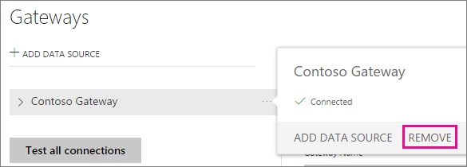

<properties
pageTitle="Administrar el origen de datos - Import/programada de actualización"
description="Cómo administrar los local puerta de enlace gateway y datos de orígenes de datos que pertenecen a dicha puerta de enlace. Este artículo es específico de los orígenes de datos que se pueden utilizar con la actualización programada importación."
services="powerbi"
documentationCenter=""
authors="guyinacube"
manager="erikre"
backup=""
editor=""
tags=""
qualityFocus="monitoring"
qualityDate="05/16/2016"/>

<tags
ms.service="powerbi"
ms.devlang="NA"
ms.topic="article"
ms.tgt_pltfrm="na"
ms.workload="powerbi"
ms.date="10/01/2016"
ms.author="asaxton"/>
# Administrar el origen de datos - Import/programada de actualización

Una vez haya instalado la puerta de enlace de datos local, debe agregar los orígenes de datos que se pueden usar con la puerta de enlace. En este artículo examinaremos cómo trabajar con puertas de enlace y orígenes de datos que se utilizan para la actualización programada en lugar de DirectQuery o conexiones directas.

## Descargue e instale la puerta de enlace

Puede descargar la puerta de enlace desde el servicio Power BI. Seleccione **descargas** > **puerta de enlace de datos**, o yendo a la [página de descarga de la puerta de enlace](https://go.microsoft.com/fwlink/?LinkId=698861).

## Agregar una puerta de enlace

Para agregar una puerta de enlace, simplemente [descargar](https://go.microsoft.com/fwlink/?LinkId=698863) e instalar la puerta de enlace de la empresa en un servidor en su entorno. Después de haber instalado la puerta de enlace, se mostrará en la lista de puertas de enlace en **Administrar puertas de enlace**.

> [AZURE.NOTE] 
            **Administrar las puertas de enlace** no se mostrará hasta que son el Administrador de al menos una puerta de enlace. Esto puede suceder ya sea por que se agrega como un administrador o instalar y configurar una puerta de enlace.

## Quitar una puerta de enlace

Quitar una puerta de enlace también se eliminan los orígenes de datos en dicha puerta de enlace.  Esto también interrumpirá cualquier paneles e informes que dependen de esos orígenes de datos.

1.  Seleccione el icono de engranaje  en la esquina superior derecha > **Administrar puertas de enlace**.

2.  Puerta de enlace > **quitar**

    

## Agregar un origen de datos

Puede agregar un origen de datos seleccionando una puerta de enlace y haga clic en **Agregar origen de datos**, o ir a la puerta de enlace > **Agregar origen de datos**.

A continuación, puede seleccionar el **el tipo de origen de datos** de la lista. Todos los orígenes de datos enumerados pueden usarse para una actualización programada con la puerta de enlace de la empresa. Analysis Services, SQL Server y SAP HANA pueden utilizarse para la actualización programada o DirectQuery/live conexiones.

A continuación, deberá rellenar la información del origen de datos que incluye la información de origen y las credenciales usadas para tener acceso al origen de datos.

> [AZURE.NOTE] Todas las consultas al origen de datos se ejecutan con estas credenciales. Para obtener más información, consulte el artículo de puerta de enlace de datos principal local para obtener más información acerca de cómo [credenciales](powerbi-gateway-onprem.md#credentials) se almacenan.

Puede hacer clic en **Agregar** después de que todo lo rellena dispone de.  Ahora puede usar este origen de datos para la actualización programada con sus datos locales. Verá *conexión correcta* Si se ha ejecutado correctamente.

<!-- Shared Install steps Include -->
[AZURE.INCLUDE [gateway-onprem-datasources-include](../includes/gateway-onprem-datasources-include.md)]

### Configuración avanzada

Puede configurar el nivel de privacidad para el origen de datos. Controla cómo se pueden puré los datos de. Sólo se utiliza para la actualización programada. [Obtener más información](https://support.office.com/article/Privacy-levels-Power-Query-CC3EDE4D-359E-4B28-BC72-9BEE7900B540)

## Quitar un origen de datos

Quitar un origen de datos se interrumpen cualquier paneles o informes que se basan en el origen de datos determinado.  

Para quitar un origen de datos, vaya al origen de datos > **quitar**.

## Administrar administradores

En la ficha de administradores, la puerta de enlace, puede agregar y quitar usuarios que pueden administrar la puerta de enlace. Sólo puede agregar usuarios en este momento. No se puede agregar grupos de seguridad.

## Administrar usuarios

En la pestaña usuarios, el origen de datos, puede agregar y quitar usuarios o grupos de seguridad, que pueden usar este origen de datos.

> [AZURE.NOTE] Sólo los controles que tienen permiso para publicar informes de lista de los usuarios. Los propietarios de informes pueden crear paneles o paquetes de contenido y compartir con otros usuarios.

## Usando el origen de datos para la actualización programada

Después de haber creado el origen de datos, estará disponible para usarse con cualquier conexiones DirectQuery o a través de la actualización programada. 

> [AZURE.NOTE] Servidor y el nombre de la base de datos deben coincidir entre Power BI Desktop y el origen de datos dentro de la puerta de enlace de datos local.

El vínculo entre el conjunto de datos y el origen de datos dentro de la puerta de enlace se basa en el nombre del servidor y el nombre de la base de datos. Estos tienen que coincidir. Por ejemplo, si proporciona una dirección IP para el nombre del servidor, en Power BI Desktop, debe utilizar la dirección IP del origen de datos dentro de la configuración de puerta de enlace. Si utiliza *servidor*, en Power BI Desktop, debe usar el mismo origen de datos configurado para la puerta de enlace.

Si se enumeran en el **usuarios** ficha del origen de datos configurado dentro de la puerta de enlace y la coincidencia de nombre de servidor y base de datos, verá la puerta de enlace como una opción para usar con la actualización programada.

> [AZURE.WARNING] Si el conjunto de datos contiene varios orígenes de datos, se debe agregar cada origen de datos dentro de la puerta de enlace. Si uno o más orígenes de datos no se agregan a la puerta de enlace, no verá la puerta de enlace como disponible para la actualización programada.

## Limitaciones

- OAuth no es un esquema de autenticación compatible con la puerta de enlace de datos local. No se puede agregar orígenes de datos que requieren OAuth. Si el conjunto de datos tiene un origen de datos que requieren OAuth, no podrá utilizar la puerta de enlace para la actualización programada.

## Consulte también

[Puerta de enlace de datos local](powerbi-gateway-onprem.md)  
[Puerta de enlace de datos - profundidad local](powerbi-gateway-onprem-indepth.md)  
[Solución de problemas de la puerta de enlace de datos local](powerbi-gateway-onprem-tshoot.md)  
¿Preguntas más frecuentes? [Pruebe la Comunidad de Power BI](http://community.powerbi.com/)