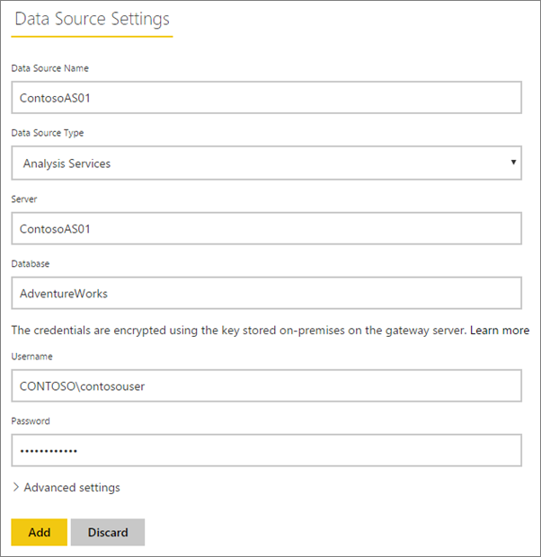
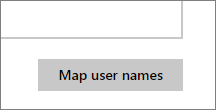
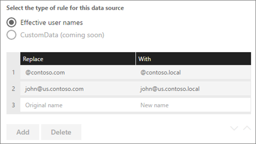
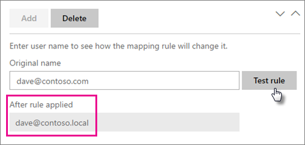

<properties
pageTitle="Administrar el origen de datos - Analysis Services"
description="Cómo administrar los locales puerta de enlace y los datos de orígenes de datos que pertenecen a dicha puerta de enlace. Esto es para Analysis Services en modo Tabular y Multidimensional."
services="powerbi"
documentationCenter=""
authors="guyinacube"
manager="erikre"
backup=""
editor=""
tags=""
qualityFocus="monitoring"
qualityDate="06/09/2016"/>

<tags
ms.service="powerbi"
ms.devlang="NA"
ms.topic="article"
ms.tgt_pltfrm="na"
ms.workload="powerbi"
ms.date="10/12/2016"
ms.author="asaxton"/>
# Administrar el origen de datos - Analysis Services

Una vez haya instalado la puerta de enlace de datos local, debe agregar los orígenes de datos que se pueden usar con la puerta de enlace. En este artículo se describe cómo trabajar con orígenes de datos y las puertas de enlace. Puede usar el origen de datos de Analysis Services para la actualización programada o conexiones directas.

<iframe width="560" height="315" src="https://www.youtube.com/embed/ownIGbcRAAU" frameborder="0" allowfullscreen></iframe>

## Descargue e instale la puerta de enlace

Puede descargar la puerta de enlace desde el servicio Power BI. Seleccione **descargas** > **puerta de enlace de datos**, o yendo a la [página de descarga de la puerta de enlace](https://go.microsoft.com/fwlink/?LinkId=698861).

## Limitaciones de conexiones activas de Analysis Services

Puede utilizar una conexión activa con instancias tabulares o multidimensionales.

|**Versión del servidor**|**SKU necesario**|
|---|---|
|2012 SP1 CU4 o posterior|SKU Business Intelligence y Enterprise|
|2014|SKU Business Intelligence y Enterprise|
|2016|SKU estándar o superior|

- Formato de nivel de celda y no se admiten características de traducción.
- Acciones y conjuntos con nombre no están expuestos a Power BI, pero todavía puede conectarse a los cubos multidimensionales que también contienen conjuntos de acciones o con nombre y crear elementos visuales y los informes.

## Agregar una puerta de enlace

Para agregar una puerta de enlace, simplemente [descargar](https://go.microsoft.com/fwlink/?LinkId=698861) e instalar la puerta de enlace de la empresa en un servidor en su entorno. Después de haber instalado la puerta de enlace, se mostrará en la lista de puertas de enlace en **Administrar puertas de enlace**.

> [AZURE.NOTE] 
            **Administrar las puertas de enlace** no se mostrará hasta que son el Administrador de al menos una puerta de enlace. Esto puede suceder ya sea por que se agrega como un administrador o instalar y configurar una puerta de enlace.

## Quitar una puerta de enlace

Quitar una puerta de enlace también se eliminan los orígenes de datos en dicha puerta de enlace.  Esto también interrumpirá cualquier paneles e informes que dependen de esos orígenes de datos.

1.  Seleccione el icono de engranaje  en la esquina superior derecha > **Administrar puertas de enlace**.

2.  Puerta de enlace > **quitar**

    

## Agregar un origen de datos

Puede agregar un origen de datos seleccionando una puerta de enlace y haga clic en **Agregar origen de datos**, o ir a la puerta de enlace > **Agregar origen de datos**.

A continuación, puede seleccionar el **el tipo de origen de datos** de la lista. Seleccione Analysis Services si se conecta a un servidor Tabular o de acceso Multidimensional.

A continuación, deberá rellenar la información del origen de datos que incluye el **Server** y **base de datos**.  

El **nombre de usuario** y **contraseña** que especifique se utilizará la puerta de enlace para conectarse a la instancia de Analysis Services. 

> [AZURE.NOTE] La cuenta de Windows especificada debe tener permisos de administrador del servidor para la instancia que se está conectando. Si se establece la contraseña de la cuenta para que caduque, los usuarios podrían obtener un error de conexión si no se actualiza la contraseña para el origen de datos. Para obtener más información, consulte el artículo de puerta de enlace de datos principal local para obtener más información acerca de cómo [credenciales](powerbi-gateway-onprem.md#credentials) se almacenan.

Puede hacer clic en **Agregar** después de que todo lo rellena dispone de.  Ahora puede usar este origen de datos para la actualización programada o live conexiones con una instancia de Analysis Services que sea local.  Verá *conexión correcta* Si se ha ejecutado correctamente.

### Configuración avanzada

Puede configurar el nivel de privacidad para el origen de datos. Controla cómo se pueden puré los datos de. Sólo se utiliza para la actualización programada. No se aplica a las conexiones de live. [Obtener más información](https://support.office.com/article/Privacy-levels-Power-Query-CC3EDE4D-359E-4B28-BC72-9BEE7900B540)

## 'Obtener datos de' experiencia para Analysis Services en el sitio de Power BI

Una única opción para Analysis Services es usar la obtención de datos dentro del servicio Power BI directamente. Puede conectarse a un origen de datos de Analysis Services en directo que se configura en la puerta de enlace sin necesidad de Power BI Desktop. La cuenta debe aparecer en el **usuarios** ficha del origen de datos, en la puerta de enlace para que se muestre en la lista. Para conectarse al origen de datos, puede hacer lo siguiente.

1. Dentro del servicio Power BI, seleccione **obtener datos**.

2. Seleccione **bases de datos**.

3. Seleccione **SQL Server Analysis Services** > **Conectar**.

4. Seleccione un origen de datos de la lista. Cualquier origen de datos de Analysis Services que tienen acceso a aparecerá aquí.

5. Seleccione el modelo que desea conectarse. A continuación, seleccione **Conectar**.

Verá un conjunto de datos aparecen con el nombre del servidor. A continuación, puede seleccionar ese conjunto de datos y empezar a crear informes en él. Esto funcionará respecto a datos activos.

## Nombres de usuario con Analysis Services

Cada vez que un usuario interactúa con un informe conectado a Analysis Services, el nombre de usuario efectivo se pasa a la puerta de enlace y, a continuación, en el servidor de Analysis Services local. La dirección de correo electrónico, iniciar sesión en Power BI, es lo que se pasará a Analysis Services como el usuario efectivo. Se pasa la propiedad de conexión [EffectiveUserName](https://msdn.microsoft.com/library/dn140245.aspx#bkmk_auth). Esta dirección de correo electrónico debe coincidir con un UPN definido en el dominio de Active Directory local. El UPN es una propiedad de una cuenta de Active Directory. A continuación, esa cuenta de Windows debe estar presente en una función de Analysis Services. Si no se encuentra una coincidencia en Active Directory, el inicio de sesión no será correcta. [Obtener más información](https://msdn.microsoft.com/library/ms677605.aspx)

También puede asignar su nombre con un UPN de directorio local de inicio de sesión de Power BI. [Obtener más información](powerbi-gateway-enterprise-manage-ssas.md#map-user-names)

<iframe width="560" height="315" src="https://www.youtube.com/embed/Qb5EEjkHoLg" frameborder="0" allowfullscreen></iframe>

### ¿Cómo se puede saber qué es mi UPN?

Puede que no sepa qué es el UPN y puede que no sea un administrador de dominio. Puede utilizar el siguiente comando desde la estación de trabajo para averiguar el UPN de la cuenta.

    whoami /upn

El resultado tendrá un aspecto similar a una dirección de correo electrónico, pero esto es el UPN de la cuenta de dominio. Si está utilizando un origen de datos de Analysis Services para las conexiones en directo y si esto no coincide con la dirección de correo electrónico que inicie sesión en Power BI con, puede mirar cómo [asignar nombres de usuario](#map-user-names).

## Asignar nombres de usuario

<iframe width="560" height="315" src="https://www.youtube.com/embed/eATPS-c7YRU" frameborder="0" allowfullscreen></iframe>

Para orígenes de datos de Analysis Services, puede configurar reglas personalizadas de nombre Principal de usuario (UPN). Esto le ayudará si los nombres de inicio de sesión del servicio de Power BI no coinciden con su directorio local UPN. Por ejemplo, si inicia sesión en Power BI mediante john@contoso.com, pero su directorio local UPN es john@contoso.local, puede configurar una regla de asignación para que john@contoso.local pasa a Analysis Services.

Para llegar a la pantalla de asignación de UPN, haga lo siguiente.

1. Vaya a la **icono de engranaje** y seleccione **Administrar puertas de enlace**.

2. Expanda la puerta de enlace que contiene el origen de datos de Analysis Services. Si no ha creado el origen de datos de Analysis Services, puede hacerlo en este momento.

3. Seleccione el origen de datos y, a continuación, seleccione la **usuarios** ficha.

4. Seleccione **asignar nombres de usuario**.

    
    
A continuación, verá opciones para agregar reglas, así como de prueba para un usuario determinado.

> [AZURE.NOTE] Es posible cambiar involuntariamente un usuario que no era su intención. Por ejemplo, si su **Reemplazar (valor original)** es *@contoso.com* y su **con (nombre)** es *@contoso.local*, todos los usuarios con un inicio de sesión que contiene *@contoso.com* se reemplazará con *@contoso.local*. Además, si su **Reemplazar (nombre Original)** es *dave@contoso.com* y su **con (nombre)** es *dave@contoso.local*, un usuario con el inicio de sesión de v-dave@contoso.com se enviaría como v dave*@contoso.local*.

Actualmente solo se pueden proporcionar reglas para **los nombres de usuario efectivo**.

### Trabajar con reglas de asignación

Para crear una regla de asignación, escriba un valor para **nombre Original** y **nuevo nombre** y, a continuación, seleccione **Agregar**.

|Campo|Descripción
|---|---|
|Replace (nombre originales)|La dirección de correo electrónico que ha iniciado sesión en Power BI con.|
|(Nuevo nombre)|El valor que desea reemplazarlo. El resultado de la sustitución es lo que se pasará a la *EffectiveUserName* propiedad para la conexión de Analysis Services.|

Cuando se selecciona un elemento en la lista, puede reordenar utilizando la **iconos de angular**, o **Eliminar** la entrada.

### Uso de Wildcard(*)

Puede utilizar un carácter comodín para su **Reemplazar (nombre Original)** cadena. Sólo puede utilizarse por sí mismo y no con cualquier otra parte de la cadena. Esto le permitirá tomar todos los usuarios y pasar un valor único para el origen de datos. Esto es útil si desea que todos los usuarios de su organización para usar el mismo usuario en su entorno local.

### Probar una regla de asignación

Puede validar un nombre original que se reemplazará con especificando un valor para **nombre Original** y seleccionando **Probar regla**.

> [AZURE.NOTE] Las reglas que se guardan tardará unos minutos para el servicio de comenzar a usarlos. En el explorador, la regla funcionará inmediatamente.

### Limitaciones de las reglas de asignación

- La asignación es para el origen de datos específico que se está configurando. No es una configuración global. Si tiene varios orígenes de datos de Analysis Services, tendrá que asignar los usuarios para cada origen de datos.

## Quitar un origen de datos

Quitar un origen de datos se interrumpen cualquier paneles o informes que se basan en el origen de datos determinado.  

Para quitar un origen de datos, vaya al origen de datos > **quitar**.

## Administrar administradores

En la ficha de administradores, la puerta de enlace, puede agregar y quitar usuarios que pueden administrar la puerta de enlace. Sólo puede agregar usuarios en este momento. No se puede agregar grupos de seguridad.

## Administrar usuarios

En la pestaña usuarios, el origen de datos, puede agregar y quitar usuarios o grupos de seguridad, que pueden usar este origen de datos.

> [AZURE.NOTE] Sólo los controles que tienen permiso para publicar informes de lista de los usuarios. Los propietarios de informes pueden crear paneles o paquetes de contenido y compartir con otros usuarios.

## Usar el origen de datos

Después de haber creado el origen de datos, estará disponible para usarse con cualquier conexiones en directo o a través de la actualización programada. 

> [AZURE.NOTE] Servidor y el nombre de la base de datos deben coincidir entre Power BI Desktop y el origen de datos dentro de la puerta de enlace de datos local.

El vínculo entre el conjunto de datos y el origen de datos dentro de la puerta de enlace se basa en el nombre del servidor y el nombre de la base de datos. Estos tienen que coincidir. Por ejemplo, si proporciona una dirección IP para el nombre del servidor, en Power BI Desktop, debe utilizar la dirección IP del origen de datos dentro de la configuración de puerta de enlace. Si utiliza *servidor*, en Power BI Desktop, debe usar el mismo origen de datos configurado para la puerta de enlace.

Este es el caso de conexiones activas y actualización programada.

### Usar el origen de datos con conexiones dinámicas

Debe asegurarse de que las coincidencias de nombre servidor y base de datos entre Power BI Desktop y el origen de datos configurado para la puerta de enlace. También necesitará asegurarse de que el usuario aparece en el **usuarios** ficha del origen de datos para poder publicar los conjuntos de datos de la conexión activa. La selección de las conexiones activas, se produce dentro de Power BI Desktop al importar datos en primer lugar.

Después de publicar, desde Power BI Desktop o **obtener datos**, los informes deben empezar a trabajar. Puede tardar varios minutos, después de crear el origen de datos dentro de la puerta de enlace para la conexión ser utilizable.

### Usar el origen de datos con la actualización programada

Si se enumeran en el **usuarios** ficha del origen de datos configurado dentro de la puerta de enlace y la coincidencia de nombre de servidor y base de datos, verá la puerta de enlace como una opción para usar con la actualización programada.

## Véase también

[Puerta de enlace de datos local](powerbi-gateway-onprem.md)  
[Puerta de enlace de datos - profundidad local](powerbi-gateway-onprem-indepth.md)  
[Solución de problemas de la puerta de enlace de datos local](powerbi-gateway-onprem-tshoot.md)  
¿Preguntas más frecuentes? [Pruebe la Comunidad de Power BI](http://community.powerbi.com/)