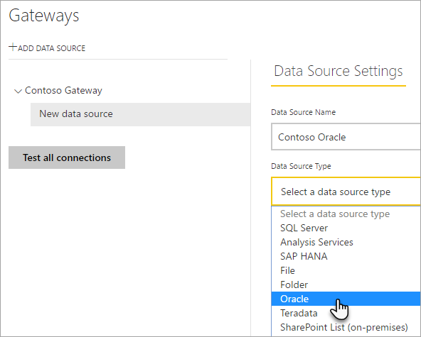
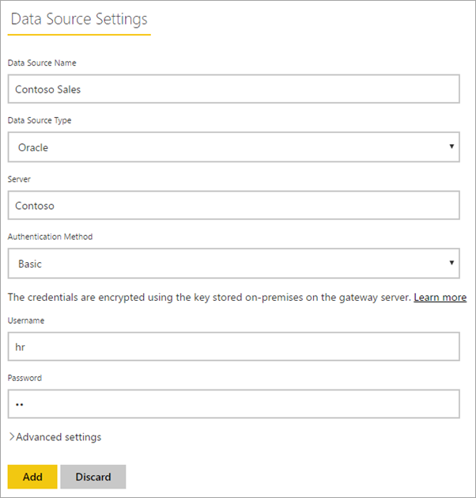

<properties
pageTitle="Manage your data source - Oracle"
description="How to manage the on-premises data gateway and data sources that belong to that gateway."
services="powerbi"
documentationCenter=""
authors="guyinacube"
manager="mblythe"
backup=""
editor=""
tags=""
qualityFocus="no"
qualityDate=""/>

<tags
ms.service="powerbi"
ms.devlang="NA"
ms.topic="article"
ms.tgt_pltfrm="na"
ms.workload="powerbi"
ms.date="08/26/2016"
ms.author="asaxton"/>
# Manage your data source - Oracle

Once you have installed the On-premises Data Gateway, you will need to add data sources that can be used with the gateway. This article will look at how to work with gateways and data sources. You can use the Oracle data source either for scheduled refresh or for DirectQuery.

## Download and install the gateway

You can download the gateway from the Power BI service. Select <bpt id="p1">**</bpt>Downloads<ept id="p1">**</ept><ph id="ph1"> &gt; </ph><bpt id="p2">**</bpt>Data Gateway<ept id="p2">**</ept>, or by going to the <bpt id="p3">[</bpt>gateway download page<ept id="p3">](https://go.microsoft.com/fwlink/?LinkId=698861)</ept>.


> [AZURE.WARNING] In order for the gateway to be able to connect to your Oracle server, the Oracle Data Provider for .NET (ODP.NET) needs to be installed and configured. This is part of the Oracle Data Access Components (ODAC). For more information on how to download the Oracle provider, see <bpt id="p1">[</bpt>Installing the Oracle Client<ept id="p1">](#installing-the-oracle-client)</ept> below.

## Installing the Oracle client

For <bpt id="p1">**</bpt>32-bit<ept id="p1">**</ept> versions of Power BI Desktop, use the following link to download and install the <bpt id="p2">**</bpt>32-bit<ept id="p2">**</ept> Oracle client:

-   [32-bit Oracle Data Access Components (ODAC) with Oracle Developer Tools for Visual Studio (12.1.0.2.4)](http://www.oracle.com/technetwork/topics/dotnet/utilsoft-086879.html)

For <bpt id="p1">**</bpt>64-bit<ept id="p1">**</ept> versions of Power BI Desktop, or for the On-Premises Data Gateway, use the following link to download and install the <bpt id="p2">**</bpt>64-bit<ept id="p2">**</ept> Oracle client:

-   [64-bit ODAC 12c Release 4 (12.1.0.2.4) Xcopy for Windows x64](http://www.oracle.com/technetwork/database/windows/downloads/index-090165.html)

Once that is installed, you will need to configure your tnsnames.ora file with the proper information for your database. Power BI Desktop and the gateway will go off of the net_service_name defined in the tnsnames.ora file. If it isn't configured, you will not be able to connect. The default path for tnsnames.ora is the following: <ph id="ph1">`[Oracle Home Directory]\Network\Admin\tnsnames.ora`</ph>. For more information about how to configure tnsnames.ora files, see <bpt id="p1">[</bpt>Oracle: Local Naming Parameters (tnsnames.ora)<ept id="p1">](https://docs.oracle.com/cd/B28359_01/network.111/b28317/tnsnames.htm)</ept>.

### Example tnsnames.ora file entry

The basic format of an entry in tnsname.ora is the following.

```
net_service_name= 
 (DESCRIPTION= 
   (ADDRESS=(protocol_address_information))
   (CONNECT_DATA= 
     (SERVICE_NAME=service_name))) 
```

Here is an example of the server and port information filled in.

```
CONTOSO =
  (DESCRIPTION =
    (ADDRESS = (PROTOCOL = TCP)(HOST = oracleserver.contoso.com)(PORT = 1521))
    (CONNECT_DATA =
      (SERVER = DEDICATED)
      (SERVICE_NAME = CONTOSO)
    )
  )
```

## Add a gateway

To add a Gateway, simply <bpt id="p1">[</bpt>download<ept id="p1">](https://go.microsoft.com/fwlink/?LinkId=698861)</ept> and install the gateway on a server in your environment. After you have installed the gateway, it will show in the lists of gateways under <bpt id="p1">**</bpt>Manage gateways<ept id="p1">**</ept>.

> [AZURE.NOTE] <bpt id="p1">**</bpt>Manage gateways<ept id="p1">**</ept> will not show up until you are the admin of at least one gateway. This can happen either by being added as an admin or you installing and configuring a gateway.

## Remove a gateway

Removing a gateway will also delete any data sources under that gateway.  This will also break any dashboards and reports that rely on those data sources.

1.  Select the gear icon <ph id="ph1"></ph> in the upper-right corner &gt; <bpt id="p1">**</bpt>Manage gateways<ept id="p1">**</ept>.

2.  Gateway &gt; <bpt id="p1">**</bpt>Remove<ept id="p1">**</ept>

    

## Add a data source

You can add a data source by either selecting a gateway and click <bpt id="p1">**</bpt>Add data source<ept id="p1">**</ept>, or go to Gateway &gt; <bpt id="p2">**</bpt>Add data source<ept id="p2">**</ept>.


You can then select the <bpt id="p1">**</bpt>Data Source Type<ept id="p1">**</ept> from the list.



You will then want to fill in the information for the data source which includes the <bpt id="p1">**</bpt>Server<ept id="p1">**</ept> and the <bpt id="p2">**</bpt>Database<ept id="p2">**</ept>.  

You will also need to choose an <bpt id="p1">**</bpt>Authentication Method<ept id="p1">**</ept>.  This can either be <bpt id="p1">**</bpt>Windows<ept id="p1">**</ept> or <bpt id="p2">**</bpt>Basic<ept id="p2">**</ept>.  You would want to choose <bpt id="p1">**</bpt>Basic<ept id="p1">**</ept> if you are going to use an account that is created within Oracle instead of Windows Authentication. Then enter the credentials that will be used for this data source.

> [AZURE.NOTE] All queries to the data source will run using these credentials. For more information, see the main on-premises data gateway article to learn more about how <bpt id="p1">[</bpt>credentials<ept id="p1">](powerbi-gateway-onprem.md#credentials)</ept> are stored.



You can click <bpt id="p1">**</bpt>Add<ept id="p1">**</ept> after you have everything filled in.  You can now use this data source for scheduled refresh, or DirectQuery, against an Oracle server that is on-premises. You will see <bpt id="p1">*</bpt>Connection Successful<ept id="p1">*</ept> if it succeeded.


### Configuración avanzada

You can configure the privacy level for your data source. This controls how data can be mashed up. This is only used for scheduled refresh. It does not apply to DirectQuery. [Obtener más información](https://support.office.com/article/Privacy-levels-Power-Query-CC3EDE4D-359E-4B28-BC72-9BEE7900B540)


## Remove a data source

Removing a data source will break any dashboards or reports that rely on the given data source.  

To remove a Data Source, go to the Data Source &gt; <bpt id="p1">**</bpt>Remove<ept id="p1">**</ept>.


## Manage administrators

On the Administrators tab, for the gateway, you can add, and remove, users that can administer the gateway. You can only add users at this time. Security groups cannot be added.


## Administrar usuarios

On the Users tab, for the data source, you can add, and remove, users, or security groups, that can use this data source.

> [AZURE.NOTE] The users list only controls who are allowed to publish reports. The report owners can create dashboards, or content packs, and share those with other users. Users that are consuming the report or dashboard do not need to be in the users list.


## Using the data source

After you have created the data source, it will be available to use with either DirectQuery connections, or through scheduled refresh. 

> [AZURE.WARNING] Server and database name have to match between Power BI Desktop and the data source within the on-premises data gateway gateway!

The link between your dataset and the data source within the gateway is based on your server name and database name. These have to match! For example, if you supply an IP Address for the server name, within Power BI Desktop, you will need to use the IP Address for the data source within the gateway configuration. This name also has to match an alias defined within the tnsnames.ora file. For more information about the tnsnames.ora file, see <bpt id="p1">[</bpt>Installing the Oracle Client<ept id="p1">](#installing-the-oracle-client)</ept>.

This is the case for both DirectQuery and scheduled refresh.

### Using the data source with DirectQuery connections

You will need to make sure the server and database name matches between Power BI Desktop and the configured data source for the gateway. You will also need to make sure your user is listed in the <bpt id="p1">**</bpt>Users<ept id="p1">**</ept> tab of the data source in order to publish DirectQuery datasets. The selection, for DirectQuery, occurs within Power BI Desktop when you first import data. [Obtener más información](powerbi-desktop-use-directquery.md)

After you publish, either from Power BI Desktop or <bpt id="p1">**</bpt>Get Data<ept id="p1">**</ept>, your reports should start working. It may take several minutes, after creating the data source within the gateway, for the connection to be usable.

### Using the data source with scheduled refresh

If you are listed in the <bpt id="p1">**</bpt>Users<ept id="p1">**</ept> tab of the data source configured within the gateway, and the server and database name match, you will see the gateway as an option to use with scheduled refresh.


## Solucionar problemas

You may encounter serveral errors from Oracle when the naming syntax is either incorrect or not configured properly.

- ORA-12154: TNS: could not resolve the connect identifier specified  
- ORA-12514: TNS listener does not currently know of service requested in connect descriptor  
- ORA-12541: TNS: no listener  
- ORA-12170: TNS:Connect timeout occurred  
- ORA-12504: TNS listener was not given the SERVICE_NAME in CONNECT_DATA  

These errors could occur if either the Oracle client is not installed, or if it is not configured properly. If it is installed, you will want to verify the tnsnames.ora file is properly configured and you are using the proper net_service_name. You will also need to make sure that the net_service_name is the same between the machine using Power BI Desktop and the machine that is running the gateway. For more information, see <bpt id="p1">[</bpt>Installing the Oracle Client<ept id="p1">](#installing-the-oracle-client)</ept>.

> [AZURE.NOTE] You may also be hitting an issue due to compatability between the Oracle server version and the Oracle client version. Typically you want these to match.

For additional troubleshooting information relating to the gateway, see <bpt id="p1">[</bpt>Troubleshooting the On-premises Data Gateway<ept id="p1">](powerbi-gateway-onprem-tshoot.md)</ept>.

## Véase también

[On-premises Data Gateway](powerbi-gateway-onprem.md)  
[On-premises Data Gateway - in-depth](powerbi-gateway-onprem-indepth.md)  
[Troubleshooting the On-premises Data Gateway](powerbi-gateway-onprem-tshoot.md)  
More questions? [Try the Power BI Community](http://community.powerbi.com/)