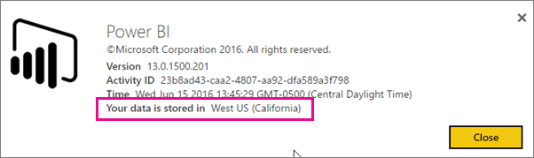
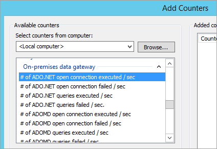
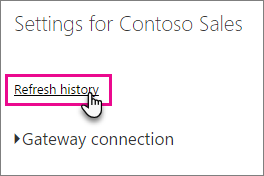

<properties
pageTitle="Solución de problemas de la puerta de enlace de datos local"
description="Este artículo proporciona métodos solucionar los problemas que tiene con la puerta de enlace de datos local. Proporciona posibles soluciones a problemas conocidos, así como herramientas para ayudarle."
services="powerbi"
documentationCenter=""
authors="guyinacube"
manager="erikre"
backup=""
editor=""
tags=""
qualityFocus="no"
qualityDate=""/>

<tags
ms.service="powerbi"
ms.devlang="NA"
ms.topic="article"
ms.tgt_pltfrm="na"
ms.workload="powerbi"
ms.date="09/21/2016"
ms.author="asaxton"/>
# Solución de problemas de la puerta de enlace de datos local

A continuación se pasa por algunos problemas comunes que puede producirse al usar la puerta de enlace de datos local. 

<!-- Shared Community & support links Include -->
[AZURE.INCLUDE [gateway-onprem-tshoot-support-links-include](../includes/gateway-onprem-tshoot-support-links-include.md)]

<!-- Shared Troubleshooting Install Include -->
[AZURE.INCLUDE [gateway-onprem-tshoot-install-include](../includes/gateway-onprem-tshoot-install-include.md)]

## Configuración

### Cómo reiniciar la puerta de enlace

La puerta de enlace se ejecuta como un servicio de Windows para que pueda iniciar y detener de varias maneras. Por ejemplo, puede abrir un símbolo del sistema con permisos elevados en el equipo donde la puerta de enlace se está ejecutando y, a continuación, ejecute cualquiera de estos comandos:

- Para detener el servicio, ejecute este comando:

    ''' net stop PBIEgwService '''
    
- Para iniciar el servicio, ejecute este comando:

    ''' del comando net start PBIEgwService '''

### Error: No se pudo crear la puerta de enlace. Inténtelo de nuevo.

Todos los detalles están disponibles, pero la llamada al servicio Power BI devolvió un error. Se mostrará el error y un identificador de actividad. Esto puede ocurrir por diferentes motivos. Puede recopilar y revisar los registros, como se menciona a continuación, para obtener más detalles. 

Esto también podría ser debido a problemas de configuración de proxy. Ahora permiten la interfaz de usuario de configuración del proxy. Puede obtener más información acerca de decisiones [cambios de configuración de proxy](powerbi-gateway-proxy.md)

### Error: Error al actualizar los detalles de la puerta de enlace.  Inténtelo de nuevo.

Ha recibido información desde el servicio Power BI, la puerta de enlace. La información se pasa en el servicio de windows local, pero no pudo devolver. O bien, error de generación de la clave simétrica. La excepción interna que se mostrarán en **Mostrar detalles**. Puede recopilar y revisar los registros, como se menciona a continuación, para obtener más detalles. 

### Error: El servicio Power BI registrado puerta de enlace local como no accesible. Reinicie la puerta de enlace y vuelva a intentarlo.

Al final de la configuración, el servicio Power BI se llamará nuevo para validar la puerta de enlace. El servicio Power BI no informa de la puerta de enlace como *live*. Reiniciar el servicio de windows puede permitir la comunicación se realice correctamente. Puede recopilar y revisar los registros, como se menciona a continuación, para obtener más detalles. 

### Error de secuencia de comandos durante el inicio de sesión en Power BI

Puede recibir un error de secuencia de comandos al iniciar sesión en Power BI como parte de la configuración de puerta de enlace de la empresa. Instalar la siguiente actualización de seguridad, debe resolver el problema. Esto se puede instalar mediante Windows Update.

[MS16-051: Actualización de seguridad para Internet Explorer: 10 de mayo de 2016 (3154070 KB)](https://support.microsoft.com/kb/3154070)

### Error en la configuración de puerta de enlace con una excepción de referencia nula

Puede encontrar un error similar al siguiente.

        Failed to update gateway details.  Please try again.
        Error updating gateway configuration.

Esto incluye un seguimiento de pila y seguimiento de la pila se pueden incluir lo siguiente.

        Microsoft.PowerBI.DataMovement.Pipeline.Diagnostics.CouldNotUpdateGatewayConfigurationException: Error updating gateway configuration. ----> System.ArgumentNullException: Value cannot be null.
        Parameter name: serviceSection

Si va a actualizar una puerta de enlace anterior, se conserva el archivo de configuración. Puede haber una sección que falta. Cuando la puerta de enlace intenta leerlo, obtenemos el anterior null a excepción de referencia.

Para corregir este problema, realice lo siguiente.

1. Desinstalar la puerta de enlace.

2. Elimine la carpeta siguiente.

        c:\Program Files\on-premises data gateway

3. Vuelva a instalar la puerta de enlace.

4. Opcionalmente, aplique la clave de recuperación para restaurar el enlace existente.

## Orígenes de datos

### Error: No se puede conectar. Detalles: "credenciales de conexión no válida"

Dentro de **Mostrar detalles**, debe mostrar el mensaje de error recibido desde el origen de datos. Para SQL Server, debería ver algo parecido a lo siguiente.

    Login failed for user 'username'.

Compruebe que tiene el nombre de usuario correcto y la contraseña. Compruebe también que esas credenciales pueden conectarse correctamente al origen de datos. Asegúrese de que coincide con la cuenta que se usa el **método de autenticación**.

### Error: No se puede conectar. Detalles: "no se puede conectar a la base de datos"

Pudimos para conectarse al servidor, pero no a la base de datos proporcionado. Compruebe el nombre de la base de datos, y que el usuario de credenciales como el permiso adecuado para tener acceso a esa base de datos.

Dentro de **Mostrar detalles**, debe mostrar el mensaje de error recibido desde el origen de datos. Para SQL Server, debería ver algo parecido a lo siguiente.

    Cannot open database "AdventureWorks" requested by the login. The login failed. Login failed for user 'username'.

### Error: No se puede conectar. Detalles: "error desconocido en la puerta de enlace empresarial"

Este error puede producirse por diferentes motivos. Asegúrese de validar que puede conectarse al origen de datos desde el equipo que hospeda la puerta de enlace. Esto puede ser el resultado del servidor no está accesible.

Dentro de **Mostrar detalles**, verá el código de error **DM_GWPipeline_UnknownError**.

También puede buscar en los registros de eventos > **registros de aplicaciones y servicios** > **servicio de puerta de enlace de Power BI empresarial** para obtener más detalles.

### Error: Se detectó un error al intentar conectarse a <server>. Detalles: "hemos llegado a la puerta de enlace de la empresa, pero la puerta de enlace no puede tener acceso el origen de datos local".

No hemos podido conectar con el origen de datos especificado. Asegúrese de validar la información proporcionada para ese origen de datos.

Dentro de **Mostrar detalles**, verá el código de error **DM_GWPipeline_Gateway_DataSourceAccessError**. 

Si el mensaje de error subyacente es similar al siguiente, esto significa que la cuenta que se usa para el origen de datos no es un administrador del servidor para esa instancia de Analysis Services. [Obtener más información](powerbi-gateway-onprem-manage-ssas.md#add-a-data-source)

    The 'CONTOSO\account' value of the 'EffectiveUserName' XML for Analysis property is not valid.

Si el mensaje de error subyacente es similar al siguiente, esto podría significar que la cuenta de servicio para Analysis Services pueden faltar los [token grupos-global-y-universal](https://msdn.microsoft.com/library/windows/desktop/ms680300.aspx) atributos de directorio (TGGAU).

    The user name or password is incorrect.

Dominios con acceso de compatibilidad de versiones anteriores de Windows 2000 tendrá el atributo TGGAU habilitado. Sin embargo, dominios creadas más recientemente no activará este atributo de forma predeterminada. Puede obtener más información sobre este [aquí](https://support.microsoft.com/kb/331951).

Puede confirmarlo haciendo lo siguiente.

1. Conectar con el equipo de Analysis Services en SQL Server Management Studio. En las propiedades avanzadas de conexión, incluir EffectiveUserName para el usuario en cuestión y vea si esto reproduce el error.

2. Puede utilizar la herramienta de Active Directory de dsacls para validar si el atributo se muestra. Esta es la herramienta se encuentra normalmente en un controlador de dominio. Debe saber cuál es el nombre de dominio completo de la cuenta y pasarlo a la herramienta.

        dsacls "CN=John Doe,CN=UserAccounts,DC=contoso,DC=com"
    
    Desea ver algo parecido a lo siguiente en los resultados.

            Allow BUILTIN\Windows Authorization Access Group
                                          SPECIAL ACCESS for tokenGroupsGlobalAndUniversal
                                          READ PROPERTY

Para corregir este problema, debe habilitar TGGAU en la cuenta usada para el servicio de windows de Analysis Services.

**Otra posibilidad de que el nombre de usuario o contraseña incorrecta**

Este error puede deberse también si el servidor de Analysis Services está en un dominio diferente que los usuarios y no hay una confianza bidireccional establecida.

Debe trabajar con los administradores de dominio para comprobar la relación de confianza entre dominios.

**No se pueden ver orígenes de datos de puerta de enlace de enterprise en 'Obtener datos' experiencia para Analysis Services desde el servicio Power BI**

Asegúrese de que su cuenta aparece en el **usuarios** ficha del origen de datos dentro de la configuración de puerta de enlace. Si no tiene acceso a la puerta de enlace, consulte con el Administrador de la puerta de enlace y pídale que compruebe. Sólo las cuentas en el **usuarios** lista verá el origen de datos en la lista de Analysis Services.

## Conjuntos de datos

### Error: No hay espacio suficiente para esta fila.

Esto ocurrirá si tiene una sola fila mayor que 4 MB de tamaño. Debe determinar cuál es la fila del origen de datos e intentar filtrar o reducir el tamaño de la fila.

## Reports

### Informe no pudo acceder al origen de datos porque no tiene acceso a nuestro origen de datos a través de una puerta de enlace de la empresa.

Esto ocurre normalmente por uno de los siguientes. 

1. La información de origen de datos no coincide con lo que está en el conjunto de datos subyacente. El servidor y el nombre de la base de datos necesitan coinciden con el origen de datos definido para la puerta de enlace de datos local y proporcionar en Power BI Desktop. Si utiliza una dirección IP en Power BI Desktop, el origen de datos, la puerta de enlace de datos local, debe usar también una dirección IP.

2. No hay un origen de datos en cualquier puerta de enlace dentro de su organización. Puede configurar el origen de datos en una puerta de enlace de datos nueva o existente, en local.

### Error: Error de acceso de origen de datos. Póngase en contacto con el Administrador de puerta de enlace.

Si está realizando este informe de uso de una conexión activa de Analysis Services, podría darse un problema con un valor que se pasa al EffectiveUserName que no es válida, o no tiene permisos en el equipo de Analysis Services. Normalmente, un problema de autenticación es debido a que el valor que se pasa para EffectiveUserName no coincide con un nombre principal de usuario local (UPN).

Para confirmar esto, puede hacer lo siguiente.

1. Buscar el nombre de usuario eficaz dentro de la [registros de puerta de enlace](#logs).

2. Una vez que el valor que se pasa, valide que es correcta. Si es el usuario, puede utilizar el siguiente comando desde un símbolo del sistema para ver el UPN. El UPN será similar a una dirección de correo electrónico.

        whoami /upn

Si lo desea, puede ver qué obtiene Power BI de Azure Active Directory.

1. Vaya a [https://graphexplorer.cloudapp.net](https://graphexplorer.cloudapp.net).

2. Seleccione **sesión** en la esquina superior derecha.

3. Ejecute la consulta siguiente. Verá una respuesta JSON bastante grande.

        https://graph.windows.net/me?api-version=1.5

4. Busque **userPrincipalName**. 


Si el UPN de Azure Active Directory no coincide con el UPN local de Active Directory, puede utilizar el [asignar nombres de usuario](powerbi-gateway-enterprise-manage-ssas.md#map-user-names) característica reemplazarla con un valor válido. O bien, puede trabajar con su administrador de inquilinos o administrador de Active Directory local, para obtener el UPN cambiado.

<!-- Shared Troubleshooting Firewall/Proxy Include -->
[AZURE.INCLUDE [gateway-onprem-tshoot-firewall-include](../includes/gateway-onprem-tshoot-firewall-include.md)]

Puede encontrar la región del centro de datos están en haciendo lo siguiente:

1. ¿Seleccione el **?** en la esquina superior derecha del servicio Power BI.

2. Seleccione **acerca de Power BI**.

3. La región de datos se mostrarán en **los datos se almacenan en**.

    

Si todavía no está recibiendo desde cualquier lugar, intente obtener un seguimiento de red mediante una herramienta como [fiddler](#fiddler) o netsh, aunque estas avanzadas métodos de colección y puede que necesite asistencia para analizar los datos recopilados. Puede ponerse en contacto con [admite](https://support.microsoft.com) para obtener ayuda.

## Pruebas

<iframe width="560" height="315" src="https://www.youtube.com/embed/IJ_DJ30VNk4?showinfo=0" frameborder="0" allowfullscreen></iframe>

### Contadores de rendimiento

Hay una serie de contadores de rendimiento que puede usar para medir las actividades de la puerta de enlace. Pueden ser helfup para entender si se tiene una gran carga de actividad y que tenga que realizar una nueva puerta de enlace. Estos contadores no reflejará cuánto tiempo tarda algo.

Estos contadores pueden acceder a través de la herramienta Monitor de rendimiento de Windows.



Hay agrupaciones generales de estos contadores.

|Tipo de contador|Descripción|
|---|---|
|ADO.NET|Se utiliza para las conexiones de DirectQuery.|
|ADOMD|Se utiliza para Analysis Services 2014 y versiones anteriores.|
|OLEDB|Esto sirve para algunos orígenes de datos. Esto incluye SAP HANA y servicio de análisis de 2016 o posterior.|
|Mashup|Esto incluye cualquier origen de datos importados. Si va a programar la actualización o realizar una actualización a petición, pasará a través del motor de mashup.|

Aquí se muestra una lista de los contadores de rendimiento disponibles.

|Contador|Descripción|
|---|---|
|# de conexión abierta de ADO.NET ejecutada por segundo|Número de acciones de conexión abierta de ADO.NET ejecutadas por segundo (correcta o errónea).|
|# de ADO.NET Abrir conexión con error por segundo|Número de acciones de conexiones abiertas de ADO.NET con error por segundo.|
|# de las consultas ADO.NET ejecutadas por segundo|Número de consultas ADO.NET ejecutadas por segundo (correcta o errónea).|
|# de ADO.NET consultas con error por segundo|Número de ADO.NET no las consultas ejecutadas por segundo.|
|# de conexión abierta de ADOMD ejecutada por segundo|Número de acciones de conexión abierta ADOMD ejecutados por segundo (correcta o errónea).|
|# de ADOMD Abrir conexión con error por segundo|Número de acciones de conexión abierta ADOMD con error por segundo.|
|# de consultas ADOMD ejecutadas por segundo|Número de consultas ADOMD ejecutados por segundo (correcta o errónea).|
|# de consultas ADOMD con error por segundo|Número de ADOMD no las consultas ejecutadas por segundo.|
|# de conexión abierto ejecutada por segundo|Número de acciones de conexión abierta ejecutados por segundo (correcta o errónea).|
|# de todas las conexiones con error por segundo|Número de acciones de error en la conexión abierta ejecutados por segundo.|
|# de todas las consultas ejecutadas por segundo|Número de consultas ejecutadas por segundo (correcta o errónea).|
|# elementos de la agrupación de conexiones de ADO.NET|Número de elementos de la agrupación de conexiones de ADO.NET.|
|# elementos de la agrupación de conexiones OLE DB|Número de elementos de la agrupación de conexiones OLE DB.|
|# de elementos en el grupo de Bus de servicio|Número de elementos en el grupo de Bus de servicio.|
|# de conexión abierta de Mashup ejecutada por segundo|Número de acciones de conexión abierta de Mashup ejecutados por segundo (correcta o errónea).|
|# de conexión abierta de Mashup con error por segundo|Número de acciones de conexión abierta de Mashup con error por segundo.|
|# de Mashup consultas ejecutadas por segundo|Número de consultas de Mashup ejecutadas por segundo (correcta o errónea).|
|# de Mashup consultas con error por segundo|Número de Mashup no las consultas ejecutadas por segundo|
|# de resultados múltiples establece consultas OLEDB con error por segundo|Número de varias consultas OLEDB error resultset ejecutados por segundo.|
|# de OLEDB resultset varias consultas ejecutadas por segundo|Número de OLEDB varias consultas de conjunto de resultados ejecutadas por segundo (correcta o errónea).|
|# de conexión abierta de OLEDB ejecutada por segundo|Número de acciones de conexión abierta de OLEDB ejecutados por segundo (correcta o errónea).|
|# de conexión abierta de OLEDB con error por segundo|Número de acciones de abrir conexión OLEDB con error por segundo.|
|# de las consultas ejecutadas por segundo de OLEDB|Número de OLEDB varias consultas de conjunto de resultados ejecutadas por segundo (correcta o errónea).|
|# de consultas OLEDB con error por segundo|Número de conjunto de resultados de varias OLEDB no las consultas ejecutadas por segundo.|
|# de consultas de conjunto de resultados único OLEDB ejecutadas por segundo|Número de consultas de conjunto de resultados único OLEDB ejecutados por segundo (correcta o errónea).|
|# de consultas con error por segundo|Número de errores de las consultas ejecutadas por segundo.|
|# de resultado único conjunto OLEDB consultas con error por segundo|Número de conjunto de resultados único OLEDB no las consultas ejecutadas por segundo.|

### Revisar las consultas lentas de rendimiento

Es posible que la respuesta a través de la puerta de enlace es lento. Esto podría ser para las consultas DirectQuery o al actualizar el conjunto de datos importado. Puede habilitar el registro adicional a las consultas de salida y sus intervalos para ayudar a entender lo que está realizando lentamente. Cuando encuentre una consulta de larga ejecución, puede requerir modificaciones adicionales en el origen de datos para optimizar el rendimiento de las consultas. Por ejemplo, ajustar los índices para una consulta de SQL Server.

Debe modificar dos archivos de configuración para determinar la duración de una consulta. 

#### Microsoft.PowerBI.DataMovement.Pipeline.GatewayCore.dll.config

Dentro de la *Microsoft.PowerBI.DataMovement.Pipeline.GatewayCore.dll.config* archivo, cambie la `EmitQueryTraces` valor de `False` a `True`. Este archivo se encuentra, de forma predeterminada, en *puerta de enlace de datos local de programa\Archivos C:\Program*. Habilitar `EmitQueryTraces` empezará a registrar las consultas que se envían desde la puerta de enlace a un origen de datos.

> [AZURE.IMPORTANT] Habilitar EmitQueryTraces podría aumentar el tamaño de registro considerablemente dependiendo del uso de la puerta de enlace. Una vez que haya terminado de revisar los registros, desee EmitQueryTraces se establece en False. No se recomienda dejar esta opción habilitada de largo plazo.

```
<setting name="EmitQueryTraces" serializeAs="String">
    <value>True</value>
</setting>
```

**Entrada de consulta de ejemplo**

```
DM.EnterpriseGateway Information: 0 : 2016-09-15T16:09:27.2664967Z DM.EnterpriseGateway 4af2c279-1f91-4c33-ae5e-b3c863946c41    d1c77e9e-3858-4b21-3e62-1b6eaf28b176    MGEQ    c32f15e3-699c-4360-9e61-2cc03e8c8f4c    FF59BC20 [DM.GatewayCore] Executing query (timeout=224) "<pi>
SELECT 
TOP (1000001) [t0].[ProductCategoryName],[t0].[FiscalYear],SUM([t0].[Amount])
 AS [a0]
FROM 
(
(select [$Table].[ProductCategoryName] as [ProductCategoryName],
    [$Table].[ProductSubcategory] as [ProductSubcategory],
    [$Table].[Product] as [Product],
    [$Table].[CustomerKey] as [CustomerKey],
    [$Table].[Region] as [Region],
    [$Table].[Age] as [Age],
    [$Table].[IncomeGroup] as [IncomeGroup],
    [$Table].[CalendarYear] as [CalendarYear],
    [$Table].[FiscalYear] as [FiscalYear],
    [$Table].[Month] as [Month],
    [$Table].[OrderNumber] as [OrderNumber],
    [$Table].[LineNumber] as [LineNumber],
    [$Table].[Quantity] as [Quantity],
    [$Table].[Amount] as [Amount]
from [dbo].[V_CustomerOrders] as [$Table])
)
 AS [t0]
GROUP BY [t0].[ProductCategoryName],[t0].[FiscalYear] </pi>"
```

#### Microsoft.PowerBI.DataMovement.Pipeline.GatewayCore.dll.config

Dentro de la *Microsoft.PowerBI.DataMovement.Pipeline.Diagnostics.dll.config* archivo, cambie la `TraceVerbosity` valor de `4` a `5`. Este archivo se encuentra, de forma predeterminada, en *puerta de enlace de datos local de programa\Archivos C:\Program*. Este cambio comenzará a detallado entradas de registro en el registro de puerta de enlace. Esto incluye las entradas que muestran la duración.

> [AZURE.IMPORTANT] Habilitar TraceVerbosity 5 podría aumentar el tamaño de registro considerablemente dependiendo del uso de la puerta de enlace. Una vez que haya terminado de revisar los registros, deberá establecer EmitQueryTraces en `4`. No se recomienda dejar esta opción habilitada de largo plazo.

```
<setting name="TracingVerbosity" serializeAs="String">
    <value>5</value>
</setting>
```

<a name="activities"></a>
#### Tipos de actividad

|Tipo de actividad|Descripción|
|---|---|
|MGEQ|Consultas ejecutadas en ADO.NET. Esto incluye orígenes de datos de DirectQuery.|
|MGEO|Consultas ejecutadas a través de OLE DB. Esto incluye SAB HANA y 2016 de Analysis Services.|
|MGEM|Consultas ejecutadas desde el motor de Mashup. Se utiliza con conjuntos de datos importados que utilice actualización programada o a petición de la actualización.|

#### Determinar la duración de una consulta

Para determinar el tiempo que tardó para consultar el origen de datos, puede hacer lo siguiente.

1. Abra el registro de puerta de enlace.

2. Buscar un [tipo de actividad](#activities) para buscar la consulta. Un ejemplo de esto sería MGEQ.

3. Tome nota del GUID de segundo es el identificador de solicitud. 

4. Continuará buscando MGEQ hasta que encuentre la entrada de FireActivityCompletedSuccessfullyEvent con la duración. Puede comprobar que la entrada tiene el mismo identificador de solicitud. Duración será en milisegundos.

        DM.EnterpriseGateway Verbose: 0 : 2016-09-26T23:08:56.7940067Z DM.EnterpriseGateway baf40f21-2eb4-4af1-9c59-0950ef11ec4a    5f99f566-106d-c8ac-c864-c0808c41a606    MGEQ    21f96cc4-7496-bfdd-748c-b4915cb4b70c    B8DFCF12 [DM.Pipeline.Common.TracingTelemetryService] Event: FireActivityCompletedSuccessfullyEvent (duration=5004)
    
    > [AZURE.NOTE] FireActivityCompletedSuccessfullyEvent es una entrada detallada. Esta entrada no se registrará a menos que sea TraceVerbosity en el nivel 5.

<!-- Shared Troubleshooting tools Include -->
[AZURE.INCLUDE [gateway-onprem-tshoot-tools-include](../includes/gateway-onprem-tshoot-tools-include.md)]

### Historial de actualización

Cuando se utiliza la puerta de enlace para una actualización programada, **historial de actualización** puede ayudarle a ver qué errores se han producido, así como proporcionar datos útiles si necesita crear una solicitud de soporte técnico. Puede ver ambos programada, así como a petición, las actualizaciones. A continuación mostramos cómo puede tener acceso a la **historial de actualización**.

1. En el panel de navegación de Power BI en **conjuntos de datos**, seleccione un conjunto de datos &gt; menú Abrir &gt; **Programar actualización**.

    

2. En **configuración...** &gt; **Programar actualización**, seleccione **historial de actualización**.

    

    

## Consulte también

[Configuración de proxy para las puertas de enlace de Power BI](powerbi-gateway-proxy.md)  
[Puerta de enlace de datos local](powerbi-gateway-onprem.md)  
[Puerta de enlace de datos - profundidad local](powerbi-gateway-onprem-indepth.md)  
[Administrar el origen de datos - Analysis Services](powerbi-gateway-enterprise-manage-ssas.md)  
[Administrar el origen de datos - SAP HANA](powerbi-gateway-enterprise-manage-sap.md)  
[Administrar el origen de datos: SQL Server](powerbi-gateway-enterprise-manage-sql.md)  
[Administrar el origen de datos - actualización programada o importar](powerbi-gateway-enterprise-manage-scheduled-refresh.md)  
¿Preguntas más frecuentes? [Pruebe la Comunidad de Power BI](http://community.powerbi.com/)