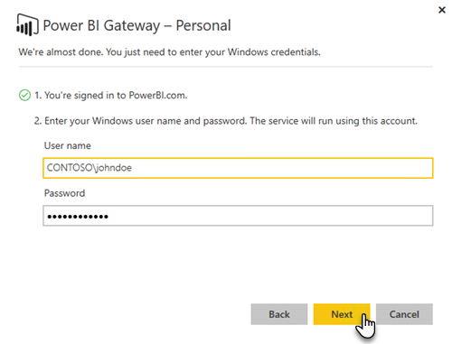

<properties
pageTitle="Puerta de enlace de datos local"
description="Se trata de una visión general de la puerta de enlace de datos local para Power BI. Puede utilizar esta puerta de enlace para trabajar con orígenes de datos de DirectQuery. También puede utilizar esta puerta de enlace para actualizar conjuntos de datos de nube con datos locales."
services="powerbi"
documentationCenter=""
authors="guyinacube"
manager="mblythe"
backup=""
editor=""
tags=""
qualityFocus="no"
qualityDate=""/>

<tags
ms.service="powerbi"
ms.devlang="NA"
ms.topic="article"
ms.tgt_pltfrm="na"
ms.workload="powerbi"
ms.date="10/12/2016"
ms.author="asaxton"/>
# Puerta de enlace de datos local

La puerta de enlace de datos local actúa como un puente, proporcionando la transferencia de datos rápida y segura entre los datos locales (datos que no están en la nube) y los servicios de Power BI, Microsoft Flow, aplicaciones lógicas y PowerApps.

Puede utilizar una sola puerta de enlace con servicios diferentes al mismo tiempo. Si está utilizando Power BI, así como PowerApps, una sola puerta de enlace y para ambos. Es dependiente de la cuenta que inicie sesión con.

<!-- Shared Requirements Include -->
[AZURE.INCLUDE [gateway-onprem-requirements-include](../includes/gateway-onprem-requirements-include.md)]

### Limitaciones de conexiones activas de Analysis Services

Puede utilizar una conexión activa con instancias tabulares o multidimensionales.

|**Versión del servidor**|**SKU necesario**|
|---|---|
|2012 SP1 CU4 o posterior|SKU Business Intelligence y Enterprise|
|2014|SKU Business Intelligence y Enterprise|
|2016|SKU estándar o superior|

- Formato de nivel de celda y no se admiten características de traducción.
- Acciones y conjuntos con nombre no están expuestos a Power BI, pero todavía puede conectarse a los cubos multidimensionales que también contienen conjuntos de acciones o con nombre y crear elementos visuales y los informes.

<!-- Shared Install steps Include -->
[AZURE.INCLUDE [gateway-onprem-datasources-include](../includes/gateway-onprem-datasources-include.md)]
 
## Descargue e instale la puerta de enlace de datos local

Para descargar la puerta de enlace, seleccione **puerta de enlace de datos** en el menú de descargas. Descargue el [puerta de enlace de datos local](http://go.microsoft.com/fwlink/?LinkID=820925).

<!-- Shared Install steps Include -->
[AZURE.INCLUDE [gateway-onprem-install-include](../includes/gateway-onprem-install-include.md)]

## Instale la puerta de enlace en modo personal 

> [AZURE.NOTE] Personal sólo funcionará con Power BI.

Después de instala la puerta de enlace personal, debe iniciar el **Power BI Gateway - Asistente para la configuración Personal**.

A continuación, debe iniciar sesión en Power BI para registrar la puerta de enlace con el servicio de nube.

También debe proporcionar el nombre de usuario de windows y la contraseña que se ejecutará el servicio de windows. Puede especificar una cuenta de Windows diferente de su propia. El servicio de puerta de enlace se ejecutará con esta cuenta.

Una vez completada la instalación, debe ir a los conjuntos de datos en Power BI y asegúrese de que se escriben las credenciales para los orígenes de datos locales.

<a name="credentials">
## Almacenar credenciales cifradas en la nube

Cuando se agrega un origen de datos a la puerta de enlace, debe proporcionar credenciales para ese origen de datos. Todas las consultas al origen de datos se ejecutan con estas credenciales. Las credenciales se cifran de forma segura, mediante el cifrado asimétrico no puede descifrarse en la nube, antes de que se almacenen en la nube. Las credenciales se envían al equipo, ejecuta la puerta de enlace local donde descifrarlas cuando se tiene acceso a los orígenes de datos.

<!-- Account and Port information -->
[AZURE.INCLUDE [gateway-onprem-accounts-ports-more](../includes/gateway-onprem-accounts-ports-more.md)]

<!-- How the gateway works -->
[AZURE.INCLUDE [gateway-onprem-how-it-works-include](../includes/gateway-onprem-how-it-works-include.md)]

## Solucionar problemas

Si tiene problemas al instalar y configurar una puerta de enlace, asegúrese de ver [solución de problemas de la puerta de enlace de Power BI - Enterprise](powerbi-gateway-enterprise-tshoot.md). Si cree que tiene un problema con el servidor de seguridad, consulte la [firewall o proxy](powerbi-gateway-enterprise-tshoot.md#firewall-or-proxy) sección en el artículo de solución de problemas.

Si piensa que ha experimentado problemas de proxy, con la puerta de enlace, consulte [configuración de proxy para las puertas de enlace de Power BI](powerbi-gateway-proxy.md).

## Consulte también

[Administrar el origen de datos - Analysis Services](powerbi-gateway-enterprise-manage-ssas.md)  
[Administrar el origen de datos - SAP HANA](powerbi-gateway-enterprise-manage-sap.md)  
[Administrar el origen de datos: SQL Server](powerbi-gateway-enterprise-manage-sql.md)  
[Administrar el origen de datos - Oracle](powerbi-gateway-onprem-manage-oracle.md)  
[Administrar el origen de datos - actualización programada o importar](powerbi-gateway-enterprise-manage-scheduled-refresh.md)  
[Puerta de enlace de datos exhaustiva local](powerbi-gateway-onprem-indepth.md)  
[Solución de problemas de la puerta de enlace de datos local](powerbi-gateway-onprem-tshoot.md)  
[Configuración de proxy para la puerta de enlace de datos local](powerbi-gateway-proxy.md)  
¿Preguntas más frecuentes? [Pruebe la Comunidad de Power BI](http://community.powerbi.com/)
