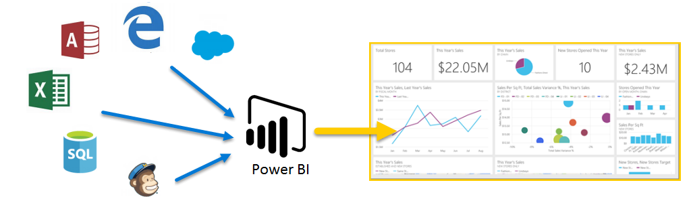

<properties
   pageTitle="Presentamos Power BI"
   description="Conocer las novedades de Power BI y sus elementos de software"
   services="powerbi"
   documentationCenter=""
   authors="davidiseminger"
   manager="mblythe"
   backup=""
   editor=""
   tags=""
   qualityFocus="no"
   qualityDate=""
   featuredVideoId=""
   courseDuration="5m"/>

<tags
   ms.service="powerbi"
   ms.devlang="NA"
   ms.topic="get-started-article"
   ms.tgt_pltfrm="NA"
   ms.workload="powerbi"
   ms.date="09/29/2016"
   ms.author="davidi"/>

# Guiada de aprendizaje para Power BI

Bienvenido a **interactiva aprendizaje** para Power BI. Este curso en línea de autoaprendizaje explica Power BI de forma secuencial, por lo que pueden aumentar su conocimiento desde el principio.

El curso está diseñado para proporcionar orientación en fragmentos comprensibles, con un flujo lógico que le ayuda a absorber conceptos, detalles y ejemplos. Incluye una gran cantidad de imágenes y vídeos para ayudarle a aprender, demasiado.

Esto **aprendizaje guiado** curso contiene muchos **secciones**, y cada sección tiene muchas **temas**. Después de los temas en esta primera **Introducción** sección, casi cada tema incluye un vídeo que describe lo que aprenda. El contenido siguiente aún más el vídeo explica el concepto, lo que le permite revisar y aprender a su propio ritmo.

Si eres un **principiante** con Power BI este curso le ayudará a ir, y si es de Power BI **veterano** unir los conceptos de este curso y rellenar los huecos. Esperamos que disfrute del curso y esperamos para incluir más contenido en el futuro.

## ¿Qué es Power BI?

            **Power BI** es una colección de servicios de software, aplicaciones y conectores que funcionan conjuntamente para activar los orígenes de datos no relacionados en información coherente, envolventes visualmente e interactivo. Si los datos son una simple hoja de cálculo de Excel, o una colección de basada en la nube y los almacenes de datos locales híbridas, **Power BI** permite conectarse fácilmente a los orígenes de datos, visualizar (o detectar) lo que es importante y que comparte con cualquiera o todos los equipos que desee.

            **Power BI** puede ser simple y rápida: capaz de crear una visión rápida de una hoja de cálculo de Excel o una base de datos local. Pero **Power BI** también es estable y empresariales, listo para una amplia modelado y análisis en tiempo real, así como desarrollo personalizado. Por lo que puede ser el informe personal y herramienta de visualización y también puede servir como el motor de análisis y Decisión detrás de los proyectos de grupo, divisiones o corporaciones enteras.

## Las partes de Power BI
Power BI consta de una aplicación de escritorio de Windows denominada **Power BI Desktop**, un SaaS en línea (*Software como servicio*) servicio denominado el **servicio Power BI**, y móviles de Power BI **aplicaciones** disponible en dispositivos Windows Phone y tabletas, así como para dispositivos iOS y Android.

Estos tres elementos: el **Desktop**, el **service**, y **Mobile** – están diseñados para permitir a los usuarios crear, compartir y consumir perspectivas empresariales en la forma en que sirve de forma más eficaz, o su función.

## Cómo Power BI coincide con su rol
Puede depender de cómo usar Power BI en su función en un proyecto o en un equipo. Y otras personas en otros roles, pueden usar Power BI diferente, que es perfectamente.

Por ejemplo, podría utilizar principalmente el **servicio Power BI**, pero su compañero de trabajo intensivas en el procesamiento, la creación de informes de negocios podría realizar un amplio uso de **Power BI Desktop** (y publicación de escritorio informa al servicio Power BI, que ver). Y otro compañero de trabajo de ventas, podría principalmente utilice su aplicación de teléfono de Power BI para supervisar el progreso de sus cuotas de venta y profundizar en los detalles del nuevo cliente potencial de ventas.

También puede utilizar cada elemento de **Power BI** en momentos diferentes, dependiendo de lo intenta conseguir o cuál es tu función para un proyecto determinado o el esfuerzo.

Quizás ver inventario y fabricación de progreso en un panel en tiempo real en el servicio y también usar **Power BI Desktop** para crear informes sobre las estadísticas de cliente engagement su propio equipo. Cómo usar Power BI puede basarse en qué característica o servicio de Power BI es la mejor herramienta para su situación, pero cada parte de Power BI está disponible, lo que es tan flexible y atractiva.

Trataremos estos tres elementos: el **Desktop**, **servicio**, y **Mobile** aplicaciones – con más detalle más adelante en este **aprendizaje guiado** curso. También podrá crear informes en Power BI Desktop, compartirlos en el servicio y profundizar en ellos en el dispositivo móvil en próximos artículos.

## El flujo de trabajo en Power BI
Comienza un flujo de trabajo en Power BI comunes en **Power BI Desktop**, donde se crea un informe. Que se ha publicado, a continuación, informe de Power BI **servicio**, y, a continuación, comparte así a los usuarios de **Power BI Mobile** aplicaciones pueden utilizar la información.

No siempre sucede de esta forma y eso está bien, pero vamos a usar ese flujo para ayudarle a conocer las distintas partes de Power BI y cómo se complementan entre sí.

Bien, ahora que tenemos una visión general de este curso, novedades de Power BI y sus tres elementos principales, echemos un vistazo qué uso **Power BI** es similar.
