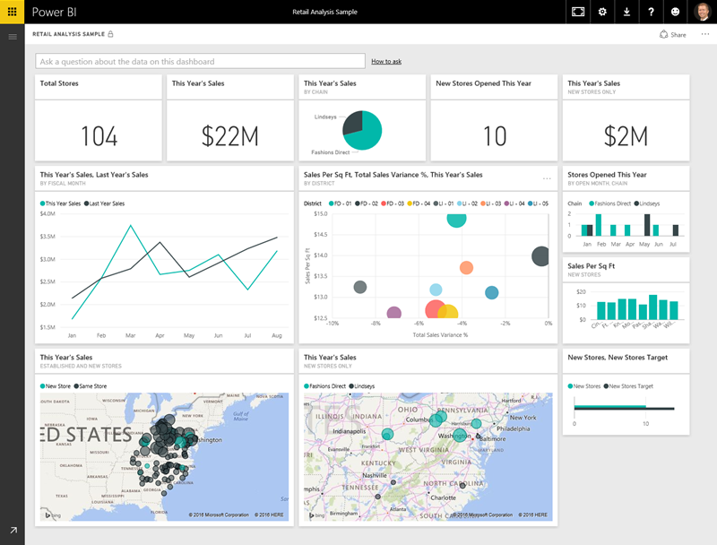

<properties
   pageTitle="Los bloques de creación de Power BI"
   description="Vea los bloques de creación de Power BI y cómo se relacionan con"
   services="powerbi"
   documentationCenter=""
   authors="davidiseminger"
   manager="mblythe"
   backup=""
   editor=""
   tags=""
   qualityFocus="no"
   qualityDate=""
   featuredVideoId=""
   courseDuration="6m"/>

<tags
   ms.service="powerbi"
   ms.devlang="NA"
   ms.topic="get-started-article"
   ms.tgt_pltfrm="NA"
   ms.workload="powerbi"
   ms.date="09/29/2016"
   ms.author="davidi"/>

# Bloques de creación de Power BI
Todo lo que haga en Power BI puede dividirse en basic unos **pilares**. Una vez que comprenda estos bloques de creación, puede expandir cada uno de ellos y comenzar a crear informes elaborados y complejos. Después de todo, incluso aparentemente complejas cosas se crean a partir de bloques de creación básicos: edificios se crean con la madera, acero, hormigón y cristal. Automóviles se realizan desde el sistema operativo, fabric y goma. Por supuesto, edificios y automóviles pueden ser básico o elaborados, dependiendo de cómo se organizan los bloques de creación básicos.

Vamos a echar un vistazo de estos bloques de creación básicos, tratan algunas cosas sencillas que pueden generarse con ellos, a continuación, proporcionan que un vistazo en operaciones complejas de cómo se puede crear también.

Los bloques de creación básicos en Power BI son los siguientes:

-   Visualizaciones
-   Conjuntos de datos
-   Reports
-   Paneles
-   Mosaicos

## Visualizaciones

Un **visualización** (a veces también se denomina un **visual**) es una representación visual de datos, como un gráfico, un gráfico, un mapa de colores o cosas interesantes que puede crear para representar los datos visualmente. Power BI tiene todo tipo de diferentes tipos de visualización y mucho más todo el tiempo. La siguiente imagen muestra una colección de visualizaciones diferentes que se crearon en el servicio Power BI.

Visualizaciones pueden ser simples: como un único número que representa algo significativo – o visualmente complejos, como un mapa de degradado de color que muestra la opinión del votante hacia un determinado problema social o preocupación. El objetivo de un objeto visual es presentar los datos de una manera que proporciona el contexto y visión, que probablemente sería difícil distinguir de una tabla sin formato de texto o números.

## Conjuntos de datos

Un **conjunto de datos** es un conjunto de datos que usa Power BI para crear sus visualizaciones.

Puede tener un conjunto de datos sencillo basado en una sola tabla de libro de Excel, similar al que se muestra en la siguiente imagen.

            **Conjuntos de datos** también puede ser una combinación de muchos orígenes diferentes, que se puede filtrar y combinar para proporcionar un datos de colección única (un conjunto de datos) para su uso en Power BI.

Por ejemplo, puede crear un conjunto de datos de los tres campos de otra base de datos, una tabla de sitio Web, una tabla de Excel y los resultados en línea de una campaña de marketing de correo electrónico. Que combinación única se considera una sola **dataset**, aunque se ha reunido de muchos orígenes diferentes.

Filtrar datos antes de ponerla en Power BI le permite que centrarse en los datos que realmente importa. Por ejemplo, puede filtrar la base de datos de contacto para que sólo los clientes que recibieron mensajes de correo electrónico de la campaña de marketing se incluyeron en el conjunto de datos. A continuación, puede crear elementos visuales basándose en ese subconjunto (que filtra la colección) de los clientes que se incluyeron en la campaña. Filtrado ayuda a centrar los datos y sus esfuerzos.

Una parte importante y habilitación de Power BI es la gran cantidad de datos **conectores** que se incluyen. Si los datos que desee en Excel o en una base de datos SQL en Azure u Oracle, o en un servicio, como Facebook, Salesforce o MailChimp en Power BI tiene datos integrados conectores que le permiten conectan a los datos, si es necesario filtrar y poner en el conjunto de datos.

Una vez que un conjunto de datos, puede empezar a crear visualizaciones que mostrar distintas partes del conjunto de datos de diferentes maneras y, con lo que ve, obtención información. Que es donde entran en juego los informes.

## Reports

En Power BI, un **informe** es una colección de visualizaciones que aparecen juntos en una o varias páginas. Al igual que cualquier otro informe que puede crear una presentación de ventas o un informe para una asignación de la escuela, en Power BI, escribiría una **informe** es una colección de elementos que se relacionan entre sí. La siguiente imagen muestra un **informe** en Power BI Desktop: en este caso, es la quinta página en un informe de la página de seis. También puede crear informes en el servicio Power BI.

Informes le permiten crear muchas visualizaciones en varias páginas diferentes si es necesario y le permite organizarlos en la forma que mejor le indica a la narración.

Es posible que tenga un informe sobre las ventas trimestrales, un informe sobre el crecimiento de producto en un segmento determinado, o puede crear un informe acerca de los patrones de migración de osos polares. El asunto sea cual fuere, los informes permiten reunir y organizar las visualizaciones en páginas de uno (o más).

## Paneles

Cuando esté preparado para compartir una única página de un informe o compartir una colección de visualizaciones, crear un **panel**. De forma similar al panel en un automóvil, Power BI **panel** es una colección de elementos visuales de una sola página que puede compartir con otros usuarios. A menudo, es un grupo seleccionado de elementos visuales que proporcionan una perspectiva rápida de los datos o el caso de que intenta presentar.

Tiene un panel caber en una sola página, que se denomina un lienzo (canvas es el telón de fondo en blanco en Power BI Desktop o el servicio, en la que colocar visualizaciones). Considérelo como el lienzo que un artista o copiar utiliza – un área de trabajo donde crear, combinar y rehacer interesantes y atractivos elementos visuales.
Puede compartir paneles con otros usuarios o grupos, que pueden interactuar con el escritorio cuando están en servicio Power BI, o en su dispositivo móvil.

## Mosaicos

En Power BI, una **icono** es una visualización única que se encuentra en un informe o en un panel. Es el cuadro rectangular que contiene cada visual individual. En la siguiente imagen, verá un mosaico (resaltado con un cuadro brillante) que también está rodeado de otras fichas.

Cuando esté *crear* un informe o un panel en Power BI, puede mover u Organizar iconos sin embargo desea presentar la información. Puede hacerlos más grande, cambiar su alto o ancho y snuggle ellos hasta otras fichas como quiera.

Cuando esté *Ver*, o *consumiendo* un panel o informe, lo que significa no es el creador o propietario, pero se ha compartido con usted: puede interactuar con él, pero no cambiar el tamaño de los mosaicos o cambiar la forma en que estén organizadas.

## Ahora todos juntos

Estos son los aspectos básicos de Power BI y sus bloques de creación. Dedique un momento a revisar.

Power BI es una colección de servicios, aplicaciones, y los conectores que le permite conectarse a sus datos – siempre ocurre residir: filtrar si es necesario, a continuación, ponerlo en Power BI, donde podrá crear atractivas visualizaciones que puede compartir con otros usuarios.  

Ahora que entiende el conjunto de bloques de creación básicos de Power BI, queda claro que puede crear conjuntos de datos que tengan sentido *le*, y crear informes visualmente atractivos que contar su historia. Casos dijimos con Power BI no tienen que estar complejos o complicados, atractivas.

Para algunas personas, utilizando una sola tabla de Excel en un conjunto de datos, a continuación, compartir un panel con sus equipos, será una forma muy valiosa para usar Power BI.

En otros casos, mediante tablas de almacenamiento de datos de SQL Azure en tiempo real que se combinan con otras bases de datos y el origen en tiempo real, que luego obtener filtrado en tiempo real para generar un conjunto de datos que supervisa el progreso de fabricación de momento por el momento será el valor en Power BI que buscan.

En ambos casos, el proceso es el mismo: crear conjuntos de datos, crear un aspecto atractivo y compartirlos con otras personas. Y de forma similar, el resultado de ambos (para cada uno) es el mismo: aprovechar su mundo cada vez mayores de datos y convertirlo en conocimientos procesables.

Si la información sobre los datos requiere sencillos o complejos conjuntos de datos, Power BI le ayuda a empezar a trabajar rápidamente y puede expandir con sus necesidades para ser tan compleja como requiere el mundo de los datos. Y puesto que Power BI es un producto de Microsoft, puede contar con que sea sólida, extensible, compatible con Office y listo para la empresa.

Ahora, veamos cómo funciona esto. Comenzaremos echando un vistazo al servicio Power BI.
