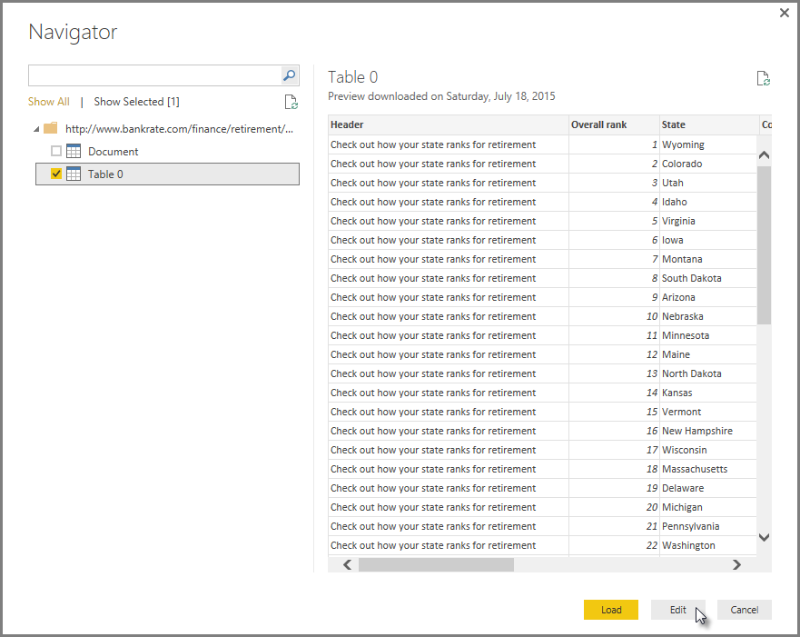

<properties
   pageTitle="Getting Started with Power BI Desktop"
   description="Get a tour of Power BI Desktop"
   services="powerbi"
   documentationCenter=""
   authors="davidiseminger"
   manager="mblythe"
   backup=""
   editor=""
   tags=""
   qualityFocus="no"
   qualityDate=""
   featuredVideoId="meDUu1sFP3Q"
   courseDuration="9m"/>

<tags
   ms.service="powerbi"
   ms.devlang="NA"
   ms.topic="get-started-article"
   ms.tgt_pltfrm="NA"
   ms.workload="powerbi"
   ms.date="09/29/2016"
   ms.author="davidi"/>

# Getting Started With Power BI Desktop

In this topic, we take a closer look at how the first two parts of Power BI fit together:

-   Create a report in <bpt id="p1">**</bpt>Power BI Desktop<ept id="p1">**</ept>
-   Publish the report in the <bpt id="p1">**</bpt>Power BI service<ept id="p1">**</ept>

We’ll start in Power BI Desktop, and select <bpt id="p1">**</bpt>Get Data<ept id="p1">**</ept>. The collection of data sources appears, allowing you to choose a data source. The following image shows selecting a Web page as the source, in the video above, Will selected an <bpt id="p1">**</bpt>Excel<ept id="p1">**</ept> workbook.

Regardless of which data source you choose, Power BI connects to that data source, and shows you the data available from that source. The following image is another example, this one is from a Web page that analyzes different states and some interesting retirement statistics.

In Power BI Desktop <bpt id="p1">**</bpt>Report<ept id="p1">**</ept> view, you can begin to build reports.

The <bpt id="p1">**</bpt>Report<ept id="p1">**</ept> view has five main areas:

1.  The ribbon, which displays common tasks associated with reports and visualizations
2.  The <bpt id="p1">**</bpt>Report<ept id="p1">**</ept> view, or canvas, where visualizations are created and arranged
3.  The <bpt id="p1">**</bpt>Pages<ept id="p1">**</ept> tab area along the bottom, which lets you select or add a report page
4.  The <bpt id="p1">**</bpt>Visualizations<ept id="p1">**</ept> pane, where you can change visualizations, customize colors or axes, apply filters, drag fields, and more
5.  The <bpt id="p1">**</bpt>Fields<ept id="p1">**</ept> pane, where query elements and filters can be dragged onto the <bpt id="p2">**</bpt>Report<ept id="p2">**</ept> view, or dragged to the <bpt id="p3">**</bpt>Filters<ept id="p3">**</ept> area of the <bpt id="p4">**</bpt>Visualizations<ept id="p4">**</ept> pane

The <bpt id="p1">**</bpt>Visualizations<ept id="p1">**</ept> and <bpt id="p2">**</bpt>Fields<ept id="p2">**</ept> pane can be collapsed by selecting the small arrow along the edge, providing more space in the <bpt id="p3">**</bpt>Report<ept id="p3">**</ept> view to build cool visualizations. When modifying visualizations, you'll also see these arrows pointing up or down, which means you can expand or collapse that section, accordingly.

To create a visualization, just drag a field from the <bpt id="p1">**</bpt>Fields<ept id="p1">**</ept> list onto the <bpt id="p2">**</bpt>Report<ept id="p2">**</ept> view. In this case, let’s drag the State field from <bpt id="p1">*</bpt>RetirementStats<ept id="p1">*</ept>, and see what happens.

 

Now let’s fast-forward a bit, and after creating a report with a few visualizations, we’re ready to publish this to the Power BI service. On the <bpt id="p1">**</bpt>Home<ept id="p1">**</ept> ribbon in Power BI Desktop, select <bpt id="p2">**</bpt>Publish<ept id="p2">**</ept>.

You’ll be prompted to sign in to Power BI.

When you've signed in and the publish process is complete, you see the following dialog. You can select the link (below <bpt id="p1">**</bpt>Success!<ept id="p1">**</ept>) to be taken to the Power BI service, where you can see the report you just published.

When you sign in to Power BI, you'll see Power BI Desktop file you just published in the service. In the image below, the report created in Power BI Desktop is shown in the <bpt id="p1">**</bpt>Reports<ept id="p1">**</ept> section.

In that report, I can choose the <bpt id="p1">**</bpt>Pin<ept id="p1">**</ept> icon to pin that visual to a dashboard. The following image shows the pin icon highlighted with a bright box and arrow.

When I select that, the following dialog appears, letting me pin the visual to an existing dashboard, or to create a new dashboard.

When we pin a couple of visuals from our report, we can see them in the dashboard.

There’s a lot more you can do with Power BI, of course, such as sharing the dashboards you create. We'll discuss sharing later on in this course.

Next, we look at a feature that can automatically create dashboards for you, just by connecting to a cloud service like Facebook, Salesforce, and many others.
