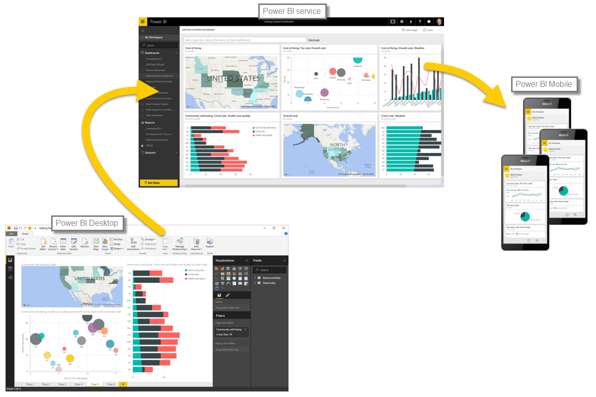

<properties
   pageTitle="Review and What's Next"
   description="Review what you learned in this introduction to Power BI"
   services="powerbi"
   documentationCenter=""
   authors="davidiseminger"
   manager="mblythe"
   backup=""
   editor=""
   tags=""
   qualityFocus="no"
   qualityDate=""
   featuredVideoId=""
   courseDuration="5m"/>

<tags
   ms.service="powerbi"
   ms.devlang="NA"
   ms.topic="get-started-article"
   ms.tgt_pltfrm="NA"
   ms.workload="powerbi"
   ms.date="09/29/2016"
   ms.author="davidi"/>

# Review this first section of Guided Learning

Let’s do a quick review of what we covered in this first section.

<bpt id="p1">**</bpt>Power BI<ept id="p1">**</ept> is a collection of software services, apps, and connectors that work together to turn your data into interactive insights. You can use data from single basic sources, such as an Excel workbook, or pull data in from multiple databases and cloud sources to create complex datasets and reports. Power BI can be as straightforward as you want, or as enterprise-ready as your complex global business requires.

Power BI consists of three main elements – the <bpt id="p1">**</bpt>Power BI Desktop<ept id="p1">**</ept>, the <bpt id="p2">**</bpt>Power BI service<ept id="p2">**</ept>, and <bpt id="p3">**</bpt>Power BI Mobile<ept id="p3">**</ept> – which all work collectively to let you create, interact with, share, and consume your data how you want it.

We discussed the basic building blocks in Power BI too, which are:

-   <bpt id="p1">**</bpt>Visualizations<ept id="p1">**</ept> – a visual representation of data, sometimes just called visuals
-   <bpt id="p1">**</bpt>Datasets<ept id="p1">**</ept> – a collection of data that Power BI uses to create visualizations
-   <bpt id="p1">**</bpt>Reports<ept id="p1">**</ept> – a collection of visuals from a dataset, spanning one or more pages
-   <bpt id="p1">**</bpt>Dashboards<ept id="p1">**</ept> – a single page collection of visuals, built from a report
-   <bpt id="p1">**</bpt>Tiles<ept id="p1">**</ept> – a single visualization found in a report or dashboard

From there, we took a look at Power BI in a video tour with our Tour Guide, <bpt id="p1">**</bpt>Will Thompson<ept id="p1">**</ept>. Will gave us a quick overview of how you can analyze and visualize data with Power BI.

<!---
In **Power BI Desktop**, we connected to a basic Excel file, created visualizations, then published those visualizations to the service. Even if you use Power BI only with your Excel workbooks, you can gain amazing visual insights with those Excel workbooks, and both interact and share it in ways never before possible.
-->
In the <bpt id="p1">**</bpt>Power BI service<ept id="p1">**</ept>, we created a dashboard with just a few clicks. We continued with our glimpse into the Power BI service and used a <bpt id="p1">**</bpt>Content Pack<ept id="p1">**</ept> – a ready-made collection of visuals and reports – and connected to a <bpt id="p2">**</bpt>software service<ept id="p2">**</ept> to populate the content pack and bring that data to life.

We also used natural language queries, called <bpt id="p1">**</bpt>Q &amp; A<ept id="p1">**</ept>, to ask questions of our answers, and let Power BI create visuals based on those questions. Lastly, we set up a <bpt id="p1">**</bpt>refresh schedule<ept id="p1">**</ept> for our data, so we know when we go back to the Power BI service, that data will be fresh.

## What's Next

**Enhorabuena.** You've completed the first section of the <bpt id="p1">**</bpt>Guided Learning<ept id="p1">**</ept> course for Power BI. You now have a firm foundation of knowledge to move on to the next section, <bpt id="p1">**</bpt>Getting Data<ept id="p1">**</ept>, which is the next step in the logical flow of work for Power BI.

We mentioned this before, but it's worth restating: this course builds your knowledge by following the common flow of work in Power BI:

-   Bring data into <bpt id="p1">**</bpt>Power BI Desktop<ept id="p1">**</ept>, and create a report.
-   <bpt id="p1">**</bpt>Publish<ept id="p1">**</ept> to the Power BI service, where you create new visualizations or build dashboards
-   <bpt id="p1">**</bpt>Share<ept id="p1">**</ept> your dashboards with others, especially people who are on the go
-   View and interact with shared dashboards and reports in <bpt id="p1">**</bpt>Power BI Mobile<ept id="p1">**</ept> apps

You might not do all that work yourself - some people will only view dashboards in the service that were created by someone else. That's fine, but because <bpt id="p1">*</bpt>you'll<ept id="p1">*</ept> go through all the sections in this course, you'll <bpt id="p2">*</bpt>understand<ept id="p2">*</ept> how those dashboards were created, and how they connected to the data... and you might even decide to create one of your own.

See you in the next section!
