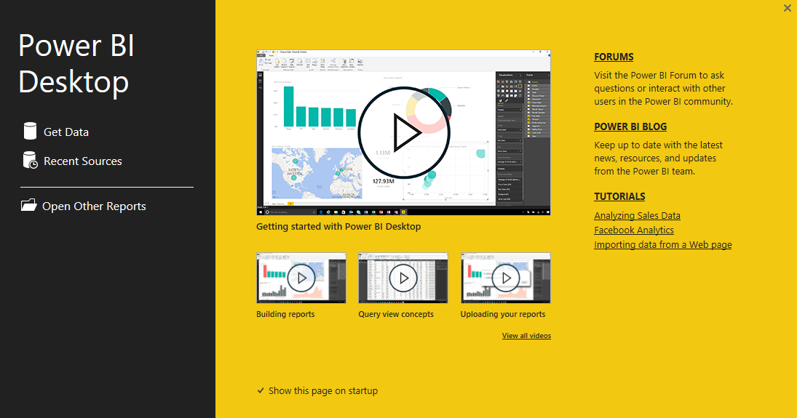

<properties
   pageTitle="Información general de Power BI Desktop"
   description="Conocer Power BI Desktop"
   services="powerbi"
   documentationCenter=""
   authors="davidiseminger"
   manager="mblythe"
   backup=""
   editor=""
   tags=""
   qualityFocus="no"
   qualityDate=""
   featuredVideoId="mdy-eRev6HM"
   courseDuration="4m"/>

<tags
   ms.service="powerbi"
   ms.devlang="NA"
   ms.topic="get-started-article"
   ms.tgt_pltfrm="NA"
   ms.workload="powerbi"
   ms.date="09/29/2016"
   ms.author="davidi"/>

# Obtener datos

Bienvenido a la segunda sección en este **aprendizaje guiado** curso para Power BI, llamado **obtener datos**. Esta sección examina las características centradas en datos y herramientas de Power BI, centrándose en Power BI Desktop. Muchas de estas herramientas también se aplican al servicio Power BI, por lo que está haciendo doble tarea con el aprendizaje de esta sección.

Al obtener datos, a veces no es tan bien formado, o *limpia*, como se desea. Por lo que en esta sección se muestra cómo obtener los datos, cómo limpiarlos (a veces denominado *limpieza* o *transformar* datos) y aprenda algunos trucos avanzados que pueden facilitar la vida de obtención de datos.

Como siempre, en este curso, su viaje de aprendizaje sigue la misma ruta que el flujo de trabajo en Power BI. Por lo tanto, vamos a desproteger **Power BI Desktop**, donde a menudo comienza.

## Información general de Power BI Desktop

Power BI Desktop es una herramienta para conectarse a, limpiar y visualizar los datos. Con Power BI Desktop, conectarse a los datos y, a continuación, modelar y visualizar de maneras diferentes. La mayoría de los usuarios que trabajan en proyectos de Business Intelligence dedican la mayor parte de su tiempo con Power BI Desktop.

Puede descargar Power BI Desktop [desde el web](http://go.microsoft.com/fwlink/?LinkID=521662), o desde el servicio Power BI. Simplemente seleccione el botón de flecha abajo en el lado superior derecho de Power BI, a continuación, seleccione Power BI Desktop.

Power BI Desktop se instala como una aplicación en el equipo de Windows.

Por lo que una vez descargarlo, debe instalar Power BI Desktop y ejecución al igual que otras aplicaciones en Windows. La siguiente imagen muestra iniciar pantalla de Power BI Desktop, que aparece cuando se inicia la aplicación.

Power BI Desktop se conecta a una amplia variedad de orígenes de datos, desde bases de datos local en hojas de cálculo de Excel a servicios en la nube. Le ayuda a limpiar y dar formato a los datos para que sea más utilizable, incluida la división y cambiar el nombre de las columnas, cambiar tipos de datos y trabajar con fechas. También puede crear relaciones entre las columnas para que sea más fácil modelar y analizar los datos.
