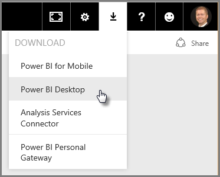

<properties
   pageTitle="Overview of Power BI Desktop"
   description="Get to know Power BI Desktop"
   services="powerbi"
   documentationCenter=""
   authors="davidiseminger"
   manager="mblythe"
   backup=""
   editor=""
   tags=""
   qualityFocus="no"
   qualityDate=""
   featuredVideoId="mdy-eRev6HM"
   courseDuration="4m"/>

<tags
   ms.service="powerbi"
   ms.devlang="NA"
   ms.topic="get-started-article"
   ms.tgt_pltfrm="NA"
   ms.workload="powerbi"
   ms.date="09/29/2016"
   ms.author="davidi"/>

# Getting Data

Welcome to the second section in this <bpt id="p1">**</bpt>Guided Learning<ept id="p1">**</ept> course for Power BI, called <bpt id="p2">**</bpt>Getting Data<ept id="p2">**</ept>. This section looks at the many data-centric features and tools of Power BI, focusing on Power BI Desktop. Many of these tools also apply to the Power BI service, so you're doing double duty with your learning in this section.

When you get data, sometimes it's not quite as well-formed, or <bpt id="p1">*</bpt>clean<ept id="p1">*</ept>, as you want it to be. So in this section you learn how to get data, how to clean it up (sometimes called <bpt id="p1">*</bpt>cleaning<ept id="p1">*</ept> or <bpt id="p2">*</bpt>transforming<ept id="p2">*</ept> data), and also learn some advanced tricks that can make your data-getting life easier.

As always in this course, your learning journey follows the same path as the flow of work in Power BI. As such, let's check out <bpt id="p1">**</bpt>Power BI Desktop<ept id="p1">**</ept>, where it often begins.

## An Overview of Power BI Desktop

Power BI Desktop is a tool to connect to, clean, and visualize your data. With Power BI Desktop, you can connect to data and then model and visualize it in different ways. Most users who are working on Business Intelligence projects will spend the majority of their time using Power BI Desktop.

You can download Power BI Desktop <bpt id="p1">[</bpt>from the web<ept id="p1">](http://go.microsoft.com/fwlink/?LinkID=521662)</ept>, or from the Power BI service. Just select the down arrow button in the upper right side of Power BI, then select Power BI Desktop.

Power BI Desktop installs as an application on your Windows computer.

So once you download it, you'll install Power BI Desktop and run it like other applications on Windows. The following image shows the Start Screen of Power BI Desktop, which appears when you start the application.

Power BI Desktop connects to a wide variety of data sources, from local on-premises databases to Excel worksheets to cloud services. It helps you clean and format your data to make it more usable, including splitting and renaming columns, changing data types, and working with dates. You can also create relationships between columns so that it's easier to model and analyze your data.
