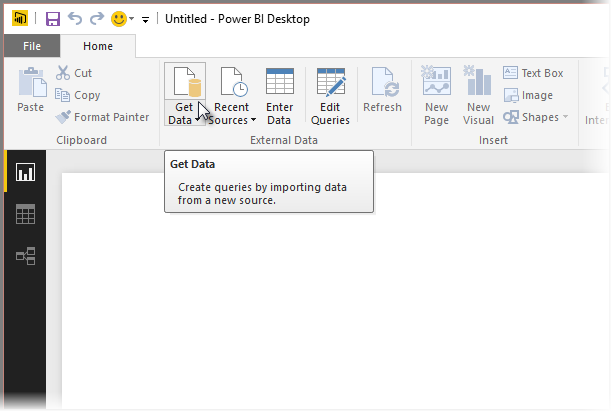
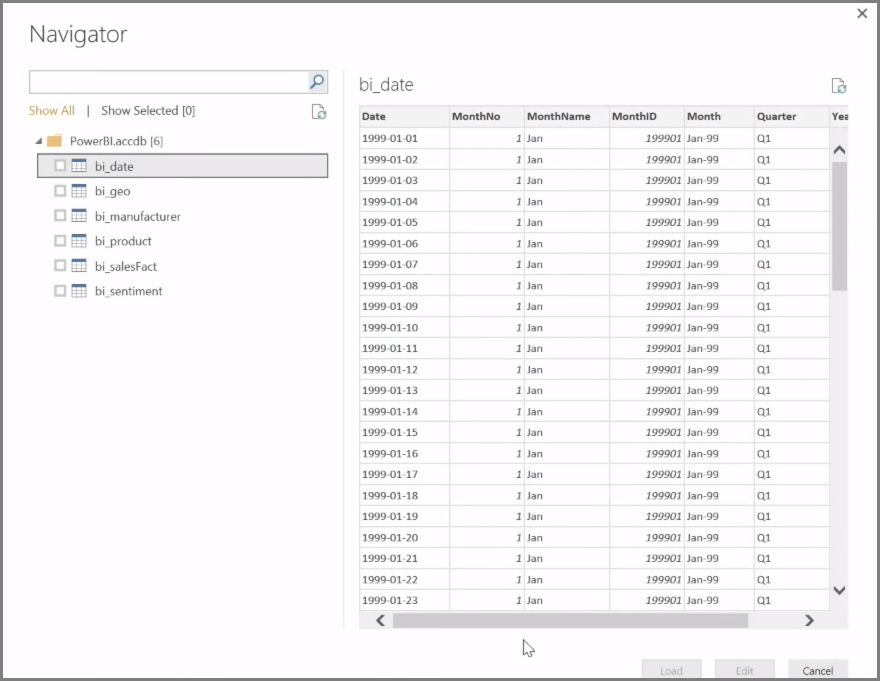

<properties
   pageTitle="Conectarse a orígenes de datos en Power BI Desktop"
   description="Averigüe cómo conectarse a datos mediante Power BI Desktop"
   services="powerbi"
   documentationCenter=""
   authors="davidiseminger"
   manager="mblythe"
   backup=""
   editor=""
   tags=""
   qualityFocus="no"
   qualityDate=""
   featuredVideoId="S6s0osmRCZ4"
   courseDuration="8m"/>

<tags
   ms.service="powerbi"
   ms.devlang="NA"
   ms.topic="get-started-article"
   ms.tgt_pltfrm="NA"
   ms.workload="powerbi"
   ms.date="10/12/2016"
   ms.author="davidi"/>

# Conectarse a orígenes de datos en Power BI Desktop

            **Power BI Desktop** puede conectarse a una amplia gama de orígenes de datos, incluidas bases de datos locales, libros de Excel y servicios en la nube. Actualmente, 59 en servicios en la nube diferente, como GitHub y Marketo tienen conectores específicos y puede conectarse a orígenes de genéricos a través de XML, CSV, texto y ODBC. Power BI separe incluso datos tabulares directamente desde una dirección URL del sitio Web. Pero vamos a empezar desde el principio, Power BI Desktop y conectarse a los datos.

Al iniciar **Power BI Desktop** y moverse más allá de la pantalla de inicio, puede elegir obtener datos desde la cinta en la **Inicio** ficha.

Hay actualizaciones mensuales a Power BI Desktop y, con cada actualización, la **Power BI Desktop What's New** página se actualiza con información acerca de las actualizaciones, vínculos al blog y un vínculo de descarga.

En Power BI Desktop, hay todo tipo de diferentes orígenes de datos disponibles. Seleccione un origen para establecer una conexión. Según su selección, se le preguntará para buscar el origen en el equipo o red, o se le pida que inicie sesión en un servicio para autenticar su solicitud.

Después de conectarse, es la primera ventana, verá el **Navigator**. El explorador muestra las tablas o entidades del origen de datos y haga clic en uno proporciona una vista previa de su contenido. A continuación, puede importar las tablas seleccionadas o entidades inmediatamente o seleccionar **Editar** para transformar y limpiar los datos antes de importar.

Una vez haya seleccionado las tablas que le gustaría poner en Power BI Desktop, puede cargarlos en Power BI Desktop seleccionando la **cargar** en la esquina inferior derecha del botón **Navigator**. Hay ocasiones, sin embargo, donde desea realizar cambios en las tablas antes de cargarlos en Power BI Desktop. Puede tener solo un subconjunto de clientes, o filtrar datos de ventas que se ha producido en un país determinado. En esos casos, puede seleccionar el botón de edición y el filtro o transformar los datos antes de ponerlo todo en Power BI Desktop.

Se deberá recoger existe y editar los datos en la sección siguiente.
