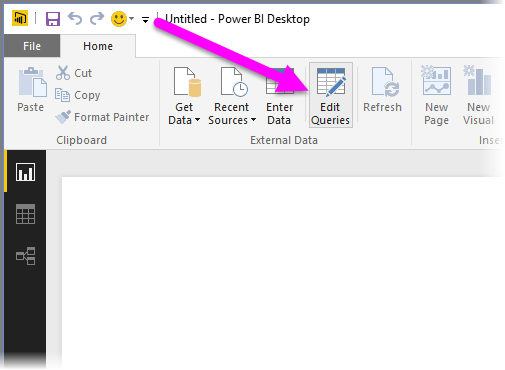
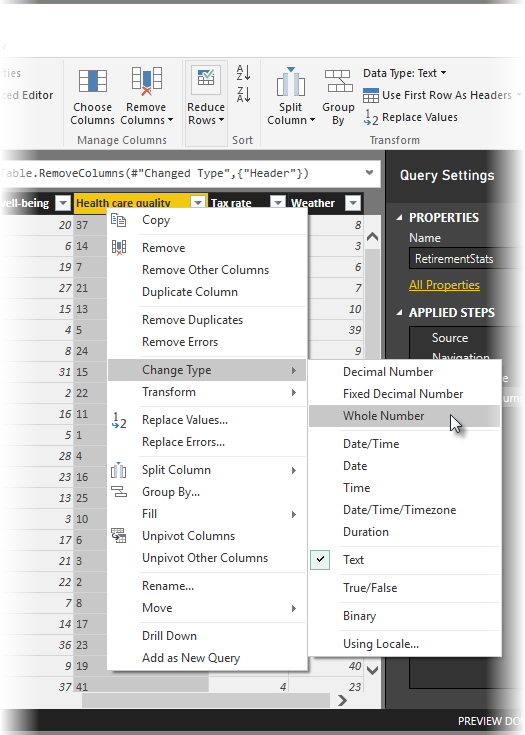
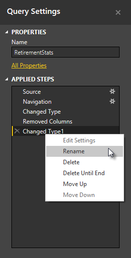
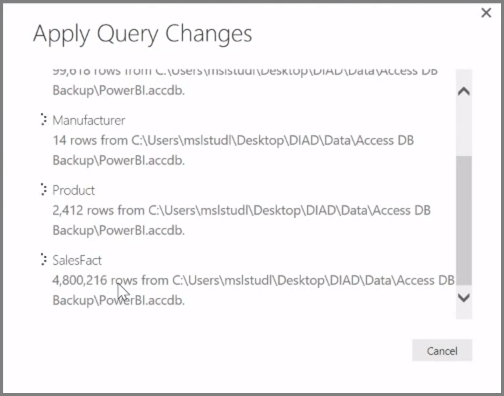

<properties
   pageTitle="Clean and Transform Your Data With the Query Editor"
   description="Get data in shape for use with Power BI"
   services="powerbi"
   documentationCenter=""
   authors="davidiseminger"
   manager="mblythe"
   backup=""
   editor=""
   tags=""
   qualityFocus="no"
   qualityDate=""
   featuredVideoId="o-sinon5JYY"
   courseDuration="8m"/>

<tags
   ms.service="powerbi"
   ms.devlang="NA"
   ms.topic="get-started-article"
   ms.tgt_pltfrm="NA"
   ms.workload="powerbi"
   ms.date="09/29/2016"
   ms.author="davidi"/>

# Clean and Transform Your Data With the Query Editor

<bpt id="p1">**</bpt>Power BI Desktop<ept id="p1">**</ept> includes <bpt id="p2">**</bpt>Query Editor<ept id="p2">**</ept>, a powerful tool for shaping and transforming data so it's ready for your models and visualizations. When you select Edit from Navigator, Query Editor launches and is populated with the tables or other entities you selected from your data source.

You can also launch <bpt id="p1">**</bpt>Query Editor<ept id="p1">**</ept> directly from <bpt id="p2">**</bpt>Power BI Desktop<ept id="p2">**</ept>, using the <bpt id="p3">**</bpt>Edit Queries<ept id="p3">**</ept> button on the <bpt id="p4">**</bpt>Home<ept id="p4">**</ept> ribbon.

Once Query Editor is loaded with data that's ready for you to shape, you see a handful of sections:

1.  In the ribbon, many buttons are now active to interact with the data in the query
2.  In the left pane, queries (one for each table, or entity) are listed and available for selection, viewing, and shaping
3.  In the center pane, data from the selected query is displayed and available for shaping
4.  The Query Settings window appears, listing the query’s properties and applied steps

In the center pane, right-clicking on a column displays a number of different available transformations, such as removing the column from the table, duplicating the column under a new name, and replacing values. From this menu you can also split text columns into multiples by common delimiters.

The <bpt id="p1">**</bpt>Query Editor<ept id="p1">**</ept> ribbon contains additional tools, such as changing the data type of columns, adding scientific notation, or extracting elements from dates, such as day of the week.

As you apply transformations, each step appears in the <bpt id="p1">**</bpt>Applied Steps<ept id="p1">**</ept> list in the <bpt id="p2">**</bpt>Query Settings<ept id="p2">**</ept> pane on the right side of <bpt id="p3">**</bpt>Query Editor<ept id="p3">**</ept>. You can use this list to undo or review specific changes, or even change the name of a step. To save your transformations, select <bpt id="p1">**</bpt>Close &amp; Apply<ept id="p1">**</ept> on the <bpt id="p2">**</bpt>Home<ept id="p2">**</ept> tab.

Once you select <bpt id="p1">**</bpt>Close &amp; Apply<ept id="p1">**</ept>, Query Editor applies the query changes you made, and applies them to Power BI Desktop.

There are all sorts of things you can do when transforming data in <bpt id="p1">**</bpt>Query Editor<ept id="p1">**</ept>, including advanced transformations. In the next section, we take a look at a few of those advanced transformations, to give you a sense of the almost immeasurable ways you can transform your data with <bpt id="p1">**</bpt>Query Editor<ept id="p1">**</ept>.
