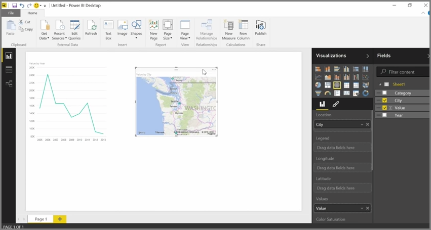

<properties
   pageTitle="Cleaning Irregularly Formatted Data"
   description="You can tackle messy data in Power BI... see how"
   services="powerbi"
   documentationCenter=""
   authors="davidiseminger"
   manager="mblythe"
   backup=""
   editor=""
   tags=""
   qualityFocus="no"
   qualityDate=""
   featuredVideoId="74KQmzdvFV8"
   featuredVideoThumb=""
   courseDuration="8m"/>

<tags
   ms.service="powerbi"
   ms.devlang="NA"
   ms.topic="get-started-article"
   ms.tgt_pltfrm="NA"
   ms.workload="powerbi"
   ms.date="09/29/2016"
   ms.author="davidi"/>

# Cleaning Irregularly Formatted Data

While Power BI can import your data from almost any source, its visualization and modeling tools work best with columnar data. Sometimes your data will not be formatted in simple columns, which is often the case with Excel spreadsheets, where a table layout that looks good to the human eye is not necessarily optimal for automated queries. For example, the following spreadsheet has headers that span multiple columns.

Fortunately, Power BI has tools to quickly transform multi-column tables into datasets that you can use.

## Transpose data
For example, using <bpt id="p1">**</bpt>Transpose<ept id="p1">**</ept> in <bpt id="p2">**</bpt>Query Editor<ept id="p2">**</ept>, you can flip data (turn columns to rows, and rows into columns) so you can break data down into formats that you can manipulate.

Once you do that a few times, as described in the video, your table begins to shape into something that Power BI can more easily work with.

## Format data
You also may need to format data, so Power BI can properly categorize and identify that data once it's imported.

With a handful of transformations, including <bpt id="p1">*</bpt>promoting rows into headers<ept id="p1">*</ept> into to break headers, using <bpt id="p2">**</bpt>Fill<ept id="p2">**</ept> to turn <bpt id="p3">*</bpt>null<ept id="p3">*</ept> values into the values found above or below in a given column, and <bpt id="p4">**</bpt>Unpivot Columns<ept id="p4">**</ept>, you can cleanse that data into a dataset that you can use in Power BI.

With Power BI, you can experiment with these transformations on your data, and determine which types get your data into the columnar format that lets Power BI work with it. And remember, all actions you take are recorded in the Applied Steps section of Query Editor, so if a transformation doesn't work the way you intended, you can simply click the <bpt id="p1">**</bpt>x<ept id="p1">**</ept> next to the step, and undo it.

## Create visuals
Once your data is in a format that Power BI can use, by transforming and cleansing the data, you can begin to create visuals.

## What's Next

**Enhorabuena.** You've completed this section of the <bpt id="p1">**</bpt>Guided Learning<ept id="p1">**</ept> course for Power BI. You now know how to <bpt id="p1">**</bpt>get data<ept id="p1">**</ept> into Power BI Desktop, and how to <bpt id="p2">*</bpt>shape<ept id="p2">*</ept> or <bpt id="p3">*</bpt>transform<ept id="p3">*</ept> that data, so you can create compelling visuals.

The next step in learning how Power BI works, and how to make it work <bpt id="p1">*</bpt>for you<ept id="p1">*</ept>, is to understand what goes into <bpt id="p2">**</bpt>modeling<ept id="p2">**</ept>. As you learned, a <bpt id="p1">**</bpt>dataset<ept id="p1">**</ept> is a basic building block of Power BI, but some datasets can be complex and based on many different sources of data. And sometimes, you need to add your own special touch (or <bpt id="p1">*</bpt>field<ept id="p1">*</ept>) to the dataset you create.

You'll learn about <bpt id="p1">**</bpt>modeling<ept id="p1">**</ept>, and a whole lot more, in the next section. See you there!
