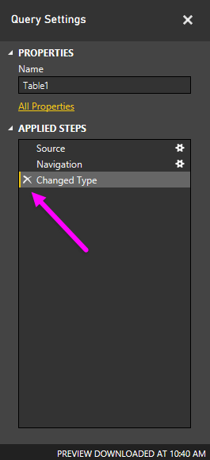

<properties
   pageTitle="Limpieza de datos con formato irregular"
   description="Puede abordar lioso datos en Power BI... Consulte cómo"
   services="powerbi"
   documentationCenter=""
   authors="davidiseminger"
   manager="mblythe"
   backup=""
   editor=""
   tags=""
   qualityFocus="no"
   qualityDate=""
   featuredVideoId="74KQmzdvFV8"
   featuredVideoThumb=""
   courseDuration="8m"/>

<tags
   ms.service="powerbi"
   ms.devlang="NA"
   ms.topic="get-started-article"
   ms.tgt_pltfrm="NA"
   ms.workload="powerbi"
   ms.date="09/29/2016"
   ms.author="davidi"/>

# Limpieza de datos con formato irregular

Mientras que Power BI puede importar los datos desde casi cualquier fuente, su visualización y modelado herramientas funcionan mejor con datos en columnas. A veces los datos no se dará formato en columnas sencillas, que suele ser el caso de las hojas de cálculo de Excel, donde no es necesariamente óptimo para consultas automatizadas de un diseño de tabla que se ve bien para el ojo humano. Por ejemplo, la siguiente hoja de cálculo tiene encabezados que abarcan varias columnas.

Afortunadamente, Power BI tiene herramientas para transformar rápidamente las tablas de varias columnas en conjuntos de datos que puede utilizar.

## Transponer datos
Por ejemplo, mediante **Transponer** en **Editor de consultas**, puede girar datos (convertir columnas y filas en columnas) para dividir datos en formatos que se pueden manipular.

Una vez se hace que varias veces, como se describe en el vídeo, la tabla comienza a la forma en algo que Power BI puede trabajar con más facilidad.

## Formato de datos
También debe dar formato a datos, por lo que Power BI puede categorizar e identificar datos una vez que se hayan importado correctamente.

Con una serie de transformaciones, incluida la *Promocionar filas en encabezados* en dividir encabezados, con **rellenar** para activar *null* valores en los valores que se encuentra encima o debajo de una columna determinada, y **de anulación de dinamización columnas**, puede limpiar los datos en un conjunto de datos que puede usar en Power BI.

Con Power BI, puede experimentar con estas transformaciones en los datos y determinar qué tipos de obtener los datos en el formato de columnas que permite que Power BI trabajar con él. Y recuerde, se registran todas las acciones que realiza en la sección pasos aplicados del Editor de consultas, por lo que si una transformación no funciona de la forma deseada, puede simplemente haga clic en el **x** junto el paso y deshacer.

## Crear efectos visuales
Una vez que los datos están en un formato que puede usar Power BI, transformación y limpieza de los datos, puede empezar a crear efectos visuales.

## Próxima Novedades

**Enhorabuena.** Ha completado esta sección de la **aprendizaje guiado** curso para Power BI. Ahora ya sabe cómo **obtener datos** en Power BI Desktop y cómo *forma* o *transformar* esos datos, por lo que puede crear un aspecto atractivo.

El siguiente paso para aprender el funcionamiento de Power BI y cómo hacerla funcionar *automáticamente*, consiste en comprender qué se incluye en **modelado**. Como ya sabe, un **conjunto de datos** es un bloque de creación básico de Power BI, pero algunos conjuntos de datos pueden ser complejo y se basa en muchos y distintos orígenes de datos. Y a veces, es necesario agregar un toque especial (o *campo*) para crear el conjunto de datos.

Obtendrá información sobre **modelado**, y mucho más, en la sección siguiente. Nos vemos allí.
