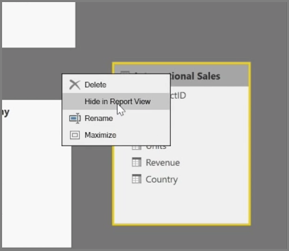
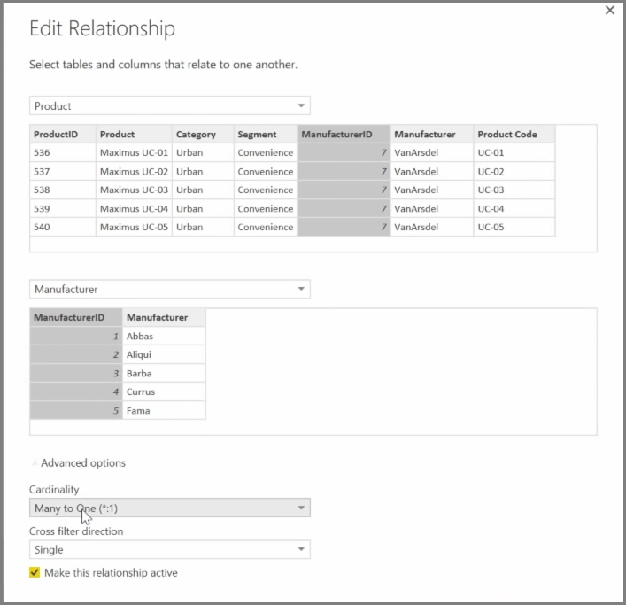

<properties
   pageTitle="How to Manage Your Data Relationships"
   description="See and manage data relationships in Power BI"
   services="powerbi"
   documentationCenter=""
   authors="davidiseminger"
   manager="mblythe"
   backup=""
   editor=""
   tags=""
   qualityFocus="no"
   qualityDate=""
   featuredVideoId="MqNX5olPGGI"
   featuredVideoThumb=""
   courseDuration="9m"/>

<tags
   ms.service="powerbi"
   ms.devlang="NA"
   ms.topic="get-started-article"
   ms.tgt_pltfrm="NA"
   ms.workload="powerbi"
   ms.date="09/29/2016"
   ms.author="davidi"/>

# How to Manage Your Data Relationships

Power BI allows you to visually set the relationship between tables or elements. To see a diagrammatic view of your data, use the <bpt id="p1">**</bpt>Relationship view<ept id="p1">**</ept>, found on the far left side of the screen next to the Report canvas.

From the <bpt id="p1">**</bpt>Relationships<ept id="p1">**</ept> view, you can see a block that represents each table and its columns, and lines between them to represent relationships.

Adding and removing relationships is simple. To remove a relationship, right-click on it and select <bpt id="p1">**</bpt>Delete<ept id="p1">**</ept>. To create a relationship, drag and drop the fields that you want to link between tables.

To hide a table or individual column from your report, right-click on it in the Relationship view and select <bpt id="p1">**</bpt>Hide in Report View<ept id="p1">**</ept>.

For a more detailed view of your data relationships, select <bpt id="p1">**</bpt>Manage Relationships<ept id="p1">**</ept> in the <bpt id="p2">**</bpt>Home<ept id="p2">**</ept> tab. This will open the <bpt id="p1">**</bpt>Manage Relationships<ept id="p1">**</ept> dialog, which displays your relationships as a list instead of a visual diagram. From here you can select <bpt id="p1">**</bpt>Autodetect<ept id="p1">**</ept> to find relationships in new or updated data. Select <bpt id="p1">**</bpt>Edit<ept id="p1">**</ept> in the <bpt id="p2">**</bpt>Manage Relationships<ept id="p2">**</ept> dialog to manually edit your relationships. This is also where you can find advanced options to set the <bpt id="p1">*</bpt>Cardinality<ept id="p1">*</ept> and <bpt id="p2">*</bpt>Cross-filter<ept id="p2">*</ept> direction of your relationships.

Your options for Cardinality are <bpt id="p1">*</bpt>Many to One<ept id="p1">*</ept>, and <bpt id="p2">*</bpt>One to One<ept id="p2">*</ept>. <bpt id="p1">*</bpt>Many to One<ept id="p1">*</ept> is the fact to dimension type relationship, for example a sales table with multiple rows per product being matched up with a table listing products in their own unique row. <bpt id="p1">*</bpt>One to One<ept id="p1">*</ept> is used often for linking single entries in reference tables.

By default, relationships will be set to cross-filter in both directions. Cross-filtering in just one direction limited some of the modeling capabilities in a relationship.

Setting accurate relationships between your data allows you to create complex calculations across multiple data elements.
