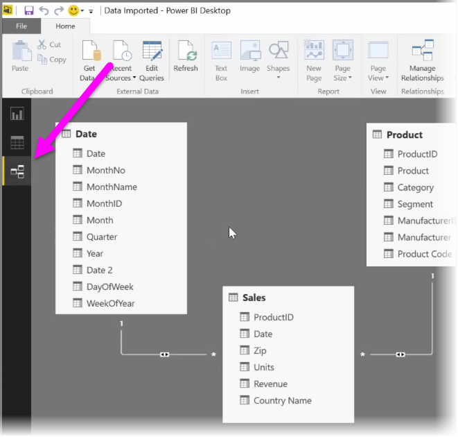
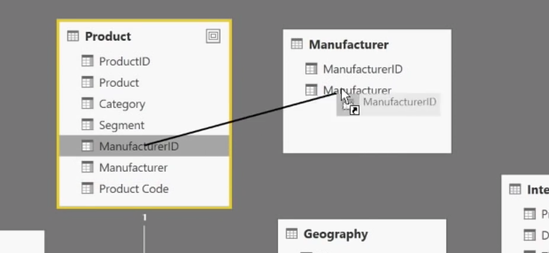

<properties
   pageTitle="Cómo administrar las relaciones de datos"
   description="Ver y administrar relaciones de datos en Power BI"
   services="powerbi"
   documentationCenter=""
   authors="davidiseminger"
   manager="mblythe"
   backup=""
   editor=""
   tags=""
   qualityFocus="no"
   qualityDate=""
   featuredVideoId="MqNX5olPGGI"
   featuredVideoThumb=""
   courseDuration="9m"/>

<tags
   ms.service="powerbi"
   ms.devlang="NA"
   ms.topic="get-started-article"
   ms.tgt_pltfrm="NA"
   ms.workload="powerbi"
   ms.date="09/29/2016"
   ms.author="davidi"/>

# Cómo administrar las relaciones de datos

Power BI permite definir visualmente la relación entre tablas o elementos. Para ver una vista de diagrama de los datos, use la **vista de relación**, que se encuentran a la izquierda de la pantalla al lado del lienzo del informe.

Desde el **relaciones** vista, puede ver un bloque que representa cada tabla y sus columnas y las líneas entre ellos para representar relaciones.

Agregar y quitar relaciones es sencillo. Para quitar una relación, haga clic en él y seleccione **Eliminar**. Para crear una relación, arrastre y coloque los campos que desea crear un vínculo entre tablas.

Para ocultar una tabla o columna individual de un informe, haga clic en él en la vista de relación y seleccione **Ocultar en la vista de informe**.

Para obtener una vista más detallada de las relaciones de datos, seleccione **Administrar relaciones** en la **Inicio** ficha. Se abrirá la **Administrar relaciones** cuadro de diálogo que muestra las relaciones como una lista en lugar de un diagrama visual. Desde aquí puede seleccionar **Autodetect** Buscar relaciones en los datos nuevos o actualizados. Seleccione **Editar** en el **Administrar relaciones** cuadro de diálogo para editar manualmente las relaciones. También es donde puede encontrar opciones avanzadas para establecer el *cardinalidad* y *filtro cruzado* dirección de las relaciones.

Las opciones de cardinalidad son *varios a uno*, y *uno a uno*. 
            *Varios a uno* es el hecho de relación del tipo de dimensión, por ejemplo una tabla de ventas con varias filas por producto que se va a asociar con una tabla en la lista de productos en su propia fila única. 
            *Uno a uno* se utiliza con frecuencia para vincular una de las entradas en las tablas de referencia.

De forma predeterminada, las relaciones se establecerá para el filtro cruzado en ambas direcciones. Filtro cruzado en una única dirección había limitado algunas de las capacidades de modelado en una relación.

Precisas relaciones entre los datos de configuración le permite crear cálculos complejos a través de varios elementos de datos.
