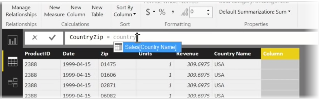

<properties
   pageTitle="Crear columnas calculadas"
   description="Las columnas calculadas permiten crear claves únicas etc."
   services="powerbi"
   documentationCenter=""
   authors="davidiseminger"
   manager="mblythe"
   backup=""
   editor=""
   tags=""
   qualityFocus="no"
   qualityDate=""
   featuredVideoId="GarBXef0Vew"
   featuredVideoThumb=""
   courseDuration="9m"/>

<tags
   ms.service="powerbi"
   ms.devlang="NA"
   ms.topic="get-started-article"
   ms.tgt_pltfrm="NA"
   ms.workload="powerbi"
   ms.date="09/29/2016"
   ms.author="davidi"/>

# Crear columnas calculadas

Crear columnas calculadas es una manera sencilla para enriquecer y mejorar los datos. Un **columna calculada** es una columna nueva que se crea definiendo un cálculo que transforma o combina dos o más elementos de datos existentes. Por ejemplo, puede crear una nueva columna mediante la combinación de dos columnas en uno.

Un motivo útil para crear una columna calculada es establecer una relación entre tablas, cuando no existe ningún campo único que se puede utilizar para establecer una relación. La falta de una relación se hace evidente cuando crea una tabla simple visual en Power BI Desktop y obtendrá el mismo valor para todas las entradas, pero sabe que los datos subyacentes son diferentes.

Para crear una relación con campos únicos en los datos, puede, por ejemplo, crear una nueva columna calculada para "Número de teléfono completo" combinando los valores de "Código de área" y "Número Local" columnas cuando existen esos valores en los datos. Las columnas calculadas son una herramienta útil para crear rápidamente modelos y visualizaciones.

Para crear una columna calculada, seleccione la **vista datos** en Power BI Desktop desde el lado izquierdo del lienzo del informe.

En la ficha de modelado, seleccione **nueva columna**. Esto permitirá que la barra de fórmulas donde puede especificar cálculos mediante el lenguaje DAX (expresiones de análisis de datos). DAX es un eficaz lenguaje de fórmulas, que también se encuentran en Excel, que le permite crear cálculos sólidas. A medida que escribe una fórmula, Power BI Desktop muestra fórmulas coincidentes o elementos de datos para ayudar a y acelerar la creación de la fórmula.

La barra de fórmulas de Power BI le sugerirá determinadas funciones DAX y relacionados con las columnas de datos a medida que escribe la expresión.

Una vez creadas las columnas calculadas en cada tabla, puede utilizarse como clave única para establecer una relación entre ellos. Vaya a **relación** vista, puede, a continuación, arrastre el campo de una tabla a otra para crear la relación.

Volver a **informe** ahora puede ver un valor diferente para cada distrito.

Hay todo tipo de cosas que puede hacer mediante la creación de columnas calculadas, demasiado.
