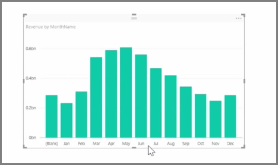

<properties
   pageTitle="Optimizing Data Models"
   description="Make creating and viewing visuals easier with optimized models"
   services="powerbi"
   documentationCenter=""
   authors="davidiseminger"
   manager="mblythe"
   backup=""
   editor=""
   tags=""
   qualityFocus="no"
   qualityDate=""
   featuredVideoId="tDcrfnjjlgk"
   featuredVideoThumb=""
   courseDuration="8m"/>

<tags
   ms.service="powerbi"
   ms.devlang="NA"
   ms.topic="get-started-article"
   ms.tgt_pltfrm="NA"
   ms.workload="powerbi"
   ms.date="09/29/2016"
   ms.author="davidi"/>

# Optimizing Data Models for Better Visuals

Imported data often contains fields that you don't actually need for your reporting and visualization tasks, either because it's extra information, or because that data is already available in another column. Power BI Desktop has tools to optimize your data, and make it more usable for you to create reports and visuals, and for viewing your shared reports.

## Hiding fields

To hide a column in the <bpt id="p1">**</bpt>Fields<ept id="p1">**</ept> pane of Power BI Desktop, right-click on it and select <bpt id="p2">**</bpt>Hide<ept id="p2">**</ept>. Note that your hidden columns are not deleted; if you've used that field in existing visualizations, the data is still in that visual, and you can still use that data in other visualizations too, the hidden field just isn't displayed in the <bpt id="p1">**</bpt>Fields<ept id="p1">**</ept> pane.

If you view tables in the <bpt id="p1">**</bpt>Relationships<ept id="p1">**</ept> view, hidden fields are indicated by being grayed out. Again, their data is still available and is still part of the model, they're just hidden from view. You can always unhide any field that has been hidden by right-clicking the field, and selecting <bpt id="p1">**</bpt>unhide<ept id="p1">**</ept>.

## Sorting visualization data by another field

The <bpt id="p1">**</bpt>Sort by Column<ept id="p1">**</ept> tool, available in the <bpt id="p2">**</bpt>Modeling<ept id="p2">**</ept> tab, is very useful to ensure that your data is displayed in the order you intended.

As a common example, data that includes the name of the month is sorted alphabetically by default, so for example, "August"  appears before "February".

In this case, selecting the field in the Fields list, then selecting <bpt id="p1">**</bpt>Sort By Column<ept id="p1">**</ept> from the <bpt id="p2">**</bpt>Modeling<ept id="p2">**</ept> tab and then choosing a field to sort by can remedy the problem. In this case, the "MonthNo" category sort option orders the months as intended.

Setting the data type for a field is another way to optimize your information so it's handled correctly. To change a data type from the report canvas, select the column in the <bpt id="p1">**</bpt>Fields<ept id="p1">**</ept> pane, and then use the <bpt id="p2">**</bpt>Format<ept id="p2">**</ept> drop-down menu to select one of the formatting options. Any visuals you've created that display that field are updated automatically.
