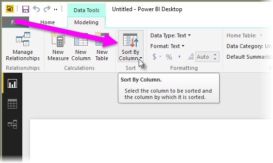
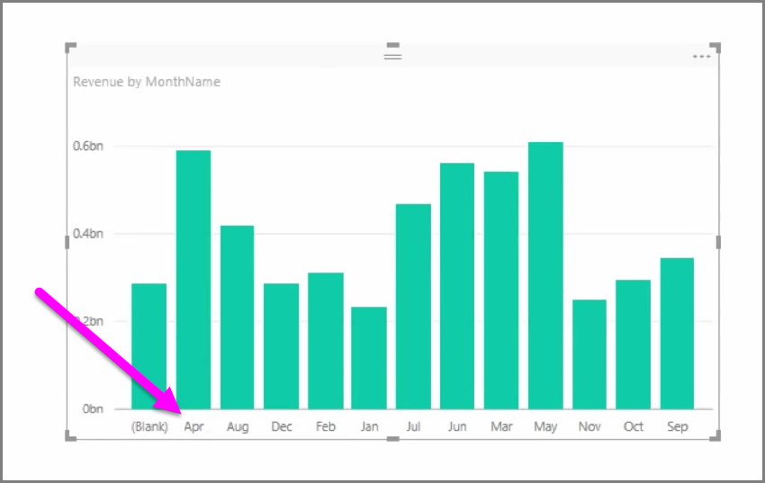

<properties
   pageTitle="Optimización de los modelos de datos"
   description="Asegúrese de crear y ver elementos visuales más fácil con modelos optimizados"
   services="powerbi"
   documentationCenter=""
   authors="davidiseminger"
   manager="mblythe"
   backup=""
   editor=""
   tags=""
   qualityFocus="no"
   qualityDate=""
   featuredVideoId="tDcrfnjjlgk"
   featuredVideoThumb=""
   courseDuration="8m"/>

<tags
   ms.service="powerbi"
   ms.devlang="NA"
   ms.topic="get-started-article"
   ms.tgt_pltfrm="NA"
   ms.workload="powerbi"
   ms.date="09/29/2016"
   ms.author="davidi"/>

# Optimización de los modelos de datos para elementos visuales mejor

Los datos importados a menudo contienen campos que no necesite realmente para las tareas de informes y visualización, porque es información adicional o porque ya están disponibles en otra columna de datos. Power BI Desktop tiene herramientas para optimizar los datos y hacer más fáciles de utilizar para crear informes y elementos visuales y para ver los informes compartidos.

## Ocultar campos

Para ocultar una columna en la **campos** panel de Power BI Desktop, haga doble clic en él y seleccione **ocultar**. Tenga en cuenta que no se eliminan las columnas ocultas; Si ha utilizado ese campo en las visualizaciones existentes, los datos aún están en ese elemento visual y, aún puede usar esos datos en otras visualizaciones demasiado, el campo oculto simplemente no se muestra en la **campos** panel.

Si se ven las tablas en el **relaciones** vista, oculto campos se indican mediante está atenuada. Nuevamente, sus datos sigue estando disponibles y sigue siendo parte del modelo, simplemente se oculta de la vista. Siempre puede mostrar cualquier campo que se ha ocultado haciendo clic en el campo y seleccionando **Mostrar**.

## Ordenar datos de visualización de otro campo

El **Ordenar por columna** herramienta disponible en el **modelado** ficha, resulta muy útil para garantizar que los datos se muestran en el orden deseado.

Un ejemplo común, los datos que incluye el nombre del mes está ordenados alfabéticamente de forma predeterminada, por ejemplo, "August" aparece antes de "Febrero".

En este caso, seleccione el campo en la lista de campos y luego seleccione **Ordenar por columna** desde el **modelado** ficha y, a continuación, elegir un campo para ordenar puede solucionan el problema. En este caso, la categoría "MonthNo" ordenación opción los meses según lo previsto.

Establecer los datos del tipo de un campo es otra manera de optimizar su información, por lo que se controla correctamente. Para cambiar un tipo de datos en el lienzo de informes, seleccione la columna de la **campos** panel y, a continuación, use la **formato** menú desplegable para seleccionar una de las opciones de formato. Los elementos visuales creados que muestran el campo se actualizan automáticamente.
