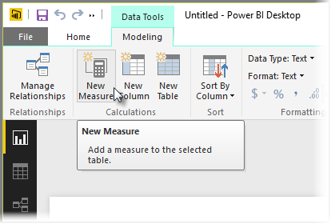

<properties
   pageTitle="Crear medidas calculadas"
   description="Definir cálculos personalizados para evaluar las funciones de tiempo"
   services="powerbi"
   documentationCenter=""
   authors="davidiseminger"
   manager="mblythe"
   backup=""
   editor=""
   tags=""
   qualityFocus="no"
   qualityDate=""
   featuredVideoId="yn2bXVQJLx8"
   featuredVideoThumb=""
   courseDuration="14m"/>

<tags
   ms.service="powerbi"
   ms.devlang="NA"
   ms.topic="get-started-article"
   ms.tgt_pltfrm="NA"
   ms.workload="powerbi"
   ms.date="09/29/2016"
   ms.author="davidi"/>

# Crear medidas y trabajar con funciones de tiempo

Un *medida* es un cálculo que existe en el modelo de datos de Power BI. Para crear una medida en **informe** Ver seleccione **nueva medida** desde el **modelado** ficha.

Una de las grandes virtudes de DAX, el lenguaje de expresiones de análisis de datos en Power BI, es que tiene una gran cantidad de funciones útiles, especialmente en relación con cálculos de tiempo como *año hasta la fecha* o *sobre año*. Con DAX puede definir una medida de tiempo una vez y, a continuación, la división por tantos campos diferentes de su modelo de datos como desee.

En Power BI, se llama a un cálculo definido un *medida*. Para crear un *medida*, seleccione **nueva medida** desde el **Inicio** ficha. Se abre la barra de fórmulas donde puede especificar la expresión de DAX que define la medida. A medida que escribe, Power BI sugiere funciones DAX pertinentes y campos de datos cuando se especifica el cálculo, y también obtendrá información sobre herramientas que explica algunos de los parámetros de función y la sintaxis.

Si el cálculo es especialmente largo, puede agregar saltos de línea adicionales en el Editor de expresiones escribiendo **ALT+ENTRAR**.

Una vez haya creado una nueva medida, aparecerán en una de las tablas en la **campos** panel, que se encuentra en el lado derecho de la pantalla. Power BI inserta la nueva medida en cualquier tabla que se ha seleccionado y, aunque no importa dónde está exactamente la medida de los datos, puede moverlo fácilmente seleccionando la medida y utilizando la **Inicio tabla** menú desplegable.

Puede usar una medida como cualquier otra columna de tabla: simplemente arrastre y coloque en los campos de elemento canvas o visualización de informes. Las medidas también integran sin dificultades con segmentaciones de datos, la segmentación de los datos sobre la marcha, lo que significa que puede definir una medida una vez y usarlo en varias visualizaciones diferentes.

El **Calculate** función DAX es una función muy eficaz que permite a todo tipo de cálculos útiles, que es especialmente útil para los informes financieros y elementos visuales.
