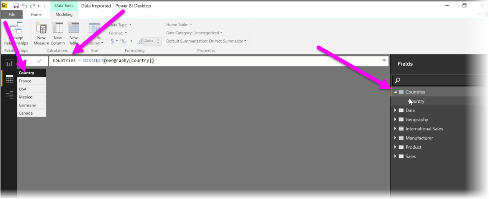

<properties
   pageTitle="Crear tablas calculadas"
   description="Crear tablas calculadas basadas en expresiones y fórmulas DAX"
   services="powerbi"
   documentationCenter=""
   authors="davidiseminger"
   manager="mblythe"
   backup=""
   editor=""
   tags=""
   qualityFocus="no"
   qualityDate=""
   featuredVideoId="aKX1E3krl4I"
   featuredVideoThumb=""
   courseDuration="4m"/>

<tags
   ms.service="powerbi"
   ms.devlang="NA"
   ms.topic="get-started-article"
   ms.tgt_pltfrm="NA"
   ms.workload="powerbi"
   ms.date="09/29/2016"
   ms.author="davidi"/>

# Crear tablas calculadas

Tablas calculadas son una función de DAX que permite expresar toda una gama de nuevas capacidades de modelado. Por ejemplo, si desea realizar diferentes tipos de combinaciones de mezcla o crear nuevas tablas sobre la marcha basándose en los resultados de una fórmula funcional, tablas calculadas son la manera de conseguirlo.

Para crear una columna calculada, vaya a **vista datos** en Power BI Desktop, puede activar desde el lado izquierdo del lienzo del informe.

Seleccione **nueva tabla** desde la ficha de modelado para abrir la barra de fórmulas.

Escriba el nombre de la nueva tabla en el lado izquierdo del signo igual y el cálculo que desea usar para formar la tabla de la derecha. Cuando termine el cálculo, la nueva tabla aparece en el panel de campos en el modelo.

Una vez creado, puede utilizar la tabla calculada como haría con cualquier otra tabla de relaciones, las fórmulas y los informes.
