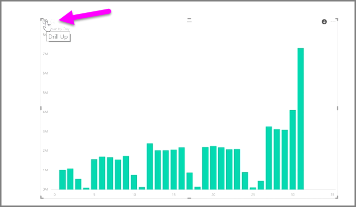

<properties
   pageTitle="Explore your time-based data"
   description="Discover hierarchical drill-down tools for date fields"
   services="powerbi"
   documentationCenter=""
   authors="davidiseminger"
   manager="mblythe"
   backup=""
   editor=""
   tags=""
   qualityFocus="no"
   qualityDate=""
   featuredVideoId="MNAaHw4PxzE"
   featuredVideoThumb=""
   courseDuration="6m"/>

<tags
   ms.service="powerbi"
   ms.devlang="NA"
   ms.topic="get-started-article"
   ms.tgt_pltfrm="NA"
   ms.workload="powerbi"
   ms.date="09/29/2016"
   ms.author="davidi"/>

# Explore Time-Based Data

It's easy to analyze time-based data with Power BI. The modeling tools in Power BI Desktop automatically include generated fields that let you drill down through years, quarters, months, and days with a single click.  

When you create a table visualization in your report using a date field, Power BI Desktop automatically includes breakdowns by time period. For example, the single date field in the <bpt id="p1">**</bpt>Date<ept id="p1">**</ept> table was automatically separated into Year, Quarter, Month and Day by Power BI, as shown in the following image.

Visualizations display data at the <bpt id="p1">*</bpt>year<ept id="p1">*</ept> level by default, but you can change that by turning on <bpt id="p2">**</bpt>Drill Down<ept id="p2">**</ept> in the top right-hand corner of the visual.

Now when you click on the bars or lines in your chart, it drills down to the next level of time hierarchy, for example from <bpt id="p1">*</bpt>years<ept id="p1">*</ept> to <bpt id="p2">*</bpt>quarters<ept id="p2">*</ept>. You can continue to drill down until you reach the most granular level of the hierarchy, which in this example is <bpt id="p1">*</bpt>days<ept id="p1">*</ept>. To move back up through the time hierarchy, click on <bpt id="p1">**</bpt>Drill Up<ept id="p1">**</ept> in the top left-hand corner of the visual.

You can also drill down through all of the data shown on the visual, rather than one selected period, by using the <bpt id="p1">**</bpt>Drill All<ept id="p1">**</ept> double-arrow icon, also in the top right-hand corner of the visual.

As long as your model has a date field, Power BI will automatically generate different views for different time hierarchies.

## What's Next

**Enhorabuena.** You've completed this section of the <bpt id="p1">**</bpt>Guided Learning<ept id="p1">**</ept> course for Power BI. Now that you know about <bpt id="p1">*</bpt>modeling<ept id="p1">*</ept> data, you're ready to learn about the fun stuff waiting in the next section: <bpt id="p2">**</bpt>Visualizations<ept id="p2">**</ept>.

As mentioned before, this course builds your knowledge by following the common flow of work in Power BI:

-   Bring data into <bpt id="p1">**</bpt>Power BI Desktop<ept id="p1">**</ept>, and create a report.
-   Publish to the Power BI service, where you create new <bpt id="p1">**</bpt>visualizations<ept id="p1">**</ept> and build dashboards
-   <bpt id="p1">**</bpt>Share<ept id="p1">**</ept> your dashboards with others, especially people who are on the go
-   View and interact with shared dashboards and reports in <bpt id="p1">**</bpt>Power BI Mobile<ept id="p1">**</ept> apps

While you might not do all that work yourself, you'll <bpt id="p1">*</bpt>understand<ept id="p1">*</ept> how those dashboards were created, and how they connected to the data... and when you're done with this course, you'll be able to create one of your own.

See you in the next section!
