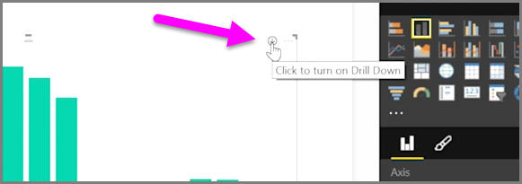
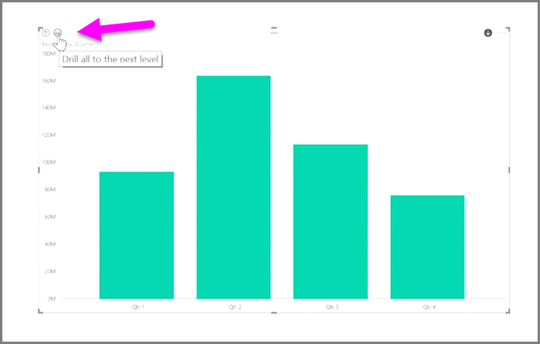

<properties
   pageTitle="Explorar los datos de tiempo"
   description="Descubra herramientas jerárquicas de detalle para campos de fecha"
   services="powerbi"
   documentationCenter=""
   authors="davidiseminger"
   manager="mblythe"
   backup=""
   editor=""
   tags=""
   qualityFocus="no"
   qualityDate=""
   featuredVideoId="MNAaHw4PxzE"
   featuredVideoThumb=""
   courseDuration="6m"/>

<tags
   ms.service="powerbi"
   ms.devlang="NA"
   ms.topic="get-started-article"
   ms.tgt_pltfrm="NA"
   ms.workload="powerbi"
   ms.date="09/29/2016"
   ms.author="davidi"/>

# Explorar datos de tiempo

Es fácil de analizar los datos basados en el tiempo con Power BI. Las herramientas de modelado en Power BI Desktop incluyen automáticamente los campos generados que permiten desplazarse por años, trimestres, meses y días con un solo clic.  

Cuando se crea una visualización de la tabla en el informe mediante un campo de fecha, Power BI Desktop incluye automáticamente los desgloses por período de tiempo. Por ejemplo, la fecha única campo en el **fecha** tabla se separan automáticamente en el año, trimestre, mes y día Power BI, tal como se muestra en la siguiente imagen.

Visualizaciones de mostrar datos en el *año* nivel de manera predeterminada, pero puede cambiar esta activando **detalle** en la esquina superior derecha del objeto visual.

Ahora cuando hace clic en las barras o líneas en el gráfico, despliega el siguiente nivel de jerarquía de tiempo, por ejemplo desde *años* a *trimestres*. Puede continuar para explorar en profundidad hasta que llegue al nivel más granular de la jerarquía, que en este ejemplo es *días*. Para subir volver a través de la jerarquía de tiempo, haga clic en **obtención de detalles ascendente** en la esquina superior izquierda del objeto visual.

También puede explorar en profundidad a través de todos los datos mostrados en el objeto visual, en lugar de uno seleccionado período, con el **Explorar todos los** icono de flecha doble, también en la esquina superior derecha del objeto visual.

Siempre y cuando el modelo tiene un campo de fecha, Power BI generará automáticamente vistas diferentes para jerarquías de hora diferentes.

## Próxima Novedades

**Enhorabuena.** Ha completado esta sección de la **aprendizaje guiado** curso para Power BI. Ahora que conoce de *modelado* datos, está listo para obtener información acerca de la diversión cosas en espera en la siguiente sección: **visualizaciones**.

Como se mencionó antes, este curso forjando su conocimiento siguiendo el flujo de trabajo en Power BI comunes:

-   Pase datos a **Power BI Desktop**, y crear un informe.
-   Publicar en el servicio Power BI, donde crear nuevos **visualizaciones** y paneles de compilación
-   
            **Recurso compartido** sus paneles con otras personas, especialmente personas que están de viaje
-   Ver e interactuar con informes y paneles compartidos en **Power BI Mobile** aplicaciones

Aunque es posible que no haga todo ese trabajo usted mismo, verá *comprender* se crearon esos paneles y cómo se conecten a los datos … y cuando haya terminado con este curso, podrá crear una propia.

Ver, en la sección siguiente.
