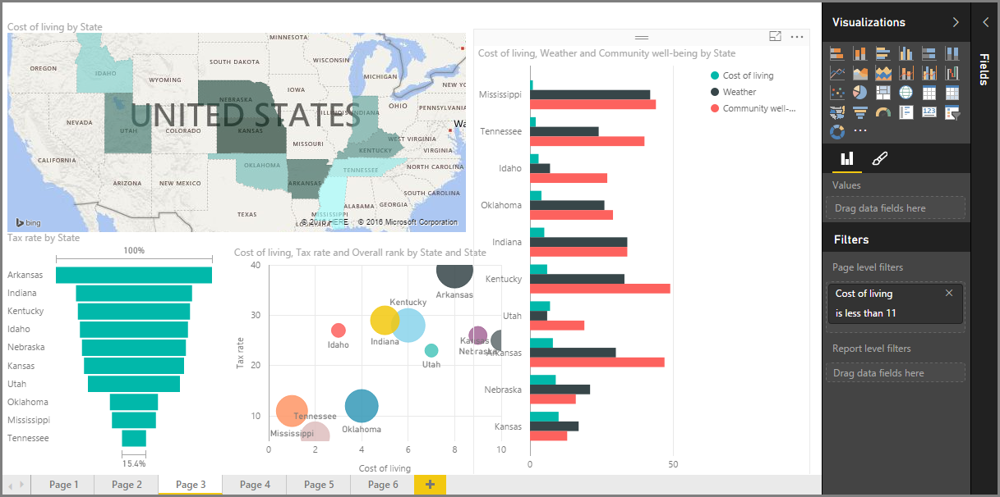

<properties
   pageTitle="Introducción a los elementos visuales en Power BI"
   description="Elementos visuales están en el centro de Power BI"
   services="powerbi"
   documentationCenter=""
   authors="davidiseminger"
   manager="mblythe"
   backup=""
   editor=""
   tags=""
   qualityFocus="no"
   qualityDate=""
   featuredVideoId="SYk_gWrtKvM"
   featuredVideoThumb=""
   courseDuration="2m"/>

<tags
   ms.service="powerbi"
   ms.devlang="NA"
   ms.topic="get-started-article"
   ms.tgt_pltfrm="NA"
   ms.workload="powerbi"
   ms.date="09/29/2016"
   ms.author="davidi"/>

# Visualizaciones

Bienvenido a la **visualizaciones** sección de la **aprendizaje guiado** curso para Power BI. Prepárese para un divertido, interesante y guiar el recorrido de las visualizaciones de muchos que Power BI tiene que ofrecer. Y esto no todas ellas: hay más visualizaciones procedentes de todo el tiempo.

Por supuesto, son el resultado final de cualquier empresa... que deseamos obtener datos, presentar de manera atractiva y revelador de business intelligence y *Mostrar* lo que destaque. Y Power BI tiene todo tipo de aspecto atractivo - y una forma casi ilimitada para personalizarlos: se trata de una importante sección!

Puede parecer que hay una gran cantidad de temas de esta sección, pero no se preocupe: cada tema es breve, rellenada con efectos visuales (usted acertó) y fácil de absorber. Probablemente encontrará usted mismo desplazándose a través de esta sección y pensar en cómo realizará estos objetos visuales presentar sus propios datos.

Comenzaremos con los principales pilares de visualizaciones - los simples elementos visuales que estamos familiarizados con - saber y asegúrese de que conoce las ventajas y desventajas. A continuación, crearemos obtener más avanzados, o al menos un poco menos común y, llenar su cuadro de herramientas de creación de informes.

Diviértase: no hay mucho que aprender aquí.

## Introducción a los elementos visuales en Power BI

Visualización de los datos es una de las partes principales de Power BI: un bloque de creación básico que definimos anteriormente en este curso - y crear elementos visuales es la manera más fácil de encontrar y compartir la información.

Power BI tiene toda una gama de visualizaciones disponibles de forma predeterminada, de los gráficos de barras simples a los gráficos circulares mapas y incluso más esotéricas ofertas como cascadas, chimeneas, medidores y mucho más. Power BI Desktop también ofrece una amplia formato herramientas como formas e imágenes, que ayudan a que el informe de vida de la página.
