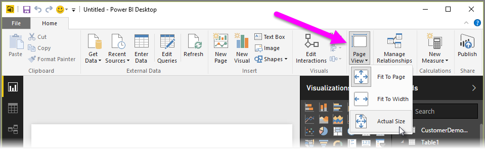

<properties
   pageTitle="Diseño de página y el formato"
   description="Mostrar los informes y paneles cómo desea"
   services="powerbi"
   documentationCenter=""
   authors="davidiseminger"
   manager="mblythe"
   backup=""
   editor=""
   tags=""
   qualityFocus="no"
   qualityDate=""
   featuredVideoId="5tg-OXzxe2g"
   featuredVideoThumb=""
   courseDuration="5m"/>

<tags
   ms.service="powerbi"
   ms.devlang="NA"
   ms.topic="get-started-article"
   ms.tgt_pltfrm="NA"
   ms.workload="powerbi"
   ms.date="09/29/2016"
   ms.author="davidi"/>

# Los informes con el diseño de página y el formato de estilo

Power BI Desktop proporciona la capacidad de controlar el diseño y el formato de las páginas del informe, como el tamaño y orientación.

Utilice la **Vista página** menú desde la ficha Inicio para cambiar la forma en la escala de páginas del informe. Las opciones disponibles incluyen **Ajustar a la página** (valor predeterminado), **Ajustar a ancho**, y **tamaño real**.

También puede cambiar el tamaño de páginas por sí mismo. De forma predeterminada, las páginas de informe son 16:9. Para cambiar el tamaño de página, asegúrese de que no hay elementos visuales están seleccionados, a continuación, seleccione el icono de pincel en el panel de visualizaciones y, a continuación, seleccione **tamaño de página** para expandir esa sección.

Opciones de tamaño de página incluyen 4 x 3 (relación de aspecto cuadrado más) y dinámico (la página se estirará para rellenar el espacio disponible). Hay un tamaño de carta estándar para los informes también. Tenga en cuenta que puede que necesite cambiar el tamaño de los objetos visuales después de cambiar el tamaño de página para asegurarse de que está completamente en el lienzo.

También puede especificar un tamaño de página personalizado, establecer el tamaño en pulgadas o en píxeles y cambiar el color de fondo de todo el informe.

Otra opción consiste en Seleccionar Cortana, que cambia el tamaño del informe para que pueda usarse como resultado de búsquedas con Cortana.
