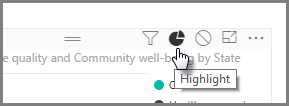

<properties
   pageTitle="Grupo de interacciones entre visualizaciones"
   description="Especificar qué elementos visuales interactúan en un panel y cuáles no"
   services="powerbi"
   documentationCenter=""
   authors="davidiseminger"
   manager="mblythe"
   backup=""
   editor=""
   tags=""
   qualityFocus="no"
   qualityDate=""
   featuredVideoId="N_xYsCbyHPw"
   featuredVideoThumb=""
   courseDuration="9m"/>

<tags
   ms.service="powerbi"
   ms.devlang="NA"
   ms.topic="get-started-article"
   ms.tgt_pltfrm="NA"
   ms.workload="powerbi"
   ms.date="09/29/2016"
   ms.author="davidi"/>

# Crear interacciones complejas entre visualizaciones

Cuando haya varias visualizaciones en la misma página de informe, seleccionar un segmento en particular haciendo clic o usando una segmentación de datos afectará a todos los elementos visuales en la página. En algunos casos, sin embargo, puede segmentar elementos visuales específicos. Esto es especialmente cierto cuando se utilizan elementos como los gráficos de dispersión, donde limitar los datos a un segmento específico se quitará el significado crucial. Afortunadamente, Power BI Desktop le permite controlar cómo fluyen las interacciones entre objetos visuales.

Para cambiar la interacción entre las visualizaciones, seleccione **Editar** desde la sección de elementos visuales de la **Inicio** la cinta de opciones para activar o desactivar **del modo de edición** en.

> Nota: La **Editar interacciones** icono en Power BI Desktop ha cambiado desde que se grabó el vídeo.

Ahora, cuando se selecciona un elemento visual en el lienzo de informe, verá un pequeño opaco *filtro* icono en la esquina superior derecha de cada otro visual se verá afectado. Para excluir un elemento visual de la interacción, haga clic en el *Ninguno* símbolo en la esquina superior derecha, cerca de la *filtro* icono.

En algunos casos puede ajustar el tipo de interacción de filtro que se produce entre los elementos visuales. Con **del modo de edición** Activar o desactivar en, seleccione el objeto visual se utiliza para filtrar. Si puede cambiar el tipo de interacción en otro visual, un *gráfico circular* icono aparecerá junto al icono de filtro en la esquina superior derecha.

Haga clic en el *gráfico circular* icono para resaltar los datos segmentados. De lo contrario, se filtrarán los datos. Como antes, puede hacer clic en el *Ninguno* icono para eliminar toda la interacción.

Una sugerencia útil es dibujar una forma transparente alrededor de objetos visuales que interactúan entre sí, por lo que resulta evidente para el usuario que tienen una relación interactiva.

