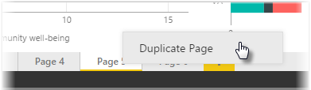

<properties
   pageTitle="Duplicar una página del informe"
   description="Ahorre tiempo con un informe similar de diseños de página"
   services="powerbi"
   documentationCenter=""
   authors="davidiseminger"
   manager="mblythe"
   backup=""
   editor=""
   tags=""
   qualityFocus="no"
   qualityDate=""
   featuredVideoId="UOKbxTXZrWw"
   featuredVideoThumb=""
   courseDuration="2m"/>

<tags
   ms.service="powerbi"
   ms.devlang="NA"
   ms.topic="get-started-article"
   ms.tgt_pltfrm="NA"
   ms.workload="powerbi"
   ms.date="09/29/2016"
   ms.author="davidi"/>

# Duplicar una página del informe

Las páginas individuales de un informe pueden ser bastante complejas, con varias visualizaciones que interactúan de forma específica y que tienen el formato preciso. Ocasionalmente al generar un informe, puede usar los mismos elementos visuales y diseños para dos temas de página diferente. Por ejemplo, si sólo ha puesto conjuntamente una página del informe en ingresos brutos, puede que una página casi idéntica en los ingresos netos.

Volver a crear todo su trabajo sería difícil, pero con Power BI Desktop solo puede duplicar una página del informe.

Haga doble clic en la ficha que desea copiar y seleccione **Duplicar página**.

Puede, a continuación, cambiar la nueva pestaña de página como actualización adecuada, el título de texto si tiene uno y, a continuación, actualizar los objetos visuales con el nuevo campo que se desea realizar un seguimiento.
