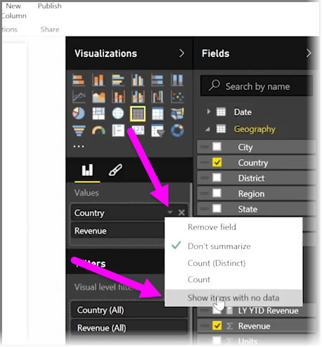
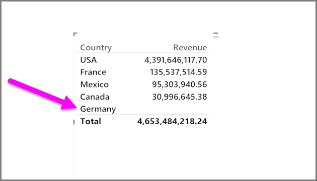
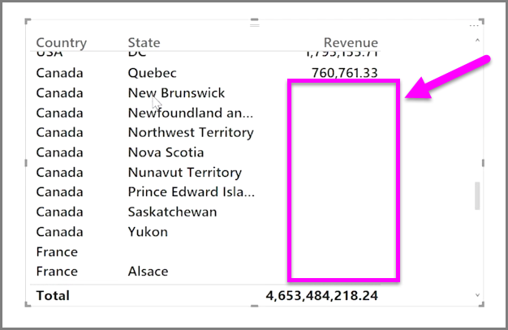

<properties
   pageTitle="Mostrar categorías sin datos"
   description="Obtenga información acerca de cómo mostrar las columnas vacías en las visualizaciones"
   services="powerbi"
   documentationCenter=""
   authors="davidiseminger"
   manager="mblythe"
   backup=""
   editor=""
   tags=""
   qualityFocus="no"
   qualityDate=""
   featuredVideoId="rsUMVJAIH00"
   featuredVideoThumb=""
   courseDuration="3m"/>

<tags
   ms.service="powerbi"
   ms.devlang="NA"
   ms.topic="get-started-article"
   ms.tgt_pltfrm="NA"
   ms.workload="powerbi"
   ms.date="09/29/2016"
   ms.author="davidi"/>

# Mostrar categorías sin datos

De forma predeterminada, los encabezados de columna sólo se muestran en los informes si contienen datos. Por ejemplo, si estuviera mostrando los ingresos por país y ha habido ventas en Noruega, a continuación, Noruega no aparecerán en cualquier parte en la visualización.

Para mostrar las categorías vacías, haga clic en la flecha abajo en el campo que desee cambiar en el  **visualizaciones** panel y seleccione **Mostrar elementos sin datos**.

Las columnas vacías aparecen ahora en el objeto visual con valores en blanco.

Una vez que selecciona **Mostrar elementos sin datos** para cualquier campo de la **visualizaciones** panel, se aplica a todos los campos que se muestran en el panel de visualizaciones. Por lo que si agrega otro campo, todos los elementos que no tienen datos también será mostrado, sin tener que volver a visitar el menú desplegable.

