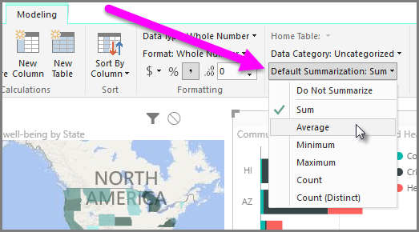

<properties
   pageTitle="Summarization and Category options"
   description="Define how your visuals summarize their data"
   services="powerbi"
   documentationCenter=""
   authors="davidiseminger"
   manager="mblythe"
   backup=""
   editor=""
   tags=""
   qualityFocus="no"
   qualityDate=""
   featuredVideoId="Co2z9b-s_yM"
   featuredVideoThumb=""
   courseDuration="9m"/>

<tags
   ms.service="powerbi"
   ms.devlang="NA"
   ms.topic="get-started-article"
   ms.tgt_pltfrm="NA"
   ms.workload="powerbi"
   ms.date="09/29/2016"
   ms.author="davidi"/>

# Customize Visuals with Summarization and Category Options

Power BI has properties that you can assign for fields in your model, which can help report and visualize and present data in ways that provide more clarity. For example, sometimes you want to average a list of numbers, but Power BI automatically sums the list. With Power BI, you can adjust how those lists of numbers are summarized.

## Numeric Control over summarization

Let's take an example, and demonstrate how to control the way Power BI summarizes numeric data fields.

Select a visual on your report canvas, and then select a field in the <bpt id="p1">**</bpt>Fields<ept id="p1">**</ept> pane. The <bpt id="p1">**</bpt>Modeling<ept id="p1">**</ept> tab appears in the ribbon and displays options for formatting data, and data properties.

You can select the type of currency symbol used, by selecting the currency symbol drop down, which is shown in the following image.

There are many different options for formatting fields. For example, you can change the format from currency to percentage.

You can change how Powwer BI summarizes the data, too. Select the <bpt id="p1">**</bpt>Default Summarization<ept id="p1">**</ept> icon to change how a field is summarized, including displaying a sum, a count, or an average.

## Manage and clarify your location data

You can make similar changes when plotting locations on a map. Select your map, and then select the field in the <bpt id="p1">**</bpt>Fields<ept id="p1">**</ept> pane that you use for the <bpt id="p2">*</bpt>Location<ept id="p2">*</ept> value. On the <bpt id="p1">**</bpt>Modeling<ept id="p1">**</ept> tab, select <bpt id="p2">**</bpt>Data Category<ept id="p2">**</ept> and then choose the category that represents your location data from the drop-down menu. For example, select state, county, or city.

