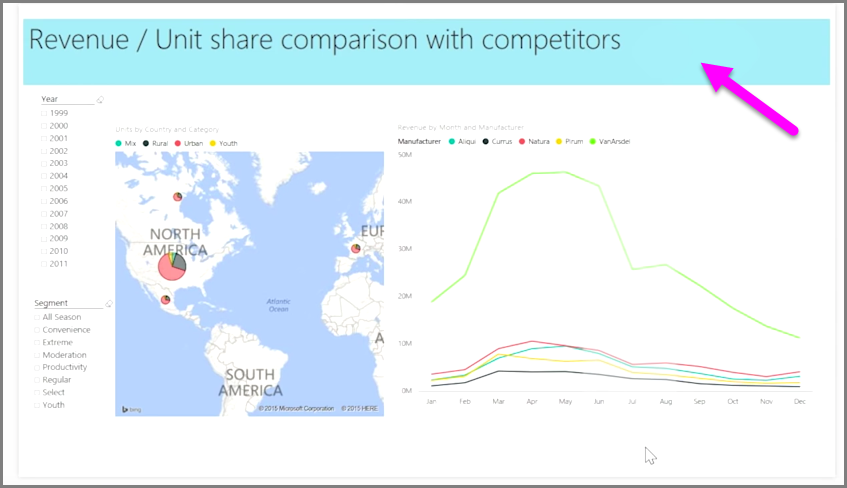

<properties
   pageTitle="Orden Z"
   description="Controlar cómo se superponen entre sí los elementos de informe"
   services="powerbi"
   documentationCenter=""
   authors="davidiseminger"
   manager="mblythe"
   backup=""
   editor=""
   tags=""
   qualityFocus="no"
   qualityDate=""
   featuredVideoId="MkiiNFI2Ve0"
   courseDuration="3m"/>

<tags
   ms.service="powerbi"
   ms.devlang="NA"
   ms.topic="get-started-article"
   ms.tgt_pltfrm="NA"
   ms.workload="powerbi"
   ms.date="09/29/2016"
   ms.author="davidi"/>

# Organizar el orden Z de los elementos de informe

Cuando tiene una gran cantidad de elementos en un informe, Power BI permite administrar la forma en que se superponen entre sí. Cómo se coloca elementos u organizan uno encima de otro, a menudo se conoce como el orden z.

Para administrar el orden z de los elementos de un informe, seleccione un elemento y utilice la **Organizar** situado en la **Inicio** la ficha de la cinta de opciones para cambiar su orden z.

Mediante las opciones en el **Organizar** menú del botón, puede obtener el orden de los elementos de informe sólo la forma que desee. Puede mover una capa visual uno hacia delante o hacia atrás o enviar a la parte delantera de la parte posterior del orden.

Con el botón Organizar es especialmente útil cuando se usan formas como fondos decorativos o bordes, o para resaltar determinadas secciones de un gráfico o un gráfico. También puede utilizar para crear un fondo, como el rectángulo azul claro siguiente que se utiliza para un fondo de título del informe.

