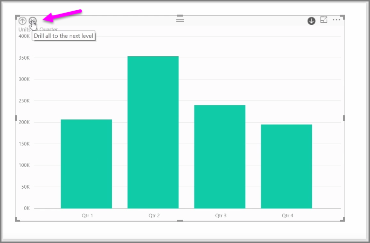

<properties
   pageTitle="Jerarquías visuales y exploración en profundidad"
   description="Aprenda a profundizar en las jerarquías y administrar cómo se comparten los niveles"
   services="powerbi"
   documentationCenter=""
   authors="davidiseminger"
   manager="mblythe"
   backup=""
   editor=""
   tags=""
   qualityFocus="no"
   qualityDate=""
   featuredVideoId="Fuhe0wo4gUI"
   courseDuration="5m"/>

<tags
   ms.service="powerbi"
   ms.devlang="NA"
   ms.topic="get-started-article"
   ms.tgt_pltfrm="NA"
   ms.workload="powerbi"
   ms.date="09/29/2016"
   ms.author="davidi"/>

# Jerarquías visuales y el comportamiento de profundidad

Cuando se agrega un *fecha* campo en un elemento visual en el *eje* depósito de campo, Power BI agrega automáticamente una jerarquía de tiempo que incluya *año*, *trimestre*, *mes* y *día*. Al hacerlo, Power BI permite que los objetos visuales basada en tiempo de interactuar con los que los ven los informes, permitiendo que los usuarios en profundidad a través de los niveles de tiempo diferente.

Una jerarquía en su lugar, puede comenzar profundizando en la jerarquía de tiempo. Por ejemplo, al hacer clic en un año en el gráfico se expande hasta el siguiente nivel en la jerarquía, en este caso *trimestres*, que se muestran en el objeto visual.

En el se crea automáticamente la jerarquía, también puede administrar el nivel de informe compartido permite a los usuarios obtener detalles. Para ello, en el panel de visualizaciones, simplemente haga clic en la X situada junto a la jerarquía que desea quitar. El nivel eliminado se quita del informe y obtención de detalles ya no muestra ese nivel.

Si necesita obtener ese nivel de la parte posterior de la jerarquía, simplemente quite el *fecha* campo y, a continuación, agregarlo de nuevo desde la **campos** panel y la jerarquía es nuevamente crea automáticamente.

Puede haber ocasiones cuando no desea que la jerarquía que se utilizará para un objeto visual. Puede controlar que seleccionando el botón de flecha hacia abajo situada junto a la *fecha* (una vez que se ha agregado un elemento visual) y seleccione **fecha** en lugar de **jerarquía de fecha**. Solicita Power BI para mostrar los valores de fecha sin procesar en el objeto visual.

También puede expandir todos los elementos de datos actualmente visibles a la vez, en lugar de seleccionar un trimestre único o un único año. Para ello, seleccione la *Explorar todos* situado en la esquina superior izquierda del objeto visual, que es un icono de flecha doble.

