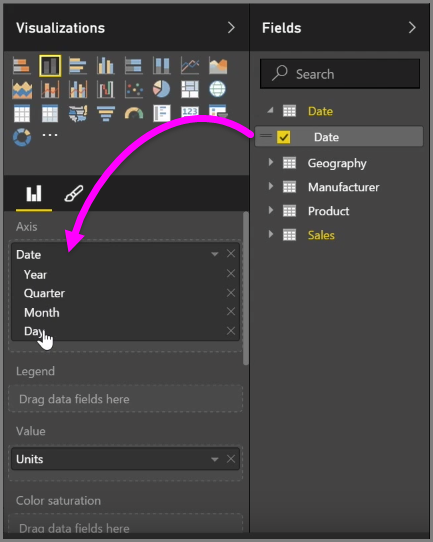
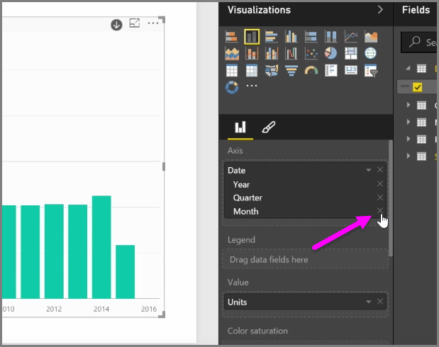

<properties
   pageTitle="Visual hierarchies and drill-down"
   description="Learn to drill into hierarchies, and manage how levels are shared"
   services="powerbi"
   documentationCenter=""
   authors="davidiseminger"
   manager="mblythe"
   backup=""
   editor=""
   tags=""
   qualityFocus="no"
   qualityDate=""
   featuredVideoId="Fuhe0wo4gUI"
   courseDuration="5m"/>

<tags
   ms.service="powerbi"
   ms.devlang="NA"
   ms.topic="get-started-article"
   ms.tgt_pltfrm="NA"
   ms.workload="powerbi"
   ms.date="09/29/2016"
   ms.author="davidi"/>

# Visual hierarchies and drill-down behavior

When you add a <bpt id="p1">*</bpt>date<ept id="p1">*</ept> field to a visual in the <bpt id="p2">*</bpt>Axis<ept id="p2">*</ept> field bucket, Power BI automatically adds a time hierarchy that includes <bpt id="p3">*</bpt>Year<ept id="p3">*</ept>, <bpt id="p4">*</bpt>Quarter<ept id="p4">*</ept>, <bpt id="p5">*</bpt>Month<ept id="p5">*</ept> and <bpt id="p6">*</bpt>Day<ept id="p6">*</ept>. By doing this, Power BI allows your visuals to have time-based interaction with those viewing your reports, by letting users drill-down through those different time levels.

With a hierarchy in place, you can begin drilling down through the time hierarchy. For example, clicking a year in the chart drills down to the next level in the hierarchy, in this case <bpt id="p1">*</bpt>Quarters<ept id="p1">*</ept>, which are then displayed in the visual.

In that automatically created hierarchy, you can also manage to which level your shared report allows people to drill. To do this, in the Visualizations pane, simply click the X beside the hierarchy that you want to remove. The deleted level is removed from the report, and drilling no longer displays that level.

If you need to get that level of the hierarchy back, just remove the <bpt id="p1">*</bpt>date<ept id="p1">*</ept> field, and then add it again from the <bpt id="p2">**</bpt>Fields<ept id="p2">**</ept> pane, and the hierarchy is once again created for you automatically.

There may be times when you don't want the hierarchy to be used for a visual. You can control that by selecting the down-arrow button beside the <bpt id="p1">*</bpt>Date<ept id="p1">*</ept> field (once you've added it to a visual), and select <bpt id="p2">**</bpt>Date<ept id="p2">**</ept> rather than <bpt id="p3">**</bpt>Date Hierarchy<ept id="p3">**</ept>. That prompts Power BI to show the raw date values in the visual.

You can also expand all data elements currently visible at once, rather than selecting a single quarter, or a single year. To do that, select the <bpt id="p1">*</bpt>Drill all<ept id="p1">*</ept> icon in the top left of the visual, which is a double-down arrow icon.

