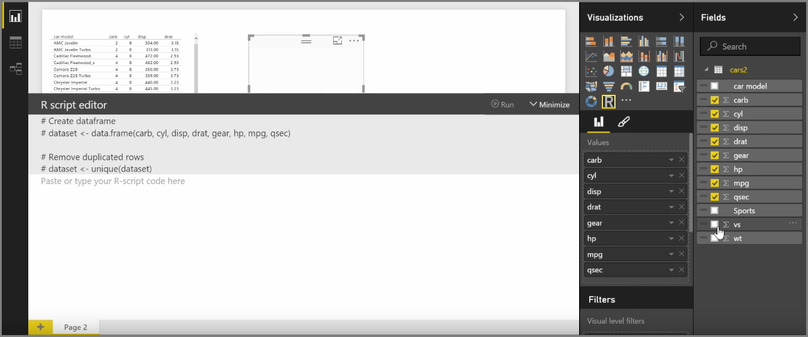
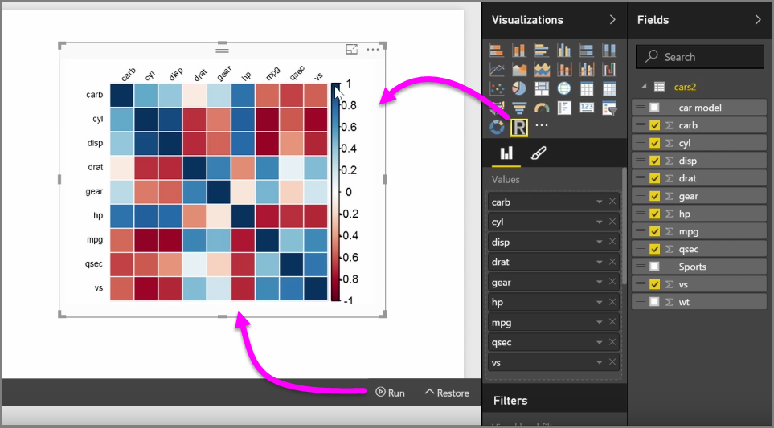

<properties
   pageTitle="Integración de R en Power BI Desktop"
   description="Aprenda a usar los elementos visuales de R en Power BI Desktop"
   services="powerbi"
   documentationCenter=""
   authors="davidiseminger"
   manager="mblythe"
   backup=""
   editor=""
   tags=""
   qualityFocus="no"
   qualityDate=""
   featuredVideoId="pV78e9aYHXk"
   courseDuration="9m"/>

<tags
   ms.service="powerbi"
   ms.devlang="NA"
   ms.topic="get-started-article"
   ms.tgt_pltfrm="NA"
   ms.workload="powerbi"
   ms.date="09/29/2016"
   ms.author="davidi"/>

# Elementos visuales de R en Power BI

Con Power BI Desktop, puede realizar análisis estadístico y análisis y crear un aspecto atractivo integrando con R. Puede hospedar las visualizaciones de R en el informe de Power BI Desktop.

Cuando se selecciona el **R visual** icono desde la **visualizaciones** panel de Power BI crea un marcador de posición en el lienzo para hospedar su visual R y, a continuación, presenta un editor de script de R para su uso derecha del lienzo. Agregar campos a la R visual, Power BI Desktop los agrega al panel de editor de script de R.

A continuación lo genera Power BI en el editor de scripts de R, puede empezar a crear el script de R para generar el objeto visual. Una vez completada la secuencia de comandos, seleccione **ejecutar** y ocurre lo siguiente:

1.  Los datos agregados al objeto visual (desde la **campos** panel) se envía desde Power BI Desktop para la instalación local de R
2.  Se ejecuta la secuencia de comandos creada en el editor de secuencias de comandos de Power BI Desktop R en esa instalación local de R
3.  Obtiene de Power BI Desktop hacer copia de un elemento visual de la instalación de R, y se muestra en el lienzo

Todo ocurre muy rápidamente, y el resultado aparece en la **R visual** visualización en el lienzo.

Puede cambiar el objeto visual R ajustando el script de R y, a continuación, seleccione **ejecutar** nuevo. En la siguiente imagen, hemos cambiado el objeto visual para mostrar círculos en lugar de cuadrados.

Y puesto que R visual es igual que cualquier otro visual en Power BI Desktop, puede interactuar con él y realizar conexiones con otros elementos visuales en el lienzo así. Cuando se interactúa con otros elementos visuales en el lienzo, a través de filtrado o resaltar, R visual reacciona automáticamente al igual que cualquier otro Power BI visual, sin necesidad de ajustar el script de R.

Es una excelente manera de usar la potencia de R, directamente en Power BI Desktop.

## Próxima Novedades

**Enhorabuena.** Ha completado este **visualizaciones** sección de la **aprendizaje guiado** curso para Power BI. Puede considerar usted mismo y versadas en las visualizaciones de muchos ofrecidas en Power BI y también conocimientos acerca de cómo utilizar, modificar y personalizarlos. Y buenas noticias: visualizaciones son las mismas en Power BI Desktop y el servicio Power BI, para lo que ha aprendido se aplica a ambos.

Ahora está preparado para ir a la nube y Sumérjase en el servicio Power BI, donde puede **explorar datos**. Como sabe, el flujo de trabajo tiene un aspecto similar al siguiente:

-   Pase datos a **Power BI Desktop**, y crear un informe.
-   Publicar en el servicio Power BI, donde crear nuevos **visualizaciones** y paneles de compilación
-   
            **Recurso compartido** sus paneles con otras personas, especialmente personas que están de viaje
-   Ver e interactuar con informes y paneles compartidos en **Power BI Mobile** aplicaciones

Si crear informes o simplemente ver e interactuar con ellos, ahora ya sabe cómo se crean todos los objetos visuales interesantes, y cómo conecta a los datos. A continuación, obtenemos ver aquellos elementos visuales y los informes en acción.

Ver, en la sección siguiente.
