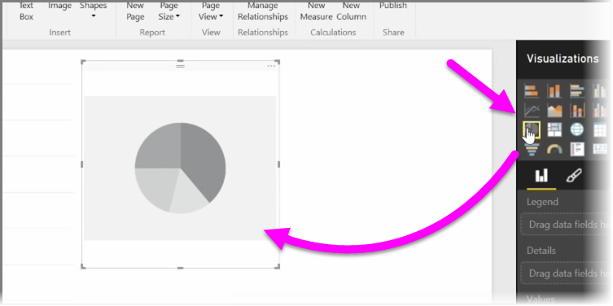
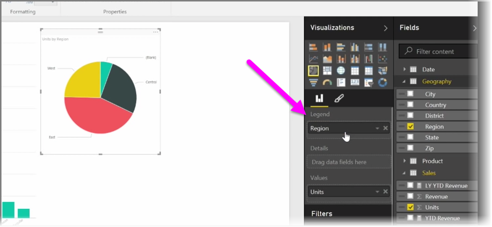
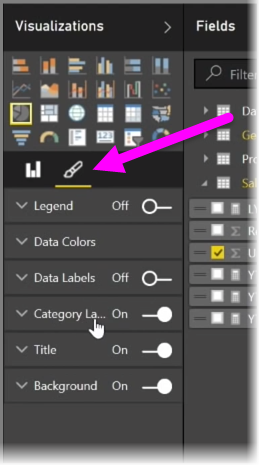

<properties
   pageTitle="Crear y personalizar las visualizaciones Simple"
   description="Personalizar tres tipos comunes de elementos visuales"
   services="powerbi"
   documentationCenter=""
   authors="davidiseminger"
   manager="mblythe"
   backup=""
   editor=""
   tags=""
   qualityFocus="no"
   qualityDate=""
   featuredVideoId="rnMyiA6Nt6Y"
   featuredVideoThumb=""
   courseDuration="8m"/>

<tags
   ms.service="powerbi"
   ms.devlang="NA"
   ms.topic="get-started-article"
   ms.tgt_pltfrm="NA"
   ms.workload="powerbi"
   ms.date="10/12/2016"
   ms.author="davidi"/>

# Crear y personalizar las visualizaciones Simple

En este artículo aprenderá a crear nuevos gráficos de barras, gráficos circulares y treemaps y personalizarlos para adaptarlos a sus informes.

Hay dos maneras diferentes de crear una nueva visualización en Power BI Desktop:

-   Puede arrastrar campos desde la **campos** panel y colóquelos en el lienzo de informes. De forma predeterminada la visualización aparece como una tabla de datos.

    

-   También puede hacer clic en el tipo de visualización que desee crear en el **visualizaciones** panel. Con este método, el valor predeterminado de visual es un marcador de posición en blanco que refleje el tipo de objeto visual seleccionado.

    

Una vez creado el gráfico, un mapa o un gráfico, puede comenzar a arrastrar campos de datos a la parte inferior de la **visualización** panel para crear y organizar su visual. Los campos disponibles cambian según el tipo de visualización que seleccionó. Arrastrar y colocar campos de datos, la visualización se actualizará automáticamente para reflejar los cambios.

Puede cambiar el tamaño de la visualización seleccionándolo y, a continuación, arrastre los controladores o de salida. También puede mover la visualización en cualquier lugar en el lienzo haciendo clic y arrastrando. Si desea convertir entre los diferentes tipos de visualizaciones, seleccione el elemento visual que desea cambiar y seleccione un elemento visual diferente en los iconos de la **visualización** panel. Power BI intenta convertir los campos seleccionados en el nuevo tipo visual tan cerca como sea posible.

Al mantener el mouse sobre las partes de las visualizaciones, obtendrá información sobre herramientas que contiene detalles sobre ese segmento, como las etiquetas y el valor total.

Seleccione el **pincel** situado en el **visualizaciones** panel para asegurarse de cosméticos cambios en el objeto visual, como la alineación de fondo, texto de título y colores de datos.

Las opciones disponibles para cambios cosméticos en su visual varían según el tipo de elemento visual que seleccionó.
