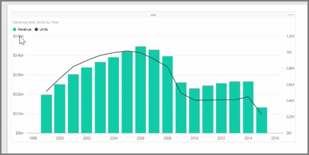
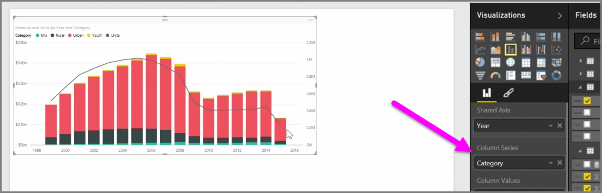

<properties
   pageTitle="Gráficos de combinación"
   description="Crear el primer gráfico de combinación"
   services="powerbi"
   documentationCenter=""
   authors="davidiseminger"
   manager="mblythe"
   backup=""
   editor=""
   tags=""
   qualityFocus="no"
   qualityDate=""
   featuredVideoId="lnv66cTZ5ho"
   featuredVideoThumb=""
   courseDuration="5m"/>

<tags
   ms.service="powerbi"
   ms.devlang="NA"
   ms.topic="get-started-article"
   ms.tgt_pltfrm="NA"
   ms.workload="powerbi"
   ms.date="09/29/2016"
   ms.author="davidi"/>

# Cómo usar gráficos de combinación

Cuando desea visualizar dos medidas que tienen muy diferentes escalas, tales como ingresos y unidades, un **gráfico combinado** que muestra una línea y una barra de escala de eje diferentes es muy útil. Power BI admite muchos tipos diferentes de gráficos de combinación de forma predeterminada, incluido el popular **línea** y **columnas apiladas** gráficos.

Cuando se crea un gráfico de combinación, se presentan con un campo para **eje compartido** (eje x) y, a continuación, los valores de los dos campos, en este caso una columna y una línea. Las leyendas de eje y dos aparecen a ambos lados de la visualización.

También puede dividir cada columna por categoría, arrastrando una categoría en el campo de serie de columnas en el panel de visualizaciones. Al hacerlo, cada barra está coloreado proporcionalmente según los valores dentro de cada categoría.

Gráficos de combinación son la escala de forma eficaz para visualizar varias medidas que tienen muy diferentes en una sola visualización.
